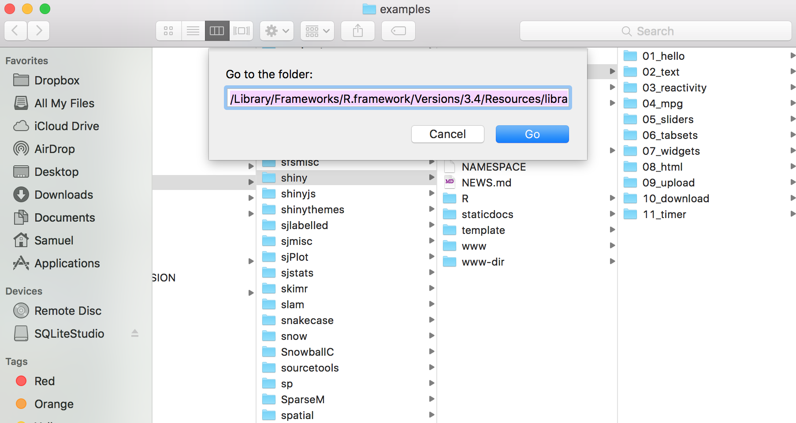

```{r setup, include=FALSE}
knitr::opts_chunk$set(echo = TRUE)
library(ggplot2)
library(plotly)
```

This R Markdown document is made interactive using Shiny. Unlike the more traditional workflow of creating static reports, you can now create documents that allow your readers to change the assumptions underlying your analysis and see the results immediately. 

## Inputs and Outputs
```{r echo=FALSE}
# Read our dataset in
vids <- read.csv("youtubetrends.csv")
vids$likesratio <- vids$likes/vids$views
vids$dislikesratio <- vids$dislikes/vids$views

# Creates our theme
theme_algoritma <- theme(legend.key = element_rect(fill="black"),
           text = element_text(color="white"),
           legend.background = element_rect(color="white", fill="#263238"),
           plot.title = element_text(size=8),
           plot.subtitle = element_text(size=6),
           panel.background = element_rect(fill="#dddddd"),
           panel.border = element_rect(fill=NA),
           panel.grid.minor.x = element_blank(),
           panel.grid.major.x = element_blank(),
           panel.grid.major.y = element_line(color="darkgrey", linetype=2),
           panel.grid.minor.y = element_blank(),
           plot.background = element_rect(fill="#263238"),
           axis.text = element_text(color="white"),
           axis.title =  element_text(color="white", size=6.5)
           )

# Data preparation:
comedy <- vids[vids$category_id == "Comedy",]
popularcomedy <- aggregate(trending_date ~ channel_title, comedy, length)
popularcomedy <- popularcomedy[order(popularcomedy$trending_date, decreasing=T), ]
popularcomedy <- popularcomedy[popularcomedy$trending_date >= 5, ]
```

```{r echo=F}
# Create our plot
Bubble <- ggplot(comedy[comedy$channel_title %in% popularcomedy$channel_title,], aes(x=likesratio, y=dislikesratio))+
  geom_point(aes(size=views, col=channel_title), alpha=0.6)+
  labs(title="Likes vs Dislikes in Trending Comedy Videos", subtitle="Visualizing likes vs dislikes in the Algoritma theme, source: YouTube")+
  guides(size=F)

Hex <- ggplot(vids[vids$category_id == "Comedy",], aes(x=likesratio, y=dislikesratio))+
  geom_hex(alpha=0.6, show.legend = F)

Line <- ggplot(vids[vids$category_id == "Comedy",], aes(x=likesratio, y=dislikesratio))+
  geom_line(col="black", show.legend = F)

Pixels <- ggplot(vids[vids$category_id == "Comedy",], aes(x=likesratio, y=dislikesratio))+
  geom_bin2d(show.legend=F)
```

You can embed Shiny inputs and outputs in your document. Outputs are automatically updated whenever inputs change.  This demonstrates how a standard R plot can be made interactive by wrapping it in the Shiny `renderPlot` function. The `selectInput` and `sliderInput` functions create the input widgets used to drive the plot.

```{r eruptions, echo=FALSE}
inputPanel(
  selectInput("ptype", label = "Choose a Plot Type:",
              choices = c("Hex", "Line", "Pixels"), selected = "Line"), 
  radioButtons("pstyle", label = "Pick a Theme:", 
    choices = c("Vanilla", "Algoritma"), selected="Vanilla")
)

renderPlot({
  pty <- switch(input$ptype,
    "Hex" = Hex,
    "Line" = Line,
    "Pixels" = Pixels
  )
  if(input$pstyle == "Algoritma"){
    pty <- pty+theme_algoritma
  }
  pty
})

renderText(paste(input$ptype, "with the", input$pstyle, "styled theme."))
```

<h4>Quiz</h4>
Can you add a new theme option and add `Bubble` as an option to the list of choices for our plot type?

## Embedded Application

It's also possible to embed an entire Shiny application within an R Markdown document using the `shinyAppDir` function. This example embeds a Shiny application located in another directory:

```{r tabsets, echo=FALSE}
shinyAppDir(
  system.file("examples/06_tabsets", package = "shiny"),
  options = list(
    width = "100%", height = 550
  )
)
```

The shiny app that was embedded is from the `shiny` package. You can take a look at all the examples shipped with `shiny` by navigating directly to the directory that contains your installation using `.libPaths()`. In this case, find `shiny/examples` and you'll see all examples:  



Another way to see all examples that are built with Shiny is by running the function `runExample()`. You have to make sure that Shiny is loaded into your workspace first by calling `library(shiny)`. If you don't pass a value to the function call, it will list all available examples.

```{r eval=F}
runExample("09_upload")
```


Note the use of the `height` parameter to determine how much vertical space the embedded application should occupy.

You can also use the `shinyApp` function to define an application inline rather then in an external directory.

In all of R code chunks above the `echo = FALSE` attribute is used. This is to prevent the R code within the chunk from rendering in the document alongside the Shiny components.


