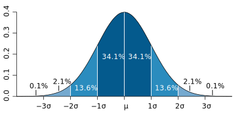

# Background {.tabset}

## Algoritma
The following coursebook is produced by the team at [Algoritma](https://algorit.ma) for its Data Science Academy workshops. The coursebook is intended for a restricted audience only, i.e. the individuals and organizations having received this coursebook directly from the training organization. It may not be reproduced, distributed, translated or adapted in any form outside these individuals and organizations without permission. 

Algoritma is a data science education center with bootcamp programs offered in:

- Bahasa Indonesia (Jakarta campus)  
- English (Singapore campus)

### Lifelong Learning Benefits
If you're an active student or an alumni member, you also qualify for all our future workshops, 100% free of charge as part of your **lifelong learning benefits**. It is a new initiative to help you gain mastery and advance your knowledge in the field of data visualization, machine learning, computer vision, natural language processing (NLP) and other sub-fields of data science. All workshops conducted by us (from 1-day to 5-day series) are available to you free-of-charge, and the benefits **never expire**. 

### Second Edition
This coursebook is initially written in 2017.

This is the second edition, written in late August 2020. Some of the code has been refactored to work with the latest major version of R, version 4.0. I would like to thank the incredible instructor team at Algoritma for their thorough input and assistance in the authoring and reviewing process.

## Libraries and Setup
We'll set-up caching for this notebook given how computationally expensive some of the code we will write can get.
```{r setup}
options(scipen = 9999)
rm(list=ls())
```

You will need to use `install.packages()` to install any packages that are not already downloaded onto your machine. You then load the package into your workspace using the `library()` function:
```{r}
library(skimr)
```


## Training Objectives
The primary objective of this course is to pave the statistical foundation for more advanced machine learning theories later on in the specialization. The syllabus covers:

- **Descriptive Statistics**
- 5 Number Summary 
- Statistical Plots for Descriptive Statistics  
- Working with Quantiles  
- Central Tendency and Variability
- z-Score and Central Limit Theorem  

- **Inferential Statistics**  
- Probability Mass Function
- Probability Density Function
- Confidence Intervals  
- Hypothesis Test
- p-Value Interpretation

By the end of the workshop, Academy students are required to complete one the following Learn-By-Building project: 

**Descriptive Statistics**  
Use a combination of statistical tools and plots to explain what you've learned from the data. Include at least 3 statistical plots, as well as a summary paragraph to describe any findings or points of interest at this stage.  

The learn-by-building project in this course is not graded. 

# Descriptive Statistics
Statisticians and data scientists use descriptive statistics to summarize and describe a large number of measurements. Many times, this task is accompanied with graphs and plots that help describe the numerical summary of data. When data science is applied in the business context, an example of descriptive statistic is the average number of transactions per month. Another example is the percentage of e-commerce transactions with a voucher code applied. The simple rule is that descriptive statistics **do not involve generalizing beyond the data we have obtained, and are merely descriptive of what we have at hand**. The branch of statistics that deal with drawing inferences about the larger population is called inferential statistics. 

Let's start by reading in the `retail` dataset:
```{r}
retail <- read.csv("data_input/workshop.csv")
```

Notice that because we did not pass the `stringsAsFactors=F` parameter, the function's default behavior is to convert any character variables into factor variables. In the last workshop we learned how to use `as.Date` and `as.character` to transform variables into the desired type but here let's see how we can combine these two "converter" functions with `lapply` to make our code more concise:    
```{r}
retail[,1:2] <- lapply(retail[,1:2], as.Date)
retail[,c("Customer.ID", "Product.Name")] <- lapply(retail[, c("Customer.ID", "Product.Name")], as.character)
```

In the first line of code, `lapply` takes `as.Date` as a function and apply that function over the first two variables: `Order.Date` and `Ship.Date`. Notice that with `lapply` instead of writing 4 or 5 converter functions, each time substituting the variable names, we could just do it in one go! 

In describing data, we are typically concerned with the task of quantifying and comparing **central tendency**, **variability**, and the **shape** of our data. 

## Measures of Central Tendency
Often times in the exploratory data analysis phase, we want to get a sense of what the _most representative score_ of a particular measurement is. We often simplify this idea by referring to it as the "average", but there are in fact, three measures of central tendency that you need to have in your statistical toolset. 

The most popular measure of central tendency is the _mean_, which is sometimes represented as $\bar{x}$ when computed on a _sample_ and represented as $\mu$ when computed on a population. Mean is really the sum of all your measurements, divided by the number of measurements, and works best on data that has an even distribution or a normal distribution (don't worry if the idea of a normal distribution isn't clear - we'll get to that in a while!). In R, the `mean` function will return the mean:
```{r}
sum(retail$Profit)/length(retail$Profit)
mean(retail$Profit)
```

The median is the point of value that cuts the distribution into two equal halves such that 50% of the observations are below it. To find this value, we would order the observations and find the middle value that separates the distribution into two equal halves. 
```{r}
shipment.kg <- c(5,10,2,3,7)
# when we order it, we see the middle value being 5
shipment.kg[order(shipment.kg)]
# using median() yield the same result
median(shipment.kg)
```

For data with odd number of observations, the median is the middle value but for data with an even number of observations we would instead use the average of the two middle scores:  
```{r}
shipment.cost <- c(5,10,2,6,8,8)
# when we order it, we see the middle value being 7
shipment.cost[order(shipment.cost)]
# using median() yield the same result
median(shipment.cost)
```

We need to be cautious when applying the `mean` on data with a skewed distribution because the mean may not be the best candidate for a **most representative score** compared to other measures of central tendency. For example, a company surveys its employees household income and posted the following monthly household income (IDR, in Mil):
```{r}
salary <- c(7.8, 7.5, 6, 7.5, 4.5, 105, 45, 7.5, 5.5, 4)
mean(salary)
median(salary)
```

While the median puts that figure at about 7.25, the mean is about 2.67 times higher and is not truly representative of the actual household income. While most of the employees have a combined household earning of less than 8 mil, the mean value of our household income would have believe that the average household income of our employees is in fact more than 20 mil IDR. 

The median in this case is a better measure of centrality because it is not sensitive to the outlier data.

If we are in fact, _required_ to compute the mean on data with skewed distribution, another technique to reduce the influence of outlier data is to use a slight variation of the mean, called the Trimmed Mean. The trimmed mean removes a small designated percentage of the largest and smallest values before computing the mean. A trimmed mean that computes the middle 95% of the distribution can be performed in R fairly easily:
```{r}
# 5% of observations to be trimmed
mean(retail$Profit, trim = 0.05)
```

When there are discreet values fora variable, the statisyical mode refers to the value that occurs most frequently. This statistic is rarely used in practice. Say we are surveying the number of times a customer place a booking in our travel booking app over the period of a year and collected the following sample:
```{r}
numberoftravels <- c(2,2,3,1,0,4,2,5,1,2,4)

most <- function(x){
  as.integer(names(sort(-table(x)))[1])
}

most(numberoftravels)
```

Because R do not have a built-in way of computing the mode, we wrote the code above to tabulate our data (using `table`), multiply the calculation by -1 (and hence giving it the effect of sorting our data in descending order) and then pick the first value.

## Measures of Spread
Measures of spread measures the extent to which **value in a distribution differ from each other**. In practice, it is far easier to compute the distance between the values to their mean and when we square each one of these distances and add them all up the average[^note_1] of that result is known as **variance**. Taking the square root of the variance will result in the **standard deviation**. Just like the mean, standard deviation is the "expected value" of how far the scores deviate from the mean. 

```{r}
sum((numberoftravels - mean(numberoftravels))^2)/(length(numberoftravels)-1)
var(numberoftravels)
```

And taking the square root of variance yields the standard deviation:
```{r}
sqrt(var(numberoftravels))
sd(numberoftravels)
```

Variance and standard deviation are always positive when the values are not identical. When there's no variability, the variance is 0. Because variance and standard deviation are sensitive to every value, they may not be the most "representative" measurement for skewed data. 

Other measurements of the spread are the **range** and the **interquartile range**. The range is the distance from our smallest measurement to the largest one:
```{r}
max(numberoftravels) - min(numberoftravels)
diff(range(numberoftravels))
```

The interquartile range is the range computed for the middle 50% of the distribution:
```{r}
IQR(numberoftravels)
as.numeric(quantile(numberoftravels, 0.75) - quantile(numberoftravels, 0.25))
```

While we can use `quantile()` to obtain the 3rd and 1st quartile individually, these two figures are also presented together with the 0th (the `min()`), 50th (the `median()`), and the 100th (the `max()`) quartiles: together they are called the five-number summary. 

When we call `fivenum()`, we get this summary that we can use as a measure of variation for even potentially skewed data:
```{r}
fivenum(retail$Profit)
```

From the above, observe that the absolute lowest profit (the `min`) approximates 6,600 and the highest profit approximates 8,400 (the `max`); Observe also that 25% of our transactions make a profit of less than 1.728. Half of the transactions (the middle 50% of the value) make a profit between 1.728 and 29.364 - recall that this range is called the _interquartile range_ (IQR). When we use `summary()` on continuous data, we'll get the five number summary and the mean in return: 
```{r}
summary(retail$Profit)
```

A related concept to standard deviation, that is quite foundational to inferential statistics when we come to that later, is the standard error of the mean. 

Standard error of the mean is a measure that estimates how close a calculated mean (sample) is likely to be to the true mean of that population; It is calculated by dividing the standard deviation of the sample data by the square root of the number of observations:
```{r}
library(psych)
sd(numberoftravels)/sqrt(length(numberoftravels))
describe(numberoftravels)$se
```

On a normal distribution (we'll get to this in a moment), 67% of the time the true population mean will lie within the range of +- 1 SE. In other words, if we can establish a normal distribution, we can theorize about the true value of the population mean with a range. Because of the formula:  
$SE = \frac{\sigma}{\sqrt{n}}$  

The larger our sample size _n_ gets, the smaller SE will be: and hence we are less uncertain about our estimation of the true population mean. 


**Quiz 1: Which financial assets has more votality in their annual price?**  
```{r}
price.coins <- c(1.4, 0.4, 0.8, 1.1, 1.8, 2.2, 2.3, 1.2)
price.oil <- c(1.6, 1.2, 1.9, 0.8, 0.6, 1.5, 2.1, 1.5)
```

The primary measure of votality used by stock traders and financial analysts is standard deviation, and recall that this metric reflects the average amount of an item's price over a period of time. While the price for our fictional "oil" asset and "coins" asset averaged out to be USD 1.4 over time, which of these two present a higher votality than the other? 

## Covariance and Correlation
When we have two samples, X and Y, of the same size, then the covariance is an estimate of how **variation in X is related to the variation in Y**. Covariance measures how two variables _covary_ and is represented as:  
$Cov(X, Y) = \frac{1}{n-1}\sum\limits^n_{i=1}(X_i - \mu_X)(Y_i - \mu_Y)$

```{r}
sum((price.coins - mean(price.coins))*(price.oil - mean(price.oil)))/(length(price.coins)-1)
cov(price.coins, price.oil)
```

Getting a negative covariance means that smaller X tends to be associated with larger Y (and vice versa). The covariance of any variable with itself is its variance[^note_2]. Notice also that cov(X,Y) = cov(Y,X). 

```{r}
cov(price.coins, price.coins)
var(price.coins)
```

And to find the correlation instead of the covariance, we would just use `cor()` instead. Correlation, unlike covariance, is not sensitive to the units in which our variables X and Y are measured and hence more useful for determining how strong the relationship is between variables: 
```{r}
cor(price.coins, price.oil)
```

Some facts about correlation:  
- Cor(X,Y) == Cor(Y,X)  
- -1 <= Cor(X,Y) <= 1  
- Cor(X,Y) is 1 or -1 only when the X and Y observations fall perfectly on a positive or negatively sloped line  
- Cor(X,Y) = 0 implies no linear relationship  

### [Optional] Additional Mathematical Details & Proof 
The variance of a random variable can be defined as:  
$Var(X) = E(X^2) - E(X)^2$  

```{r}
# Notice this gives us different answer from var(price.coins) 
# because var() in R uses (n-1) as divisor to give us an unbiased estimator
# of population variance. We calculate by hand using (n) instead assuming that
# all 8 observations represent the full population
mean(price.coins^2)-
(mean(price.coins))^2

sum((price.coins - mean(price.coins))^2)/length(price.coins)
```

Which can be rewritten as:  
$Var(X) = E(XX) - E(X)E(X)$  

With this version of the Variance equation, we can now ask, "What if one of the Xs were another variable, Y?":  
$E(XY) - E(X)E(Y)$  

```{r}
# Population covariance
mean(price.coins * price.oil) - mean(price.coins) * mean(price.oil)
sum((price.coins - mean(price.coins))*(price.oil - mean(price.oil)))/(length(price.coins))

# Estimator of the Population Covariance
sum((price.coins - mean(price.coins))*(price.oil - mean(price.oil)))/(length(price.coins)-1)
cov(price.coins, price.oil)
```

And this above, is the definition of Covariance $Cov(X,Y)$, while variance measures how a variable varies with itself covariance measures how one variable varies with another. 

Since $Cov(X,Y) = E(XY) - E(X)E(Y)$, then $Cov(X,X) = E(XX) - E(X)E(X)$ and recall that $Var(X) = E(X^2) - E(X)^2$ and hence the covariance of a variable with itself is really just the variable. 

If the formula for covariance is still confusing, it's helpful to recall the formula for variance and understand that covariance is just a measure of how variables **co-vary**. Since variance is given as:  
$S^2 = \frac{1}{n-1} \sum \limits^{n}_{i=1}(X_i-\bar{X})^2$  

And Covariance can be given as:
$Cov(X,Y) = \frac{1}{n-1} \sum \limits^{n}_{i=1} (X_i-\bar{X})(Y_i-\bar{Y})$

But there is a problem with covariances: they are hard to compare because variables are sometimes expressed in different units or scales. It is hard to tell if there is an "objectively stronger" variance between UK Pound and Indonesia Rupiah or bitcoin prices and the US dollar because the "scale" at which we measure and compute the covariance on is different.  

One solution is to "normalize" the covariance: we divide the covariance by something that encapsulate the scale in both the covariates, leading us up to a value that is bounded to the range of -1 and +1. This is the **correlation**. Whatever units our original variables were in, this transformation will get us a measurement that allow us to compare whether two variables exhibit a correlation stronger than another:  

$Corr(X,Y) = \frac{Cov(X,Y)}{\sqrt{Var(X)Var(Y)}}$  

```{r}
cov(price.oil, price.coins) / sqrt(var(price.oil)*var(price.coins))
cor(price.oil, price.coins)
```


## The normal distribution  
Another way of studying the central tendency and spread of data is through a curve: a curve is often used to represent a distribution and the most famous of all distributions is the normal curve.  

A normal distribution with a mean of 0 and standard deviation of 1 is called a **standard normal curve** and can be plotted with `curve(dnorm)` while specifying the limits for our x-axis:
```{r}
curve(dnorm, -3.5, 3.5, lwd=2, axes = FALSE, xlab = "", ylab = "")
axis(1, at = -3:3, labels = c("-3s", "-2s", "-1s", "mean", "1s", "2s", "3s"))
```

When a measurement follows a standard normal distribution, then the assumptions of a normal distribution can be applied to the data and these assumptions can be completely specified by two parameters, which are the mean and standard deviation. The empirical rule of a standard normal gives us the following:  

- 68% of data will fall within 1 standard deviation of the mean  
- 95% of data will fall within 2 standard deviations of the mean
- 99.7% of data will fall within 3 standard deviations of the mean

Scroll back to the normal curve we plotted above, observe:  
- It is perfectly symmetrical
- It is unimodal (has only a single mode)  
- Area under curve is 1

One relating idea that gives the normal distribution such significance is known as the **Central limit theorem**: it says that when we have many independent variables generated by all kinds of distributions, the aggregate of those variables will tend toward a normal distribution assuming of course the lack of any extraordinary intervention. This universality is observed across different domains making the normal distribution a core centerpiece in applied statistics and mathematics. 

As an exercise, I'd like you to generate 50 random numbers using `rnorm(50, 0, 1)` indicating mean of 0 and standard deviation of 1. Print the result. Now, go ahead and save that as a variable, say, `x`. You can use `density()` in conjunction with `plot()` to now plot the 50 random numbers:

```{r}
x = rnorm(50,0,1)
plot(density(x))
```

Supposed you were to change 50 to 500, and then to 5000 and even 50000, what did you observe? The key takeaway here is that as the number of sample approach infinity this plot will eventually converge in distribution to the standard normal. 

Take some time to work through the above concepts if any of these are new to you. When you're ready, we're hop into inferential statistics and talk about continuous random variables and the **probability density function**. 

# Inferential Statistics
## Probability Density Function
When we're thinking about continuous random variables (blood sugar level, height, rainfall amount), it is important to realize that this variable has an uncountable number of possible values, even between two real intervals. The resulting probability distribution of the variable can be described by a probability density, where the probability is found by taking the area under the curve. 



## Probability Mass Function
Discrete random variables (number of player injury, amount of defaulted loans, travel bookings per customer), on the other hand, can be described using a probability mass function, which maps each value of the random variable to a probability:  
- p(0 bookings) = 0.28  
- p(1 booking) = 0.09  
...
- p(6 bookings) = 0.004

Because they are probabilities, these individual probabilities have to sum up to 1. 

## Real Life Examples: Why these attributes are important
Going back to the standard normal distribution - you may be asking by now how any of what you're learning in the past few chapters are useful. To answer the question, I feel it is only appropriate we solidify these intuition with a few concrete examples. Consider the following scenario:

The height of men in Indonesia is normally distributed with a mean of 160cm and a standard deviation of 7cm. What is the probability of a randomly selected man being taller than 175cm?

The solution: 175cm is 15cm above the mean, and dividing that by the standard deviation of 7cm, we get 2.143. We refer to this as the _z-score_. The probability of an Indonesian men being taller than 175cm is P(Z > 2.143)

```{r}
z <- (175-160)/7
pnorm(z, lower.tail=F)
# equivalent: 1-pnorm(z)
```

**Quiz 2: Supposed we have a population mean of 180cm and standard deviation of 8cm, what is the probability that a randomly picked person being shorter than 174cm?**  
```{r}
#====Your Solution====
```

The Z-scores we used above is useful when relating different measurement distributions to each acting as a common denominator. Essentially, a z-score gives us a "standardized" unit that measure how many standard deviations is a particular statistic away from the mean. This property, as we'll see, is paramount to many statistical hypothesis tests, performance evaluation (more of that when we get to the Machine Learning courses), and in the construction of confidence or prediction intervals. 

## Confidence Intervals
To summarize what we've learned so far: 
- Populations are characterized by descriptive statistics ("parameters")  
- Inferences about these parameters are drawn from sample statistics  
- In estimating the population parameters we want to quantify the certainty or reliability of our estimates  

We often begin our estimation with a point estimate, using for example the sample mean $\bar{x}$ as a point estimate of the population mean $\mu$. We can then construct confidence intervals around our point estimates so we have an interval that may contain the true value of the parameter. When statisticians say a "95% confidence interval", what they mean is that if we create 100 confidence intervals of the same size from a given population, we expect to find the true parameter (let's say the population's net savings per household) in 95 of them. 

We construct a confidence interval by taking the point estimate +/- margin of error, where margin of error is computed as:  
$E = Z_{\alpha/2} * \frac{\sigma}{\sqrt{n}}$

Because confidence intervals are two-sided the level of significance we chose (alpha) has to be divided into halves. When we compute by finding the z-score associated with a value of 2.5% (0.025) on each end, we end up looking at the middle 95% of the area under the curve. We can use `qnorm(0.025)` to help us find the z-score associated with a 95% confidence interval. 
```{r}
# 95% confidence interval
qnorm(0.025)
# 99% confidence interval
qnorm(0.005)
```

Again, let's put together a scenario to make all of this more concrete. Say we want to know the average annual dividend payout in a particular industry, and had known through an earlier study that this figure resembles a normal distribution with a population standard deviation of 2.4%. We looked at the public books of these 81 companies in said industry and attain a sample mean of 11.8% (that is, the average company from this group of 81 companies pay 11.8% of profit to their shareholders annually). We want to construct a 95% confidence interval for the $\mu$, the mean dividend payout.

Solution: 
- Z-score associated with a 95% confidence interval is 1.96  
- The standard error of the mean (SE) is 2.4/sqrt(81) = 0.267
- The margin of error (E) is 1.96*SE = 0.524  
- The confidence interval is 11.8% +- 0.524%

And so we can say that the 95% confidence interval for the mean dividend payout in this industry is **(11.28%, 12.32%)**. We can be 95% confident that this interval will contain the mean dividend payout for this particular industry. 

## Hypothesis Test and p-value
In your day to day data science work, you will often be required to explain the model's reliability and uncertainty, and the formal process of such is specified as something called the **test of significance**. Statistical significance often reference the **p-value**, a measure of the probability of obtaining a result equal to or more extreme than what was actually observed, assuming the null hypothesis is true. 

Imagine a scenario where you're assigned to consult on Quicker, a startup that simplify and automate government grants application for newly incorporated startups. Through public announcements and official records, you find that the average duration for a newly incorporated startup to get its first government grant or financial funding is 215 days (with a population standard variance of 24 days, again through official records). Of the 35 entrepreneurs using Quicker platform, the average time is 178 days. 

**Quiz 3: Does this observation (178 days) deviate away from the population enough for it to be statistically significant? Use a 95% confidence interval**  

The null hypothesis is $H_0: \mu = \mu_0$  
The alternative hypothesis is: $H_A: \mu < \mu_0$

The null hypothesis is that our new mean **equals to** the original mean, whereas the alternative hypothesis states that the mean of Quicker customers **is lower than** the original mean.

Recall what we've learned about the z-score, we can compute the p-value as follow:
```{r}
z <- (178-215)/24
pnorm(z)

# equivalent: pnorm(178, 215, 24)
```

While we can reject the null hypothesis at the 95% confidence level if our p-value is <= alpha (0.05), this is not the case here as our p-value is actually 0.0616. In this scenario, we fail to reject the null hypothesis that the Quicker platform did in fact led to a statistically significant reduction in government funding time.

## T-Test
Generally, z-tests are used when we have a large enough sample size (rule of thumb is n >= 30) and when the population standard deviation is known. If the above conditions aren't met, we can instead use a statistical measurement known as the Student's t-test. Say grant automation platform has 10 users so far, and below is a vector named `duration` that stores the number of days it takes for their first government funding. Supposed also that the population standard deviation (sigma) is not known. 

In R we can use `t.test(x, mu)` and pass in an optional alternative hypothesis. Here we're interested in finding out whether we can reject the null hypothesis (that says there is no difference in government funding time for Quicker startups and other startups) in favor of the alternative hypothesis (that Quicker startup spend **less** time on average to acquire their first grant):
```{r}
duration <- c(184, 181, 230, 169, 158, 204, 220, 197, 219, 223)
t.test(duration, mu=215, alternative = "less")
```

As you progress along the Machine Learning Specialization, many of the models you will come across will inevitably make use of these statistical tools we have discussed. You will see plenty application of p-values, confidence intervals, and the numerous statistical methods we've just learned. 

Because this is a **Practical Statistics** workshop, I want to dedicate the following chapter to tips and techniques you can incorporate into your data science work using the goodness that has been baked into R. 

# Tips and Techniques: Working with Statistics in R
1. Density Plots
```{r}
plot(density(retail$Profit, from=-100, to=100))
```

```{r}
plot(density(retail$Profit, from=-100, to=100), col="goldenrod3")
lines(density(retail$Sales), col="dodgerblue2")
```

2. Boxplots
```{r}
boxplot(Profit ~ Category, retail, ylim=c(-100, 100))
```

3. Using `skim()` for better summary statistics:
```{r}
library(skimr)
# skim(retail[,c("Sales", "Quantity", "Discount", "Profit")])
skim(retail[,10:13])
```

4. Pairs Matrix
```{r}
pairs(retail[,c("Sales", "Quantity", "Discount", "Profit")])
```


```{r}
# 2x2 pictures on one plot, square plotting region
op <- par(mfrow=c(2,2), pty="s")

par(mfrow=c(1,3))
hist(retail$Sales, breaks = 100, xlim=c(0,2500), main="")
plot(density(retail$Sales, from=0, to=2500), main="")
plot(sort(retail$Sales), pch=".")
title(main = "Three Statistical Plots", outer = T)
# end of plotting, reset to previous settings
par(op)
```


**Learn-By-Building: Statistical Treatment of Retail Dataset**  
Using what you've learned, formulate a question and derive a statistical hypothesis test to answer the question. You have to demonstrate that you're able to make decisions using data in a scientific manner. Examples of questions can be:  
- Is there a different in profitability between standard shipment and same-day shipment?  
- Supposed there is no difference in profitability between the different product segment, what is the probability that we obtain the current observation due to pure chance alone?  

You can think about the kind of business question you'd like to tackle, and you are free to choose the reasonable parameters for your confidence intervals and other statistical tests. Explain your decision-making process. 

This learn-by-building module is not graded. 

# Additional Remarks

[^note_1]: While I use the word _average_, the sum of squared difference is in fact divided by $n-1$ instead of $n$ when we're estimating the standard deviation (or variance) of the population from the equivalent sample statistic. This is because the observed values fall on average closer to the sample mean than the population mean, the standard deviation which is calculated using deviations from the sample mean underestimates the desired standard deviation of the population. Using $n-1$ instead of $n$ as the divisor corrects for that "underestimation" by making the result a little bigger. 

[^note_2]: Refer to Optional part: Additional Mathematical Details & Proof 

