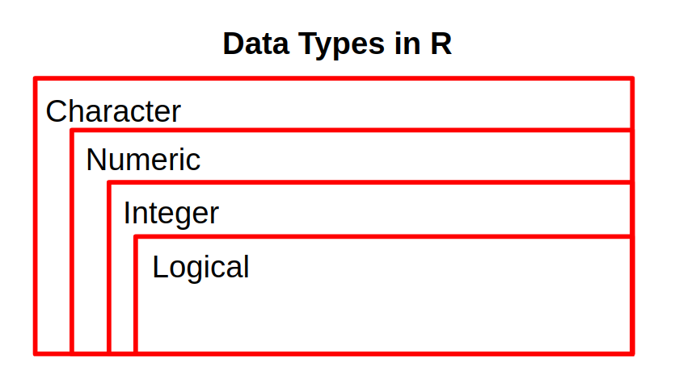
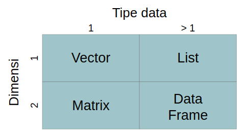
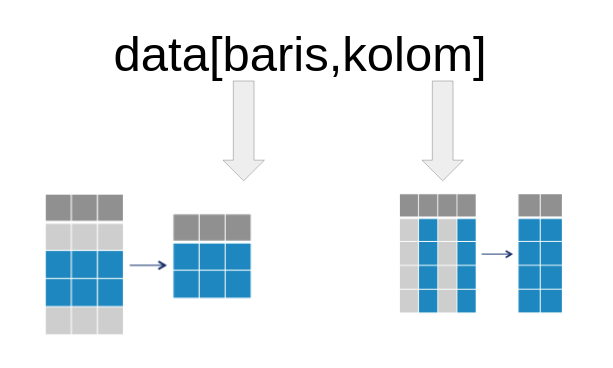

```{r setup, include=FALSE}
knitr::opts_chunk$set(echo = TRUE)
```

# Basic R Programming

## Introduction to R Markdown

Bagian putih dari R Markdown (.Rmd) berguna untuk menulis narasi. Pada bagian ini dapat ditambahkan heading dengan menambahkan hashtag `#` sebelum kalimat. Narasi yang tidak ditambahkan `#` sebelum kalimat akan menjadi paragraf biasa.

Bagian abu-abu dari Rmarkdown adalah `chunk`. Chunk berguna untuk menulis **code**. 

```{r}
12 - 2
12 + 12 +  7
32
```

**Tips**
gunakan shortcut untuk membuat, dan menjalankan chunk agar lebih efisien. 
- membuat chunk : ctrl + alt + i
- menjalankan satu baris pada chunk : ctrl + enter
- menjalankan seluruh baris pada chunk : ctrl + shift + enter

## Object
Untuk pengolahan data di R, data atau sebuah value dapat disimpan/diassign ke dalam object. Untuk assign object dapat menggunakan `<-` dan hasilnya akan tersimpan pada environment.

**Tips**
gunakan shortcut `alt + -` untuk membuat tanda <-
 
```{r}
nama <- "David" 
```
 
### Overwrite object

apabila object yang sama diisi dengan nilai yang berbeda maka nilai yang akan diambil adalah nilai terakhir. 

apa isi dari object `object1` ?
```{r}
object1 <- "Jakarta"
object1 <- "Bogor"
```
 
 
## Case Sensitive

R merupakan bahasa pemrograman yang case sensitive, hal ini berarti penamaan kapital dan non-kapital sangat berpengaruh. 
 
```{r}
obj2 <- "Algo"
obj3 <- "algo"
obj2 == obj3
```

```{r}
OBJ3 <- "David"
```
 
```{r}
obj3 
```
 


## Comment 

Untuk memasukan narasi dalam chunk dapat menggunakan **comment** dengan menambahkan `#` sebelum narasi tersebut. Comment tidak dianggap sebagai codingan dalam chunk, sehingga tidak akan menimbulkan error.

```{r}
# ini adalah komentar
kota <- "Bogor" # Bogor itu ada di jawa barat 
kota
```


**Tips**
untuk memberikan comment bisa menggunakan shortcut `ctrl + shift + c`

```{r}
# komen 1
# komen 2
# komen 3
```


**Dive Deeper 1 (3- 7 menit)**

1. Buat 3 Buah object dengan nama dan isi sebagai berikut :     
- `nama`     : Nama anda    
- `kota`     : Kota tempat anda tinggal     
- `provinsi` : Provinsi tempat anda tinggal

setelah membuat keempat object diatas, berikan komentar pada setiap akhir baris
```{r}
# code here

# code here 
nama <- 'Ani Susanti' # Nama saya adalah Ani Susanti
kota <- 'Tangerang' #Saat ini saya tinggal di Tangerang 
provinsi <- 'Banten' #Tangerang berada di dalam provinsi Banten 

# code here 
nama <- "Calvin" #yo soy 
kota <- "Jakarta" #City 
provinsi <- "DKI" #province 

nama <- "Ardy" 
kota <- "Brussels"
provinsi <- "Brussels" 

```

2. Object `tahun` dibawah berisi value 2020. ubah object tahun dengan `2021` dengan melakukan **overwrite** pada object tahun

```{r}
tahun <- 2020    # mengubah value pada tahun

```

## Directory

untuk mengetahui lokasi directory dari lokasi Rmd bisa menggunakan fungsi `getwd()`

segala sesuatu yang ada () itu adalah function/ fungsi
```{r}
getwd() # detailnya akan dibahas di hari ke2
```
Tipe data
struktur data

## Data Type

### Character

Tipe data yang berisi huruf/karakter.
ciri2 : diawali dan diakhir dengan tanda petik ("")

untuk mengetahui tipe data pada suatu object bisa menggunakan fungsi `class()`
```{r}
nama <- "David"
divisi <- "product"
class(nama)
class(divisi)
```


### Numeric

Tipe data berisi angka yang dapat berupa angka kontinu (ada koma/pecahan), maupun diskrit (bilangan bulat tanpa koma).

```{r}
periode <- 1.3
periode <- c(12, 33, 1.2)
class(periode)
```

### Integer

Tipe data berisi angka yang berupa angka diskrit (bilangan bulat tanpa koma). Umumnya dari data ID (costumer ID, transaction ID, dll). Untuk memaksa numeric menjadi integer, dapat gunakann L dibelakang angka.

```{r}
obj_int2 <- c(12,33,45,56) # c untuk menggabungkan beberapa nilai dalam satu object
class(obj_int2)
```


```{r}
obj_int <- c(1L,12L, 33L,11L)
class(obj_int)
```

### Logical

Tipe data yang hanya berisi `TRUE` atau `FALSE`. Penulisan TRUE/FALSE dapat disingkat menjadi T/F.

```{r}
status <- c(TRUE, FALSE, T, F)
class(status)
```



```{r}
mix <- c( 26L, TRUE,T, "FALSE")
class(mix)
```

```{r}
comp <- c(3i+1, 2i+2) # jarang digunakan
class(comp)
```


Summary

- R : bahasa pemrograman
- R Studio : tempat ngodingnya

- R Studio Panel :
  - console : tempat buat ngoding (mirip sama R, ga bisa langsung di edit)
  - source : source code nya, rmd dkk
  - Environment : history object yang ada 
  - files: direcory yang kita buka
  
- file materi
  - .html : materi web base
  - .Rmd  : materi versi R
  - .Rproj: wadahnya, ngebungkus 1 project (bikin semua dalam  satu workspace)
  
- R markdown
  - chunk : tempat menulis code
  - non-chunk : tempat untuk menulis hasil analisa
  
  
- R bersifat *case sensitive* sehingga kapital dan non-kapital adalah hal yang berbeda
- untuk memberikan comment dalam chunk bisa menggunakan `#`
- ketika sebuah object yang sama diisi dengan 2 nilai yang berbeda nilai yang diambil adalah nilai paling terakhir


urutan tipe data yang paling general sampai yang paling spesifik adalah 

chr > num > int > log

-- End of Day 1--
-- Day 2 --

**Dive Deeper 2**

buat 3 buah object yang berisi minimal 3 value dengan kriteria sesbgai berikut :
- `makanan` : makanan yang anda suka
- `harga`  : harga dari setiap makanan
- `status` : status ketersediaan (TRUE : ada, FALSE: habis)

dan cek tipe datanya menggunakan fungsi class()

```{r}
# Pak Janu
makanan <- c("sop iga", "iga bakar", "sop buntut")
harga <- c(45000,50000,90000) 
status <- c(T,F,T) 

class(makanan)
class(harga)
class(status) 
```

```{r}
c("FALSE", "12L", "12.123") # semua ini adalah chr
```


Bagaimana bila campuran?
```{r}
mix <- c(1000, TRUE, "Tempe")
class(mix)
mix
```

## Data Structure
4 Struktur data 

bagaimana suatu data disusun

### Vector

fungsi untuk membuat : `c()`    
karakteristk : 
- 1 dimensi (baris saja)
- hanya bisa menampung 1 tipe data yang sama saja    

```{r}
jabar <- c("Bogor", "Bandung", "Sukabumi")
jabar
```

**Perhitungan pada R (indexing) dimulai dari 1**

cara subset vector menggunakan `[]`


bagaimana caarnya bila saya ingin mengambil value "Bandung" pad object nama? 

```{r}
jabar[2]
# ambil Bogor dan Sukabumi
jabar[c(1,3)] # cara 1
jabar[-2] # cara 2. tanda - digunakan untuk exclude nilai pada index tersebut
```

#### Factor

factor merupkan bentuk perkembangan dari vector, yang membedakan vector dan factor adalah pada factor objek memiliki *levels*. 


```{r}
card <- c("Gold", "Platinum", "Silver", "Silver", "Gold")
card <- factor(card, levels = c("Silver", "Gold", "Platinum"))
card
```

kalau nilainya berulang jadikan dia factor

gender : "male" "female" <fct> 
name   : <chr>
id     : <chr>
job level : <fct>

### list

fungsi untuk membuat : `list()`
karakteristik : 
- berdimensi 1 (satu kolom)
- dapat memiliki lebih dari 1 tipe data

```{r}
list_temp <- list(2000, TRUE, c("tempe", "tahu"))
list_temp
```

input -> function() -> output
function()

() : itu adalah function
[] : subset data

```{r}
# bentuknya masih berupa list. dan data yang diambil adalah index dan valuenya
list_temp[2]
class(list_temp[2]) 
```

```{r}
list_temp[[2]]
class(list_temp[[2]]) 
```


```{r}
# ambil nilai tempe
class(list_temp[[3]][1]) 
```
[] : ambil index dan value
[[]] : value

```{r}
list_temp[[3]][1]
```


cara subset-nya?

```{r}
list_temp[[3]][2]
```

### Matrix

fungsi untuk membuat : `matrix()`
karakteristik:
- 2 dimensi (baris dan kolom)
- hanya bisa satu tipe data saja

: -> artinya sampai dengan 

11:16 -> nilai 11 sampai 16 

```{r}
# jarang membuat matrix secara manual
mat1 <- matrix(11L:16L, nrow = 2, ncol = 3)
mat1
```
cara subset matrix dengan menggunakan [index baris, index kolom]

15
baris : 1
kolom : 3

```{r}
mat1[1,3]
```


```{r}
mat1[1, 3]
```

### Data frame

fungsi untuk membuat: `data.frame()`
karakteristik :
- bisa lebih dari 1 tipe data
- berdimensi 2 (baris dan kolom)

notes : dbl == num
```{r}
buah_df <- data.frame(buah = c("Mangga", "Apel", "Durian"), 
           berat = c(14, 10, 25))
buah_df

```

bagaimana cara mengambil nilai pada kolom buah saja

$ : untuk mengakses kolom pada data frame

```{r}
buah_df$buah # cara 1
buah_df[,"buah"] # cara 2
buah_df[,1]

```


```{r}
buah_df[1,2]
```




Dive Deeper 3 (10 - 15 menit)

buat 4 buah vector dengan nama object dan isi sebagai berikut

- nama    : nama anda dan nama rekan satu breakout room anda (chr)
- kota  : kota anda tinggal dan rekan satu breakout room anda (chr)
- background  : latar belakang pendidikan anda dan rekan satu breakout room anda (chr)
- programming  : TRUE apabila anda atau rekan anda memilki basic programming, dan FALSE apabila sebaliknya (lgl)

setelah itu jadikan vector tersebut sebuah data frame yang bernama `algo_df`

```{r}
# code here

```


# Working with Data Frame

## Read and extracting data

untuk memasukkan data yang bertipe csv ke R kita bisa menggunakan fungsi `read.csv`. Pada workshop kali ini data yang digunakan adalah data *retail.csv* yang berada pada folder **data_input**

```{r}
getwd()
```


```{r}
retail <- read.csv("data_input/retail.csv") # sering
retail
```


### View()
Pada umumnya ketika bekerja dengan data kita ingin melihat data bentuk data secara keseluruhan, hal tersebut dapat dilakukan dengan menggunakan fungsi View().

```{r}
# View(retail)
```

### head() and tail()

Untuk melihat seluruh sebagian data yang sudah digunakan bisa menggunakan fungsi `head()` dan `tail()`. 
`head()` berguna untuk melihat beberapa baris pertama pada data (default 6)
```{r}
head(retail) # sering
```

sedangkan `tail()` untuk melihat beberapa data terakhir.

```{r}
tail(retail,7)
```

### str()

Untuk melihat tipe data yang dimiliki dapat mengguankan fungsi `str()`

```{r}
str(retail) # sering
```

Factor : 
Ship.Mode
Segment  
Category 
Sub.Category

Date : 
Order.Date
Ship.Date


### dim(), nrow(), ncol()

mengetahui dimensi dari data bisa menggunakan fungsi dim()
```{r}
dim(retail)
```

untuk mengetahui jumlah baris bisa menggunakan fungsi `nrow()` sedangkan jumlah kolom bisa menggunakan `ncol()`
```{r}
nrow(retail)
ncol(retail)
```

### summary

dengan menggunakan fungsi `summary()` kita bisa melihat rangkuman dari suatu data.

```{r}
summary(retail) # sering
```


**Knowledge Check**

1. Code yang tepat untuk melihat 10 baris *terakhir* pada data `retail` yaitu ?
- [ ] head(retail, 10)
- [ ] str(retail)
- [ ] summary(retail,10)
- [x] tail(retail,10)

2. Fungsi yang digunakan untuk *menampilakan dimensi data* serta *tipe data setiap kolom* secara sekaligus yaitu?
- [ ] dim()
- [ ] ncol()
- [ ] class()
- [X] str()

## Performing simple data cleansing

### explicit coercion


tahapan awal sebelum melakukan analisis data adalah memastikan bahwa data yang digunakan sudah bersih. salah satu teknik data cleansing yaitu mengubah tipe data ke dalam tipe data yang tepat.


```{r}
str(retail)
```

Terdapat beberapa kolom yang belum memiliki tipe data yang tepat seperti 


untuk mengubah tipe data kita bisa melakukan *explicit coercion* dengan menggunakan fungsi `as.xxx()` dimana xxx adalah tipe data yang diinginkan. 

Fungsi-fungsi explicit coercion diantaranya:

* as.character()
* as.Date()
* as.integer()
* as.numeric()
* dll.


harusnya date:

harusnya factor : 

Factor : 
Ship.Mode
Segment  
Category 
Sub.Category

Date : 
Order.Date
Ship.Date


```{r}
retail$Ship.Mode <- as.factor(retail$Ship.Mode) 
retail$Segment <- as.factor(retail$Segment) 
retail$Category <- as.factor(retail$Category) 
retail$Sub.Category <- as.factor(retail$Sub.Category)

```

cara sekaligus
```{r}
retail[,c("Ship.Mode", "Segment", "Category", "Sub.Category")] <- lapply(retail[,c("Ship.Mode", "Segment", "Category", "Sub.Category")],as.factor)
```

```{r}
summary(retail)
```

```{r}
tail(retail)
```


untuk bermain dengan tipe data date akan menggunakan package `lubridate`

format : format asal BUKAN format tujuan

```{r}
# ubah tipe data
retail$Ship.Date <- as.Date(retail$Ship.Date, format = "%m/%d/%y")
# ubah order data
retail$Order.Date <- as.Date(retail$Order.Date, format = "%m/%d/%y")
```

```{r}
# buat kolom durasi yang berisi jarak dari barang dipesan sampai dikirim
retail$durasi <- retail$Ship.Date - retail$Order.Date
head(retail)
```


Summary Day 2
Tipe data : 
  - Character
  - numeric
  - integer
  - logical
Struktur data:
  - Vector    : 1 dimensi; 1 tipe data; c()
  - list      : 1 dimensi; >1 tipe data; list()
  - matrix    : 2 dimensi; 1 tipe data; matrix
  - dataframe : 2 dimensi; >1 tipe data; data.frame()

working with data frame
read data     : read.csv()
melihat sebagian data :  head() tail()
struktur data : str() ; tipe data yang tidak tepat
rangkuman data :summary() ; 


chr -> factor
as.factor()
numeric -> integer
as.integer()
numeric -> chr
as.character()

char -> data
as.Date()

-- End Of Day 2--
note : as.Date blm dibahas

-- Day 3 --

### Missing Value

Untuk mengetahui apakah terdapat missing value pada data, kita bisa menggunakan fungsi `anyNA()`

```{r}
anyNA(retail) # cek NA pada seluruh data
```

untuk mengecek missing value pada setiap kolom dapat menggunakan fungsi `is.na()` dan `ColSums()`

```{r}
colSums(is.na(retail))  # menghitung NA u/ setiap kolom
```

Pada data retail tidak didapati missing value. Proses imputasi missing value akan dibahas pada course *machine learning*.

1. Kenapa dia bisa NA?
   - lupa isi 
   - NA mewakili suatu nilai (0)
2. Data yang NA itu bisa dicari ga datanya? (join data)
3. data dibuang / data diisi?
  dibuang : <  5% dibuang
    - baris atau kolom ? 
  diisi: 
    - 0
    - data hari sebelumnya
    - ukuran pemusatan (rata2, median, modus)
    - ML

< 2% total data

- dibuang
- diisi pakai rata
- diisi pakai machine learning
- dilihat dulu kepentingan data

### subsetting

Pak Janu : dari df retail, sy mau cari customer id yg dia order thn 2015-2016 tapi tidak order lagi tahun 2017 

untuk melakukan subsetting pada R anda akan membutuhkan [,]. Ilustrasi penggunaan [,] dapat dilihat seperti gambar dibawah



Dari data retail, ambil data dengan index 10 hingga 20

```{r}
retail[10:20,]
```

Dari data retail ambil kolom kolom `Ship.Date` dan `Ship.Mode`

```{r}
retail[,c("Ship.Date","Ship.Mode")]
```


Gabungkan kedua subset diatas
```{r}
retail[10:20, c("Ship.Date", "Ship.Mode")] 
```

Dari data `retail` ambil data pada index 100 sampai 500 dan kolom yang diambil hanya `Product.Name`, `Quantity`, dan `Profit`

```{r}
retail[100:500, c('Quantity','Profit','Product.Name')]
retail[c(1:5,7,9,11), c('Quantity','Profit','Product.Name')]

```

anda juga dapat menggunakan logical operator sebagai kondisi dari subset yang diinginkan

**Logical Operator untuk baris:** 

* `>` lebih dari
* `<` kurang dari
* `>=` lebih dari sama dengan
* `<=` kurang dari sama dengan
* `==` mengecek kesamaan 2 nilai
* `!=` tidak sama dengan
* `&` dan
* `|` atau
*` %in%`
* `!` negasi 

x %in% y : yang diambil adalah kondisi ada/ TRUE
! (x %in% y) : yang diambil adalah kondisi tidak ada/ FALSE


berapa banyak transaksi pada data `retail` yang memiliki `Profit` lebih dari 4000. tampilkan kolom `Product.Name` dan `Profit` saja

Profit > 4000
baris atau kolom?

`Product.Name` dan `Profit`
baris atau kolom?

5 transaksi

```{r}
retail[retail$Profit > 4000, c("Product.Name", "Profit") ]
```

berapa banyak transaksi yang dikirim menggunakan `second class` atau `Standard Class` (Ship.Mode)  dan nilai Sales lebih dari 500

(Second | Standard) & Sales > 500


Second class ; Sales 450


```{r}
# 5,968
# Salah
retail[retail$Ship.Mode == "Standard Class" |
         retail$Ship.Mode == "second class" & 
         retail$Sales > 500, ]
```


```{r}
#  1,945
# Salah
retail[c(retail$Ship.Mode == "Second Class" |
           retail$Ship.Mode == "Standar Class" & 
           retail$Sales > 500),]
```


```{r}
# 917
cara3 <-  retail[c((retail$Ship.Mode == "Second Class" | 
                      retail$Ship.Mode == "Standard Class") & 
                     retail$Sales>500),]
summary(cara3)
```


```{r}
# 6,203
# salah
retail[retail$Sales > 500 & retail$Ship.Mode == "Second Class" | retail$Ship.Mode == "Standard Class", ]
```


```{r}
# 682
retail[retail$Sales>500 & retail$Ship.Mode == "Standard Class" | retail$Ship.Mode == "Second Class",] 
```


**Dive Deeper 2** (7 - 10 menit)

Sebagai seorang analis yang hendak menelusuri performa penjualan suatu perusahaan. Jawablah beberapa pertanyaan berikut

1. Berdasarkan data `retail` berapa banyak `Category` *Furniture*, yang dikirim (`Ship.Mode`) dengan tipe *Standard Class* ?

```{r}
# your code
no1 <- retail[retail$Category == "Furniture" & retail$Ship.Mode == "Standard Class", ]
nrow(no1) #1,248
```

2. Berapa banyak transaksi yang memiliki Profit diatas rata rata dan Quantity barang yang terjual dibawah 3?
mean()

```{r}
# your code
retail_no2 <- retail[retail$Profit > mean(retail$Profit) & retail$Quantity <3,]
nrow(retail_no2)
```


3. ambil data yang memiliki Sub.Category sebagai berikut
Chairs, Art, Copiers, Paper
logical operator %in% berguna untuk mencari data yang ada pada vector

```{r}
sub_retail <- c("Chairs", "Art", "Copiers", "Paper") 
soal_3 <- retail[retail$Sub.Category %in% sub_retail,]
soal_3
nrow(soal_3)
```

4. Siapa customer yang tidak membeli product lagi di tahun 2017. padahal pada tahun 2015 sampai 2016 customer tersebut melakukan pembelian

```{r}
install.packages("lubridate")
library(lubridate)
year(retail$Order.Date)
```

```{r}
retail$year <- year(retail$Order.Date) 
retail_agg <- retail[retail$year > 2015 & retail$year < 2017, ] 
retail_agg
```


```{r}
retail$Order.Year <- year(retail$Order.Date)
cust_list <- unique(retail[retail$Order.Year==2015 | retail$Order.Year==2016,"Customer.ID"])

str(cust_list)

cust_2017 <- retail[retail$Order.Year==2017 & retail$Customer.ID %in% cust_list,"Customer.ID"]
str(cust_2017) 
```

```{r}

buy <- retail[(year(retail$Order.Date) %in% c(2015, 2016)), c("Customer.ID")] 

not_buy <- retail[year(retail$Order.Date) == 2017, c("Customer.ID")] 


retail_no4 <- retail[!(buy %in% not_buy) & (year(retail$Order.Date) %in% c(2015, 2016)), c("Customer.ID","Order.Date")] 

unique(retail_no4$Customer.ID)
```


```{r}
# buat kolom tahun
retail$year <- lubridate::year(retail$Order.Date)
# ambil customer id pada tahun 2015-2016
customer_1516 <- retail[retail$year %in% 2015:2016, "Customer.ID"]
# ambil unique id saja
customer_1516 <- unique(customer_1516)

customer_17 <- retail[retail$year == 2017 , "Customer.ID"]
customer_17 <- unique(customer_17)

dor <-  customer_1516[!customer_1516 %in% customer_17]
retail[retail$Customer.ID %in% dor,]

```


### Sampling Data

Sampling data digunakan untuk mengambil beberapa baris secara random dari data. Biasanya dipakai ketika machine learning. Untuk sampling data gunakan fungsi `sample()` dan random number generator `set.seed()`.

```{r}
# contoh sederhana menggunakan vector
# tanpa set.seed() sampling akan berubah tiap kali running
Daerah <- c("Bandung", "Jakarta", "Yogyakarta", "Medan")
Daerah


sample(x = Daerah, size =  3)
```

sample(data yang akan di-sample, jumlah sampel)

random generator/sampling = memanfaatkan seed

```{r}
# `set.seed()` mengunci random number generatornya, sehingga cara sampling tidak berubah tiap kali running.

set.seed(13) # dijalankan bersaman sample. angkanya bebas, max 10 digit.
sample(Daerah, 2)
```
set.seed digunakan sebagai kunci 


Untuk sampling dari data.frame, harus dibuat objek berisi index baris yang akan diambil. Index baris dibuat secara random, kemudian diambil baris sesuai index yang sudah dibuat.

Contoh: Sample 60% observasi dari data retail!

data retail
```{r}
nrow(retail)
```


```{r}
head(retail)
```


```{r}
# buat index baris secara random
set.seed(100)
index <- sample(nrow(retail), # jumlah baris data
                nrow(retail)*0.6) # jumlah baris yang ingin diambil: 60%

head(index) # menampilkan index random yang akan disampling
```

```{r}
retail[ index, ]
```

Kata kunci :

- format : sample(data yang akan di-sample, jumlah sampel)
- kalau ingin sampling tidak berubah ubah, kita menggunakan set.seed dan diletakkan di atas function sample


## Data Aggregation / Agregasi Data

Ketika melakukan analisis data selain subsetting hal lain yang sering dilakukan adalah aggregasi data. 

- `table()`
- `prop.table()`
- `xtabs()`
- `aggregate()`

### `table()`

`table()`: menampilkan **frekuensi** tiap **kategori**
*frekuensi* = Jumlah baris

1. Hitung *frekuensi* dari setiap Segment pada data.

```{r}
table(retail$Segment) 
```

Cari frekuensi dari Segment dan Category

```{r}
table(retail$Segment, retail$Category)
```

### `prop.table()`

Untuk mengetahui **proporsi/persentase** dari tiap kategori.

`prop.table(table(...))`

Tampilkan proporsi transaksi untuk masing-masing Segment pelanggan!

```{r}
table(retail$Segment) # freq
prop.table(table(retail$Segment))*100 # proporsi, dalam decimal
```

**Try it**
Berapa banyak transaksi (dalam bentuk proporsi) yang menggunakan Ship.Mode 
margin = 1 jumlah baris 1
margin = 2 jumlah kolom 1
```{r}
# Code here
prop.table(table(retail$Ship.Mode, retail$Segment), margin = 2) 
```

### xtabs

`xtabs()` menampilkan **jumlah (sum) suatu variabel numerik** untuk tiap variabel factor.

`xtab(formula = ..., data =...)`

Ket:

* formula = numerik ~ factor
* data = data yang digunakan

Contoh:

Berapa total Profit yang dihasilkan untuk tiap Category Produk?

formula = yang ingin dihitung totalnya ~ kelompok / kategori

```{r}
xtabs(formula = Profit ~ Category, data = retail)
```


Berapa total Sales yang dihasilkan untuk tiap pasangan Segment & Category?

```{r}
# your code
retail_xtab <-  xtabs(formula = Profit ~ Segment + Category, data = retail) # sum
as.data.frame(retail_xtab)
```

- table : melihat frekuensi atau jumlah data
- prop.table : proporsi/persentase data
- xtabs : melihat sum/total 

### Aggregate 

Untuk aggregasi data lebih fleksibel (dari segi fungsi yang digunakan), kita dapat menggunakan fungsi `aggregate()`. `aggregate()` digunakan untuk menghitung nilai statistik tertentu (jumlah, rata2, dll) berdasarkan kategori tertentu dalam data.

`aggreagete(formula=..., data=..., FUN=...)`

Ket:

* formula = (yg ingin dihitung) ~ (kategori1) + (kategori2) + (dst)
* data = data yang ingin digunakan
* fungsi = nilai statistik tertentu:
    + sum   = jumlah
    + min   = nilai min
    + max   = nilai max
    + mean  = rata rata
    + median = nilai tengah

Contoh: Berapa rata-rata Sales untuk setiap Segment dan Category?


```{r}
aggregate(formula = Sales ~ Segment + Category, data = retail, FUN = mean) # cara 1
aggregate(Sales ~ Segment + Category, retail, mean ) # cara 2

```

**Dive Deeper!**

1. Berapa rata-rata profit yang dihasilkan dari tiap Segmen pelanggan?

```{r}
# aggregate
aggregate(formula=Profit ~ Segment, data = retail, FUN=mean) 
```

2. Berapa jumlah Quantity yang terjual untuk masing-masing Category?

```{r}
xtabs(formula = Quantity~Category, data = retail) # table
aggregate(formula = Quantity ~ Category, data = retail, FUN = sum) # data frame
```

3. Pada Category Furniture, Sub.Category apa yang memiliki median profit tertinggi?
hint : 
- bisa dilakukan subset terleibh dahulu

```{r}
# Pak Dicky
furniture <- retail[retail$Category=="Furniture",]
aggregate(formula=Profit ~ Sub.Category, data=furniture, FUN=median) 

# Pak Wahyu
aggregate(formula = Profit ~ Sub.Category, data = retail[retail$Category=="Furniture",], FUN=median) 

# Pak Farhan
library(dplyr)
retail %>% 
  filter(Category == "Furniture") %>% 
  group_by(Sub.Category) %>% 
  summarise(n = median(Profit))

```


Summary

# Subset data

data[baris,Kolom ]

logical operator digunakan pada kondisi baris

# Aggregasi Data

Frekuensi saja           : table()
Total (sum) saja         : xtabs()
Bisa beberapa function   : aggregate()


# Other

## Install Packages

```{r}
# install.packages("ggplot2") # cara install 
# library(ggplot2)

```

1. untuk menginstall packages cukup 1 kali saja
2. untuk menggunakan packages harus dipanggil pada setiap Rmd
3. jangan install packages pada chunk Rmd


## Function

Input : data csv di laptop
Function : read.csv()
Output: Read data yang berformat csv 


cara membuat function : 

1. output : mencari modus dari suatu data kategorikal
2. input  : berupa vector 

```{r}
# mencari modus dari ship.mode
# 
# modus <- function(x){
#   temp <- table(x)
#   temp <- as.matrix(temp)
#   temp_id <- which.max(temp)
#   paste(rownames(temp)[temp_id], ":", temp[temp_id])  
# }
# modus(x = retail$Sub.Category)

```


## R Script
untuk memanggil R script ke dalam Rmd bisa menggunakan funsi `source()`
```{r}
# source("modus.R")
```


```{r}
modus(retail$Sub.Category)
```

Function : membuat function biasanya ketika ingin menyelesaikan suatu problem yang spesifik

R Script : 
  - tidak bisa memberikan narasi seperti Rmd. (bentuknya harus komentar)
  - R script .R ;  R markdown .Rmd
  - untuk memanggil r script ke dalam Rmd bisa menggunakan fungsi `source`

```{r}
retail
```

