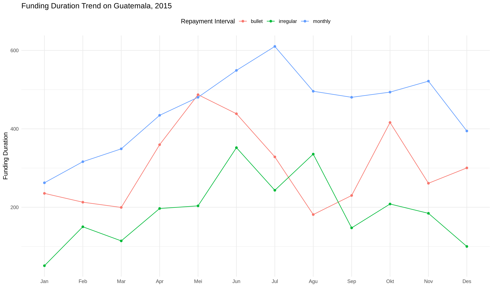

```{r setup, include=FALSE}
knitr::opts_chunk$set(echo = TRUE)
```

This quiz is part of Algoritma Academy assessment process. Congratulations on completing the Data Visualization course! We will conduct an assessment quiz to test the practical data visualization techniques that you have learned on the course. The quiz is expected to be taken in the classroom. Please contact our team of instructors if you missed the chance to take it in class.

## Inspecting Dataset
 
We will analyze the dataset from **Kiva**, a non-profit organization that allows people to lend money using a P2P (peer-to-peer) model. Read the data from `loan_kiva.csv`. The data has 165,040 observations with 14 variables and consists of historical detail on loan request in 2015. 

First, you will need to import the data:
```{r}
# Your code here
kiva <- read.csv("loan_kiva.csv",stringsAsFactors=T)
head(kiva)
```

Please use the following glossary of each column for your reference:
* `id`: Unique ID for the loan (Loan ID)
* `funded_amount`: The amount disbursed by Kiva to the field agent (USD)
* `loan_amount`: The amount disbursed by the field agent to the borrower (USD)
* `activity`: Activity type as a more specific category
* `sector`: High-level category of the loan
* `country`: Full country name of the country in which loan was disbursed
* `region`: Full region name within the country
* `currency`: The currency in which the loan was disbursed
* `partner_id`: ID of the partner organization
* `posted_time`: The time at which the loan is posted on Kiva by the field agent
* `funded_time`: The time at which the loan posted to Kiva gets funded by lenders completely
* `term_in_months`: The duration for which the loan was disbursed in months
* `lender_count`: The total number of lenders that contributed to each loan
* `repayment_interval`: Interval for the repayment of the loan
___

## Analyzing Data Distribution

1. By visualizing the distribution of `lender_count` variable, we can find which range has the highest frequency of data occurrence. Say, we are interested in finding out the range of `lender_count` which is most likely to occur, for all loans in the United States. You may need to check the distribution of the `lender_count` variable using a histogram or density chart.

First, you need to subset all loans from the United States:
```{r}
# your code here
US <- kiva[kiva$country=="United States",]
head(US)
```
    
Then, try to visualize the data distribution of the lender count. You can use either the base plot or the ggplot2 to visualize the data.
```{r}
# your code here
ggplot(US, aes(x=lender_count)) + geom_bar()
```

Which range has the highest frequency of `lender_count` in the United States?
    
   - [X] 0-100
   - [ ] 100-200
   - [ ] 200-400

## Understanding Data Relationship

Say we are interested in analyzing the loans posted in the Manufacturing sector. We would like to see the relationship or pattern between the amount of loan (`loan_amount`) and the number of lenders (`lender_count`). To do that, we can use a scatter plot.

First, you will need to subset the original loan dataset to acquire all loans from the Manufacturing sector:
```{r}
# your code here
manufactur <- kiva[kiva$sector=="Manufacturing",]
head(manufactur)
```
    
Then, you can create a scatter plot to see if there is any existing pattern between the amount of loan and the number of lenders:
```{r}
# your code here
plot(manufactur$loan_amount,manufactur$lender_count)
abline(lm(manufactur$lender_count ~ manufactur$loan_amount), col= "red", lwd=2, lty=2)
```
   
2. How would you describe the relationship between the amount of loan and the number of lenders from all loans within the `Manufacturing` sector?  
   - [ ] The higher the loan amount, the lower the number of lenders
   - [X] The higher the loan amount, the higher the number of lenders
   - [ ] Loan amount and number of lenders does not have any meaningful relationship

3. Which statement is **TRUE** based on the scatter plot you have created?

   - [X] There are some loans that have a relatively large amount of loan with a small number of lenders
   - [ ] There are some loans that have a relatively large number of lenders with a small amount of loan
   - [ ] Most of the loan requests have the loan amount of more than 7,500 USD
   
   
## Using Line Chart for Trend Analysis

Consider the following case: One of the data analysts in Kiva was tasked to analyze the time duration of a loan from the first time was posted until it was fully funded, for each repayment interval, for all loans from Guatemala. The analyst then tried to visualize the monthly trend of the average funding time duration in hourly units for each month. Pay attention to the resulting plot of the analyst’s task, below:

```{r, out.width = "100px"}

```

Now, your task is to recreate the previous plot using all loans from the Philippines.

In order to analyze the trend, we need to subset the data for the country of **Philippines**. We will also need to convert any data related to date into its proper date and time format. You can use the `lubridate` package to manipulate the date and time data.

```{r}
library(lubridate)
# your code here
ph <- kiva[kiva$country=="Philippines",]
ph$posted_time <- ymd_hms(ph$posted_time)
ph$funded_time <- ymd_hms(ph$funded_time)
head(ph)
```

For exploratory purposes, find out the range of the posted time:

```{r results='hide', message=FALSE, warning=FALSE}
# insert your code here
library("dplyr")
ph <- ph[order(ph$posted_time),]
paste(first(ph$posted_time),"and",last(ph$posted_time))
```
```{r}
head(as.data.frame(ph$posted_time))
```


4. What is the earliest and latest posted time of any loan?

   - [X] 2015-01-01 01:27:00 UTC and 2015-12-31 05:54:25 UTC
   - [ ] 2015-01-01 03:34:51 UTC and 2015-12-31 05:54:25 UTC
   - [ ] 2015-01-01 01:27:00 UTC and 2015-12-31 23:04:04 UTC
   - [ ] 2015-01-01 00:42:30 UTC and 2015-12-31 05:54:25 UTC

Now we are set to calculate the duration from a loan being posted until it was fully funded. We need to create a new column that contains the difference between the funded time and posted time. We will call it **funding_duration**.  

You can use `difftime()` to get the time difference between funded time and the posted time. Make sure that the time would be in hourly unit. As an alternative, you may also use simple subtraction between the two variables. The result will have a data type of *time* and presented in unit of minutes. We need to convert them into *numeric* and divide them by 60 to obtain the time in hourly value.

Create a new column `funding_duration` which stores the difference between `funded_time` and `posted_time`: 
```{r}
# your code here
ph$funding_duration <- difftime(time1 =ph$funded_time,
                                time2 = ph$posted_time,
                                units = "hours" )
head(as.data.frame(ph$funding_duration))
```

Since we want to visualize the monthly average funding duration, we need to create a new column called `month` which contains the month of the posted time before aggregating the data. 
```{r}
# your code here
ph$month <- month(ph$posted_time,
                  label = T)
head(ph$month)
```

Finally, we can aggregate the data based on the `month` of the posted time and the `repayment interval` to get the average (mean) `funding duration`. 
```{r}
# your code here
loan_agg <- aggregate.data.frame(list(funding_duration=ph$funding_duration),
                                 by=list(month=ph$month,
                                      repayment_interval=ph$repayment_interval),
                                 FUN = mean
                                 )
loan_agg <- loan_agg[order(loan_agg$funding_duration,decreasing = TRUE),]
loan_agg
```

5. Which repayment interval has the longest funding duration and at what month did it happen?

   - [ ] monthly repayment interval in April
   - [ ] bullet repayment interval in January
   - [X] monthly repayment interval in March

The data has been properly prepared. Now it is your time to create the line plot to visualize the trend. Fill in the code below to produce the plot.

```{r}
library(ggplot2)
ggplot(loan_agg, aes(x = month, y = funding_duration, color = repayment_interval, group = repayment_interval))+
  geom_line()+
  geom_point()+
   labs(title = "Funding Duration Trend on Philippines, 2015",
       x = NULL, y = "Funding Duration",
       color = "Repayment Interval")+
   theme_minimal()+
   theme(legend.position = "top")
```

6. Which statement is **TRUE** based on the line plot?

   - [X] Monthly repayment interval has almost the same funding duration with Irregular repayment interval in August
   - [ ] Bullet repayment interval has longer funding duration than Irregular repayment interval in June
   - [ ] Monthly repayment interval never funded faster than Irregular repayment interval
