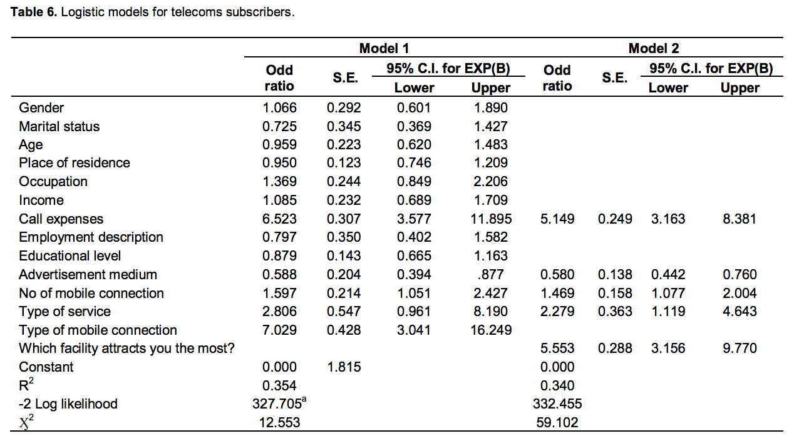
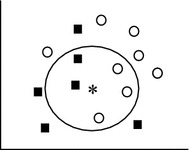
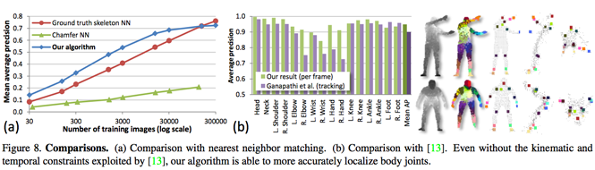

# Background {.tabset}
## Algoritma
The following coursebook is produced by the team at [Algoritma](https://algorit.ma) for its Data Science Academy workshops. The coursebook is intended for a restricted audience only, i.e. the individuals and organizations having received this coursebook directly from the training organization. It may not be reproduced, distributed, translated or adapted in any form outside these individuals and organizations without permission. 

Algoritma is a data science education center with bootcamp programs offered in:

- Bahasa Indonesia (Jakarta campus)  
- English (Singapore campus)

### Lifelong Learning Benefits
If you're an active student or an alumni member, you also qualify for all our future workshops, 100% free of charge as part of your **lifelong learning benefits**. It is a new initiative to help you gain mastery and advance your knowledge in the field of data visualization, machine learning, computer vision, natural language processing (NLP) and other sub-fields of data science. All workshops conducted by us (from 1-day to 5-day series) are available to you free-of-charge, and the benefits **never expire**. 

### Second Edition
This coursebook is initially written in 2017.

This is the second edition, written in late August 2020. Some of the code has been refactored to work with the latest major version of R, version 4.0. I would like to thank the incredible instructor team at Algoritma for their thorough input and assistance in the authoring and reviewing process.


## Libraries and Setup
We'll set-up caching for this notebook given how computationally expensive some of the code we will write can get.
```{r setup}
knitr::opts_chunk$set(cache=TRUE)
options(scipen = 9999)
rm(list=ls())
```

You will need to use `install.packages()` to install any packages that are not already downloaded onto your machine. You then load the package into your workspace using the `library()` function:
```{r}
library(gtools)
library(gmodels)
library(ggplot2)
library(class)
```


## Training Objectives
In this workshop, we'll extend our understanding of regression algorithms and see what we've learned in the previous workshop can be extended to solve a different kind of problems: classification problems. More specifically, we'll learn to solve binary and multi-class classification models using machine learning algorithms that are easily understood and in the case of logistic regression, readily interpretable. 

You will learn to develop classification algorithms from scratch, and investigate the mathematical foundations underpinning logistic regressions and nearest neighbors algorithms. My objective is to deliver a 9-hour session that is packed with the depth to help you develop, apply, score and evaluate two of the most highly versatile algorithms widely used today.

- **Logistic Regression**
- Understanding Odds  
- Log of Odds  
- Sigmoid Curve  
- `glm` Function  
- Logistic Regression in Practice  

- **Nearest Neighbors Prediction**

# Logistic Regression
## Theory
Logistic regression is a classification algorithm used to fit a regression curve, $y = f(x)$, where $y$ is a categorical variable. When $y$ is binary (1 for spam, 0 for not-spam) we also call the model **binomial logistic regression** where in cases of $y$ assuming more than 2 values you'll sometimes hear the model being referred to as a class of **multinomial logistic regression**. We can think of logistic regression as a special case of linear regression (which you've mastered in the previous workshop), except we're using **log of odds** as our target variable. 

## Relation to Probability
So it's perhaps important to understand what odds mean. Most of us are familiar with **probabilities**. We understood that the **probability** of an event is the proportion of times it will occur divided by the total number of trials. If an event occurs 1 out of 5 times, then the probability (`p`) would be 1 out of 5, or 0.2. 

Odds are defined as the probability that an event will occur (`p`) divided by the probability than the event will not occur (we'll call it `q`, which is the same as `1-p`). If p is 0.2, we will see that q is 0.8. Expressed in a formula, odds can then be defined as:  
$\frac{p}{(1-p)}$

Let's use a fun and real-life example. Supposed we were playing black jack (assuming the casino uses two decks on black jack) and the first card dealt is an Ace, the probability of the next card dealt to the dealer is a Ten is 31.07% (32 possible Tens out of 103 possibility). If we have to express it in odds and define p as 0.31, then our odds of the dealer being dealt a Blackjack (Ace + a Ten) is 0.31/(1-0.31), which brings it to 0.45 to 1. 

Note that if we have defined `p` as the probability of the Dealer **not having a Blackjack**, our odds would instead be 0.69/0.31, which brings us to 2.23 to 1. We can interpret this as "for every 2.23 times the dealer didn't get a blackjack, she would get 1 blackjack". Odds, as we so far understand it, refers to the ratio of favorable event (dealer doesn't get a blackjack) to the unfavorable event. 

**Quiz 1: Odds of flying on time vs suffering a departure delay**

Now to a less-fun but no less important example: airport delays. If I tell you that the probability of a minor departure delay occurring at a particularly busy airport (Soekarno-Hatta) on a festive holiday season is 0.2, what are the chances (expressed in odds) of you departing on time versus that of a departure delay. Recall the formula: 

$Odds = \frac{No-delay}{Delay}$

I hope you arrived at the right answer of 4 to 1, and intuitively interpret the situation as "we are 4 times more likely to depart on time than to be delayed". 

Odds are rather commonly used in some industry and in sports. In football and in horse racing, you'll often see betting odds expressed as fractions (e.g. 3/1 for a Germany win). In some academic writing or journalistic reporting, you may also see odds being expressed such as this: "the relative risk of a credit event with Financial Product A over Product B is 1.125". If you think about it, this is the same concept we've been talking about: odds. 

If it wasn't immediately clear, consider assigning some numbers to the above example:  
- Financial Product A has a 0.45 empirical probability of incurring a credit event  
- Financial Product B has a 0.4 empirical probability of incurring a credit event  

The odds is hence 0.45/0.4, or 1.125:1. 

### Understanding log of odds
When we have a probability $p$, the log of odds (sometimes called the "log-odds") is simply the log of the odds ratio, which is:  
$log(p/(1-p))$

Odds ratios as we observe above, are just an alternate way of expressing probabilities. Let's say we have the probability of success as 0.8, then the probability of failure is 1 - 0.8 = 0.2. The odds of success are defined as the probability of success over the probability of failure, in our case the odds would be .8/.2 = 4. We can also say that the odds of success is hence 4 to 1. If the probability of success is .5, i.e 50-50, our odds of success is 1 to 1.

The transformation from probability to odds is a monotonic transformation, so the odds increases as the probability increase (however note that odds take a range of 0 to infinity):
```{r}
curve((x/(1-x)), from = 0, to=1, ylim=c(0,10), xlab = "Probability", ylab="Odds")
```

Notice how we have an **odd of 1 when our p is 0.5**, and our odd is 4, when p is 0.8, just as we learned from the earlier example (50:50 -> odds of 1, success rate of 0.8 -> odds of 4). 

Now that we've understood the transformation from probability to odds, let's understand the transformation from odds to logs of odds. 

Log of odds are:
$logit(p) = log(\frac{p}{1-p})$

Almost same code for the above curve, except this time we plot the curve of `log(x/(1-x))` instead of `(x/(1-x))`.
```{r}
# Plot sigmoid curve
curve(log(x/ (1-x)), from = 0, to=1, xlab = "Probability", ylab="Log of odds")
```

Change `x` below from 0.5 to 1, and then to 0 to verify that the log of odds can take any positive or negative value (which is to say, its range is -Inf to Inf). A linear model can produce any value of log of odds and they would be acceptable as a prediction as the range is -Inf to Inf. That is not the case if a linear model has to produce a prediction that is a valid value of "probability", because a probability only takes a range of 0 to 1.  
```{r}
x <- 0.5
log(x/ (1-x))
```

Again, the transformation of odds to log of odds is a monotonic one. The greater the odds, the greater the log of odds. However, recall that the probability of .5 will yield us a log-odds of 0. This is because the logit (log of odds) function takes values on [min, max] and transforms them to span [-Inf, Inf]. 5 is our median number and hence it's value on the log of odds scale is 0.

The above sigmoid curve can also be plotted using the `logit()` function from the `gtools` package:
```{r}
library(gtools)
# Plot sigmoid curve
# logit(x) == log(x/(1-x))
curve(logit(x), from = 0, to=1, xlab = "Probability", ylab="Log of odds")
```


### Understanding `logit()` 
The `logit` function, formally defined, is expressed as:
$y = log(\frac{p}{1-p})$ where $p = \frac{x - min}{max-min}$  

In the case of a p=0.5 on a scale of 0 to 1, our *p* would then be p = ( 0.5 - 0 ) / (1 - 0) = 0.5; In the case of a p=30 on a scale of 1 to 100, our *p* would subsequently take on the value of (30-1)/(100-1) = 0.292929293.

We can use the `logit()` function from the `gtools` package, or just use `log()` with our odds and you'll get the same result. What you obtained is the log of odds:
```{r}
# Proof
## using logit(p, wo/ normalization)
proof1 <- logit(30, min=1, max=100)

## using logit(p, w/ min-max normalization)
proof2 <- logit(0.292929293)

## equivalent: log(p/(1-p))
proof3 <- log(0.292929293/(1-0.292929293))

proof1 <- round(proof1, 4)
proof2 <- round(proof2, 4)
proof3 <- round(proof3, 4)

print(paste(proof1, " | ", proof2, " | ", proof3))
```


Notice, however, that the `logit` function puts our probability on the x-axis instead of the y-axis and we can *invert* both axes by using the `inv.logit` function, also called the Sigmoidal **logistic function**.  

```{r}
library(gtools)
# Plot sigmoid curve
curve(inv.logit(x), from = -10, to=10)
```

You could be wondering by now why we're concerned with understanding these underlying concepts? It turns out that the reason is surprisingly straightforward if we approach it from our prior knowledge of linear regression models.  

Recall that with linear regression, we are used to representing our hypothesis in the following form:

$\hat{y} = \beta_0 + \beta_1x_1 + ... + \beta_mx_m$  
Where m is the number of predictors

But with that hypothesis, our value $\hat{y}$ could take on any value from *-Inf* to *Inf*. This is obviously not very helpful for our classification task. Ideally, we want:

$0 \leq \hat{y} \leq 1$  

This is because we can then set a threshold value, say 0.5, and classify any examples above 0.5 as a "positive" and any value below it as a "negative". Turns out, we can transform a simple linear regression model $\hat{y} = \beta_0 + \beta_1x_1$ by applying the sigmoid function, also known as the logistic function so we would end up with a hypothesis that bound our value to the range of 0 to 1:
$\hat{y}  = sigmoid( \beta_0 + \beta_1x_1)$
- where $\hat{y}$ = estimated probability that y=1 on input x.  

More formally:
$\hat{y} = P(y=1 | x;\theta)$  

### [Optional] Extra Proof: Intuition behind the sigmoid function  
This sub-chapter sheds light on another perspective behind the sigmoid function, in the hope of helping you make sense of the sigmoid function a little more.

Starting from a simple linear regression example with an independent variable called "Age" (imagine predicting income based on age), we would have the following hypothesis:
$\hat{y} = \beta_0 + \beta_{Age}$

In logistic regression, since we are only concerned about the probability of our outcome (target), we need our hypothesis to be between 0 and 1:
$0 \leq \hat{y} \leq 1$

Recall that we can think of $\hat{y}$ simply as a probability of y being 1, we can denote it as $p$ for the purpose of convenience. Since probability must always be positive, we put this linear equation in exponential form, such that for any value of slope and dependent variable, exponent of this equation will never be negative:
$p = exp(\beta_0 + \beta_{Age}) = e^{(\beta_0 + \beta_{Age})}$

Exponenting something would make it an always positive value:
```{r}
exp(-14)
```

Now that we've made the range our $p$ can take on 0 to positive infinity; We still have one task to do - we need to make our probability assume a range smaller than 1, essentially making it take on the range of 0 to 1. To make the probability lesser than 1, we will divide p by a number greater than p. 

> Divide 4 by 5 and get 0.8; or 4 by 20 and get 0.2, for an arithmetic proof  

So, back to making p lesser than 1:  
$p = exp(\beta_0 + \beta_{Age}) / exp(\beta_0 + \beta_{Age} + 1) )$

The above equation is of course equivalent to:
$e^{(\beta_0 + \beta_{Age})} / e^{\beta_0 + \beta_{Age}+ 1)}$

Putting all of these together, we can now rewrite the probability as:
p = e^z / (1 + e^z)

Where p is the probability of success (y=1) and `z` is the placeholder for $\beta_0 + \beta_{Age}$. `q`, the probability of failure, will then be:
q = (1 - p) = 1 - ( e^z / (1 + e^z ) )

Recalling what we know about *odds*, we can now define our odds as:
$\frac{p}{1-p}$  

Let's expand from the above equation:  
$\frac{p}{1-p}$  
= $p * \frac{1}{(1-p)}$  
= $\frac{e^z}{1+e^z} * \frac{1}{1-\frac{e^z}{1+e^z}}$  
= $\frac{e^z}{(1+e^z) - (\frac{e^z * (1+e^z)}{1+e^z})}$  
= $\frac{e^z}{(1+e^z) - e^z}$  
= $\frac{e^z}{1}$  

So from the above odds equation $\frac{p}{1-p} = e^z$, we can take the log on both sides and obtain:  
$log(\frac{p}{1-p}) = z$

After substituting z for the actual hypothesis in our earlier linear regression example, we arrive at:
$log(\frac{p}{1-p}) = \beta_0 + \beta(Age)$

This, we learned earlier, is the equation used in logistic regression. It turns out that we arrive at the log of odds which we've studied in the previous section! 

Recalling what we've learned about the log of odds: as long as the log of our odd ratio, `log(p/1-p)` is positive the probability of success will always be more than 50%. To strengthen our intuition, refer back to our sigmoid curve below:

```{r}
# Plot sigmoid curve
# plogis == inv.logit(x)
curve(plogis, from=-5, to=5, ylab = "Prob(y=1)")
```

Notice how we substituted `inv.logit()` to `plogis()` but the output is the same. `plogis` is R's built in method that return a logistic distribution function. `qlogis(p)` is exactly the same as `logit(p) = log(p/(1-p))`, and `plogis(p)` has consequently been called the "inverse logit". 

Another important observation: realize that regardless of what value x takes, our probability of success (y=1) will always be on the range of 0 to 1. 

## Key Assumptions of Logistic Regression  
Many of the key assumptions of linear regression do not hold true with logistic regression. We've learned about the linearity assumption, normality of residuals, and homoskedasticity assumptions in our regression models class - they do not apply in the case of logistic regression.

Logistic regression **does not** require a linear relationship between the dependent and independent variables - it also does not assume normality of residuals nor is it concerned with the problem of heteroskedasticity the way that linear regressions are.

However, a few of the assumptions do apply:  
- Multicollinearity: Just as with the case of linear regression, logistic regression assumes little to no multicollinearity among the independent variables (recall how we used VIF to identify highly correlated variables in the last workshop)  
- Independence of Observations: The observations should not come from repeated measurements and are independent from each other  
- Linearity of predictor and log odds: While logistic regressions do not assume linearity between the dependent and independent variables, it does assume that the independent variables (predictors) are linearly related to the log odds.  

The first two points are rather self-explanatory, and the third will be illustrated to you in an example later (flight delay prediction). If put slightly differently, the third point stresses that a logistic regression models the logit-transformed probability as a linear relationship with the predictor variables.

## Binary Logistic Regression
Supposed you work in an education institution and are put in charge to evaluate the likelihood of a student graduating with a honors degree given their academic scores in a reading test, writing test and mathematics test.  

This dataset has four features: `female`, `read`, `write`, `math` and the target variable is `hon`, a binary feature with 1 indicating that the student is in fact in an honors class and 0 indicating otherwise. The dataset is credited to the UCLA: Statistical Consulting Group (see credits for link and details). 

```{r}
honors <- read.csv("data_input/sample.csv")
honors$hon <- as.factor(honors$hon)
prop.table(table(honors$hon))
```

In R, fitting a logistic regression is done using the `glm()` function with the `family="binomial` parameter; To fully understand logistic regression, let's begin by regressing `hon` with no predictor variables.

### Logistic regression with no predictor variables
```{r}
honors.logit <- glm(hon ~ 1, data=honors, family="binomial") 
summary(honors.logit)
```

Recall from the earlier section that our `logit()` function, formally defined, is expressed as:  
$y = log(\frac{p}{1-p})$ where $p = \frac{x - min}{max-min}$

```{r}
table(honors$hon)
```


P(honors) = 49/200
p(!honors) = 151/200
```{r}
log((49/200)/(151/200))
```


Our odds ratio, without the influence of any predictor variable, is 49 out of 200 (49 in honors classes vs 151 not), so that give us a probability of 49/200, p = 0.245. Our odds ratio is therefore 0.245/(1-0.245) = 0.3245033

Taking the log of 0.3245033, our log of odds is therefore:
```{r}
log(0.3245033)
```

This is essentially what our logistic regression model gave us:
```{r}
coefficients(honors.logit)
```

Observe how, when we take **log(p/(1-p))** or **log(odds ratio)**, we find the same value of -1.12546, confirming our understanding that the log of odds is the intercept from the model without any predictor variables. 

If we have wanted the log of odds in the form of probability, we could do that too:
```{r}
exp(-1.12546)/(1+exp(-1.12546))
```
And... that's 0.245, which is the equivalent of 49/200 (probability of success!)

If you need a refresher, recall that:  
$p = \frac{e^z}{1+e^z}$
Or scroll back to line 200 to look at the mathematical details of the logit function.


### Logistic regression with one discrete predictor variable
Let's now add one binary predictor variable, **female** to the model, such that the equation for our model is formally described as:
$logit(p) = \beta_0 + \beta_1 * female$
```{r}
honors.logit2 <- glm(hon ~ female, data=honors, family="binomial")
```
Before we attempt to interpret the parameters estimated from our model above, let's examine the odds ratio of a female being in a honors class as we did before:

```{r}
table(honors = honors$hon, female = honors$female)
```

- For males: odds of being in honors class = (17/91)/(74/91) = 0.2297297  
- For females: odds of being in honors class = (32/109)/(77/109) = 0.4155844  
- The ratio of the odds for female vs ratio of the odds for male = .42/.23 = 1.809, which is to say that the odds for female being in an honors class are about 81% more than that of their male counterpart  

```{r}
paste("Male:", (17/91)/(74/91))
paste("Female:", (32/109)/(77/109))

```

Getting the log of odds:
```{r}
#log(odds ratio)
log(0.4155844/0.2297297)
```

Let's now relate the odds ratio to the output from the logistic regression model with our `female` predictor variable. 
```{r}
summary(honors.logit2)
```

The intercept of **-1.4709** is the log odds for males since male is the reference group (**female** = 0). If we have wanted to confirm this, we can manually calculate this using the odds ratio for the male group:
```{r}
log(0.2297297)
```

The coefficient for **female** is the log of odds ratio between the female group and the male group, which can be manually calculated:
```{r}
log(1.809)
```

Using what we've learned earlier, we also know how easy it would be for us to calculate the odds ratio from the output of the model's summary: we simply have to exponentiate the coefficient it gives us for female. 

And if we were to relate this back to the original equation:
$logit(p) = \beta_0 + \beta_1 * female$

- For a male (female = 0): we would substitute the values into the equation and arrive at logit(p) = -1.4709  
- For a female (female = 1): we would instead get logit(p) = -1.4709 + (0.5928*1) = -0.8781  

```{r}
# calculating the change in odds
# odds of female in honors / odds of male in honors
# log of odds to odds is an exponent transformation
exp(-0.8781)/exp(-1.4709)
```

> The ratio of the odds for female vs ratio of the odds for male = .42/.23 = 1.809, which is to say that the odds for female being in an honors class are about 81% more than that of their male counterpart  

Notice how this is the same answer we derive from our manual calculation even before looking at the output of our logistic regression model. In fact, we could as well have taken the **estimated coefficient** value for `female`, which the output says is 0.5928, and get its exponent:
```{r}
exp(honors.logit2$coefficients["female"])
```

### Logistic regression with one continuous predictor variable
Let's try another exercise, this time using the `math` score (continuous variable) such that the equation for our model is formally described as:
$logit(p) = \beta_0 + \beta_1 * math$

```{r}
honors.logit3 <- glm( hon ~ math, data=honors, family="binomial" )
summary(honors.logit3)
```

Notice in the case of a continuous variable such as the math score, our estimated coefficient for the intercept is the log-odds of a student with a math score of zero being in an honors class. If we mentally visualize a plot with both x and y axis, this makes intuitive sense: the intercept points to the value of y **when our x feature = 0**. By taking the exponent of this value, we can then know the odds of such student being in an honors class:
```{r}
exp(honors.logit3$coefficients["(Intercept)"])
```

These odds are very low, and a peek at the distribution for the variable math will reveal that no one in the sample has a math score lower than 30 (mean of 53 in fact), which tells us that the intercept in this model corresponds to the log odds of being in an honors class when math is at the hypothetical value of zero.

How do we interpret the coefficient for math? Recall our equation:
$logit(p) = log(p/(1-p)) = \beta_0 + \beta_1 * math$

With the substituted values:
logit(p) = -9.79394 + 0.15634 * math

```{r}
hist(honors$math, breaks=20)
abline(v=median(honors$math), col="blue", lwd=3)
```


The median of math is ~52. Let's assume a `math` value of 52:
logit(p) = -9.79394 + 0.15634 * 52 = -1.66426

Examine the effect of a one-unit increase in math score, at 53:
logit(p) = -9.79394 + 0.15634 * 53 = -1.50792

Taking the difference:
-1.50792 - (-1.66426) = 0.15634

```{r}
-1.50792 - (-1.66426)
# 0.15634, the diff with a one-unit increase should also be the
# coefficient for our math variable
honors.logit3$coefficients[2]
```

...and that checks out with our manual calculation! So the coefficient for `math` is in fact the difference in the log odds for one unit of increment in that variable (math score of 53 vs 52). In simpler words, for one-unit increase in the math score, the expected change in log odds is 0.15634.

Like the earlier example, we could also translate this change in log odds to the change in odds by exponentiating the log-odds:

Change in Odds  = odds(math=53) / odds(math=52)  
                = exp(-1.50792) / exp(-1.66426)  
                = odds (difference in one-unit increase)  
                = exp(0.15634)  
                = 1.169224  

```{r}
exp(-1.50792) / exp(-1.66426)
exp(-1.50792 - -1.66426)
exp(0.15634)
exp(honors.logit3$coefficients[2])
```
                
We interpret this as: for a one-unit increase in math score, we expect to see ~17% increase in the odds of being in an honors class. This 17% does not depend on the value that math is held at. It's also important to note that a 17% increase in odds is not the same as a 17% increase in probability. All it is saying that compared to a score of 52, scoring 53 will improve the odds of being in an honors class by 1.17 times.

### Logistic regression with multiple predictor variables and no interaction terms
In general, we can have multiple predictor variables in a logistic regression model:
logit(p)        = log(p/(1-p))  
                = $\beta_0 + \beta1 * x1 + ... + \beta_k *xk$  
                
Applying such a model to our example dataset, each estimated coefficient is the expected change in the log odds of being in an honors class **for a one-unit increase in the corresponding predictor variable** holding the other variables constant at a certain value. Each exponentiated coefficient is the ratio of two odds, or the change in odds in the multiplicative scale for a one-unit increase in the corresponding predictor variable holding other variables at a certain value. Let's look at the following equation:

$logit(p) = \beta_0 + \beta_1 * math + \beta_2 * female + \beta_3 * read$

```{r}
honors.logit4 <- glm(hon ~ math + female + read, data=honors, family="binomial")
summary(honors.logit4)
```

The coefficient for *math* tells us that, holding *female* and *reading* at a fixed value ("constant"), we will see a 13% increase in the odds of graduating with honors class for a one-unit increase in math score since exp(.12296) = 1.13. 

As a warm-up to your graded assignment (for full Academy students), can you attempt to interpret the above model and answer the following question?

- Holding Female and Mathematics score constant, a one-unit increase in reading score improves the odds of graduating with honors by how much?
```{r}
exp(0.05906)
```

### Extra Example: Predicting Flight Delay
Let's take a look at what happened when we try to predict flight delays using a logistic regression models where the predictor variables are `Month`, `DayofMonth`, and `DayofWeek` respectively.
```{r}
flights.s <- read.csv("data_input/flight_sm.csv")

summary(glm(DepDel15 ~ Month + DayofMonth + DayofWeek, data=flights.s, family="binomial"))
```

There is a problem with the above logistic regression model: Can you tell which among the three key assumptions did it violate(s)?
- Multicollinearity  
- Independence of Observations  
- Linearity of predictor and log odds  

## Application of Logistic Regression
In the field of market research where its commonplace for business analysts to try and get as accurate as possible a prediction of a new product launch (success/failure), a new bundle pricing strategy (odds of success / odds of failure), or a new enrollment plan, logistic regression and its accompanying analysis plays a pivotal role. An example of this is the scenario of a company that is estimating the change of probability / odds of customer buy-in for every $1 dollar change in price. Another example of this is in election forecasts: where a campaign manager is trying to determine the odds of a likely voter to vote for a particular candidate, using demographic parameters such as gender, age, and education level. 

Another common use of logistic regression in business is in building models of customer retention, which can offer incredible insights into why some customers leave and others stay (drivers of customer retention). This is particularly important in certain industries, where reducing customer defections by as little as five percent can double profits (Reichheld, 1996[^1])

Another interest project that models customer retention using historical data from a database (more than 500,000 clients) of a big mutual fund investment company and logistic regression (Eiben, Euverman, Kowalczyk, Slisser[^2]) highlights the benefits of an interpretative model like the one we obtain with logistic regression.

A third area of application for logistic regression models is in the modeling of customer churn and attrition[^3]:



Yet another example is in Credit Risk Analysis, where machine learning is deployed to estimate probability of loan defaults, or non-performing loans (or in the measurement of other types of credit risk). The paper described how loan officers at bank use logistic regression "to identify characteristics that are indicative of people who are likely to default on loans, and then use those characteristics to discriminate between good and bad credit risks"[^4]. 

A quick summary of the findings:  
- Number of years at current employment and number of years at current address have negative coefficients, indicating that customers who have spent less time at either their current employer or their current address are more likely to default  
- Debt-to-income ratio (`dti`, a measurement we'll use in our project later) and amount of credit card debt both have positive coefficients, indicating that higher dti ratios or higher amounts of credit card debts are both associated with a greater likelihood of loan defaults.  

## Credit Risk Analysis / Modeling: Loans from Q4 2017
I've prepared the following data originally made available by [LendingClub](https://www.lendingclub). Some preprocessing steps have been applied to save you from the "data cleansing" work. We'll read the data into our workspace:

```{r}
loans.s <- read.csv("data_input/loan2017Q4.csv")
str(loans.s)
```

The variable of interest is the `not_paid` variable, a binary variable that indicate whether a loan is fully paid or not. A loan is considered "not paid" (not paid = 1) when it is **Defaulted**, **Charged Off**, or past due date (**Grace Period**). To prevent one class from dominating the other, the data I've prepared here over-sampled more "bad" loans so that the underlying characteristics of the empirically minority class is adequately represented.  
```{r}
table(loans.s$not_paid)
```

What's important to note is that logistic regression is not susceptible to a "class imbalance" problem per-se, and an unbalanced class representation is for the most part dealt with as sample size grows anyway. That said, in the situation of highly imbalanced class representation, the patterns within the minority class may not be sufficiently "described" and in the case of an extreme imbalance you may be better off using an "anomaly detection" approach than through a classification approach.

In the Unsupervised Machine Learning workshop within the Machine Learning Specialization, I will delve into the specific details of anomaly detection algorithms with far greater depth so let's stay on track and study the dataset we've just read into our environment:  
- `initial_list_status`: Either `w` (whole) or `f` (fractional). This variable indicates if the loan was a whole loan or fractional loan. For background: Some institutional investors have a preference to purchase loans in their entirety to obtain legal and accounting treatment specific to their situation - with the added benefit of "instant funding" to borrowers  
- `purpose`: Simplified from the original data; One of: `credit_card`, `debt_consolidation`, `home_improvement`, `major_purchase` and `small_business`  
- `int_rate`: Interest rate in percentages  
- `installment`: Monthly payment owed by the borrower  
- `annual_inc`: Self-reported annual income provided by the borrower / co-borrowers during application  
- `dti`: A ratio of the borrower's total monthly debt payments on his/her total obligations to the self-reported monthly income  
- `verification_status`: is the reported income verified, not verified, or if the income source was verified  
- `grade`: software-assigned loan grade  
- `revol_bal`: total credit revolving balance (in the case of credit card, it refers to the portion of credit card spending that goes unpaid at the end of a billing cycle)  
- `inq_last_12m`: number of credit inquiries in the last 12 months  
- `delinq_2yrs`: number of 30+ days past-due incidences of delinquency in the borrower's credit file for the past 2 years  
- `home_ownership`: one of `MORTGAGE`, `OWN` and `RENT`  
- `not_paid`: 0 for fully-paid loans, 1 for charged-off, past-due / grace period or defaulted  
- `log_inc`: log of `annual_inc`  
- `verified`: 0 for "Not verified" under `verification_status`, 1 otherwise  
- `grdCtoA`: 1 for a `grade` of A, B or C, 0 otherwise

Before we dive into building our classification model, I'd like to encourage you to spend some time on the "exploratory phase". This is the phase where you investigate the relationships and discover rough structures of the data. You can use `summary()`, or `fivenum()`, or even `cor()` - take your time to write a few more lines of code below this chunk and be curious about your data!
```{r}
summary(loans.s[loans.s$not_paid == 0, "dti"])
summary(loans.s[loans.s$not_paid == 1, "dti"])
```

```{r}
xtabs(dti ~ purpose + not_paid, loans.s)
```

```{r}
plot(xtabs(dti ~ grade + not_paid, loans.s), 
     main="Assigned Grade of Loan vs Default")
```

### Cross-Validation and Out-of-Sample Error
Before we develop our classification model, I'll introduce you to the idea of estimating the accuracy of our model. Simply put, we are going to:  
- Split our dataset into train and test sets  
- Build our machine learning model using data **only** from our train set  
- Obtain an unbiased measurement of the model's accuracy by predicting on test set  

A related idea is known as **cross-validation**, in which we:  
- Split our dataset into train, cross-validation, and test sets  
- Develop the initial model using our train set  
- Evaluate model on cross-validation set(s), returning to the previous step if necessary (say, pick different predictor variables, use a different parameter, or to tune other aspects of the model specification)  
- Pick a final model based on an evaluation criteria (Adj.R-squared, accuracy, etc)  
- Obtain an unbiased measurement of the model's accuracy by predicting on test set  

We can repeat step(2) and step(3) as much as is necessary, testing out different algorithms or model specification, or combinations of predictor variables and pick a final model on which we will obtain our estimated accuracy by testing it on the test set. An important rule on this is that the **test set must not be used in any of the steps before the (5)**, such that the accuracy we obtain is an unbiased measurement of the out-of-sample accuracy of the model. 

The idea of obtaining an unbiased estimate of our model's out-of-sample performance is an important one as it is often the case that the in-sample error (the error you obtain from running your algorithm on the dataset it was trained on) is optimistic and tuned / adapted in a particular way to minimize the error in the training sample. Therefore - the in-sample error is not a good representation or indication of how our model will perform when it is applied on unseen data. 

Another way to think about is that our training data has two components to it: signal and noise. The goal of machine learning is to identify the signal but be robust enough to avoid modeling the "noise" component of the data. When we build a model, we want to know that our model is not overly adapted to the data set to the point that it captures both the signal and noise, a phenomenon known as "overfitting". When our model is guilty of overfitting, the in-sample accuracy will be very high (in some cases ~100%) but fail to perform on unseen data. The idea is to strike the right balance between accuracy (don't underfit) and robustness to noise (don't overfit).  

### Predicting Credit Risk from Loans
Applying what we've learned above, we'll split our data into the `loans.train` and `loans.test` set. I'll first show you this approach and later show you the cross-validation approach - I encourage you to follow this part of the workshop closely:
```{r}
RNGkind(sample.kind="Rounding")
set.seed(417)
intrain <- sample(nrow(loans.s), nrow(loans.s)*0.8)
loans.train <- loans.s[intrain, ]
loans.test <- loans.s[-intrain, ]
```

We already know how to build a binomial logistic regression and learned the "manual" way of obtaining those coefficients in previous sections. Here we'll cut to the chase and use `glm` for our model construction:
```{r}
creditrisk <- glm(not_paid ~ verified + purpose + installment + int_rate + home_ownership + grdCtoA + annual_inc, loans.train, family="binomial")
summary(creditrisk)
```

We observe from the model summary that holding other variables constant, obtaining an assigned grade of A to C reduce the log-odds (because it's a negative coefficient) of a loan default; Now let's use the `predict()` function, specifying the:  
- Model to be used for prediction (`creditrisk`)  
- Dataset on which the model should predict (`loans.test`)
- A response type. The default `link` is on the scale of the linear predictors (log-odds) but we'll specify `response` so the prediction is on the scale of the response variable (which means: probabilities). 

```{r}
loans.test$pred.Risk <- predict(creditrisk, loans.test, type = "response")
```

We can verify that `response` in fact transform the scale of our prediction from odds to probabilities:
```{r}
predict(creditrisk, head(loans.test), type = "response")
predict(creditrisk, head(loans.test), type = "link")
predict(creditrisk, head(loans.test))
```

A step-by-step transformation of log-odds to probabilities:
- log-odds: -0.7124156  
- odds: 0.490458  
- p/(1-p) = 0.490458  
- p = 0.490458/1.490458 = 0.3290653  


Visualize the distribution of probabilities of a loan default from our prediction vector:
```{r}
hist(loans.test$pred.Risk, breaks=20)
```

Taking a look at the `pred.Risk` variable we appended to our `loans.test` dataframe: we can therefore set a "risk" threshold, say, at 0.5 and predict any loans that exceed that threshold as a "default=1". 0.5 may not always be the right threshold setting and we'll discuss that later in the section describing "precision" vs "recall". 
```{r}
loans.test[1:10, 15:17]
```

### Exercise: Prediction Output
As an exercise, try appending yet another variable (column) to the above dataframe. Name it `pred.not_paid` and make sure it's a binary (0 or 1). You can use `ifelse` for this task. 

If you succeed in the above task, compare using `table()` the prediction you've made (`pred.not_paid`) against the "ground truth" which is in the `not_paid` variable.   
```{r}
table("predicted"=as.numeric(loans.test$pred.Risk>=0.5), "actual"=loans.test$not_paid)
```
This table above is also known as the **confusion matrix**. 

Observe from the confusion matrix that: 
- Out of the 151 actual defaults we classified 97 of them correctly  
- Out of the 161 fully-paid loans we classified 93 of them correctly  
- Out of the 312 cases of loans in our test set, we classified 190 of them correctly  

## Evaluating Classifiers: Sensitivity, Specificity and Precision
Sensitivity and specificity are metrics commonly used to measures the performance of a binary classification.  

- Sensitivity (also called the true positive rate, the **recall**, or probability of detection in some fields) measures the proportion of positives that are correctly identified as such (cancer cell detection, email spam, insurance fraud etc)  
- Specificity (also called the true negative rate) measures the proportion of negatives that are correctly identified as such (e.g. the percentage of healthy people who are correctly identified as not having the condition, legitimate emails identified as such, legitimate insurance claims)  
- Precision: Proportion of correctly identified positives from all classified as such  
- Accuracy: Proportion of correctly identified cases from all cases  


Given the confusion matrix, can you describe the precision, recall, and accuracy of our model?
```{r}
table("predicted"=as.numeric(loans.test$pred.Risk>=0.5), "actual"=loans.test$not_paid)
```

```{r}
accu <- round((93+97)/nrow(loans.test),2)
reca <- round(97/(54+97),2)
prec <- round(97/(68+97),2)
spec <- round(93/(93+68),2)

paste("Recall:", reca)
paste("Precision:", prec)
paste("Specificity:", spec)
paste("Accuracy:", accu)
```

Sometimes, you'll also find machine learning applications that uses the notion of a baseline measure in their model evaluation phase. The baseline performance is used to quantify the improvement of an applied solution to the problem and a **base rate** is just the accuracy of trivially predicting the most-frequent (or majority) class. An implementation of this is the ZeroR Classifier found in many data mining applications or related domains: since it ignores all predictors, ZeroR ends us classifying according to the prior probability. 

```{r}
prop.table(table(loans.test$not_paid))
```

Our baseline rate is 0.51 - a classifier that does no better than 0.51 is not useful because we might as well have classify every loan to the majority class! 

False negatives and false positives are rarely equally costly to a business (or really, to any domain). For an insurance company, a false negative on an insurance payout is likely to cost the company more than a false positive for example. Finding the right precision-recall tradeoff comes with domain expertise - and let's make all of these more concrete by extending our credit risk example above.

Say the bank's credit department would rather sacrifice some level of specificity or precision in favor of higher recall (or sensitivity). In simpler words, we want to be more sensitive to "loan defaults", how would you go about doing that? Try and think critically of the problem before scrolling down to the proposed solution.

Well, one thing we can do is to set the threshold to be more sensitive to "positive cases": Let's see what happen if we were to predict a "default" when the probability exceed 0.4 (20% more sensitive than our previous classifier): 

```{r}
table("predicted"=as.integer(loans.test$pred.Risk>=0.4), "actual"=loans.test$not_paid)
```

We increased our Sensitivity or Recall rate from 0.64 to above 0.85! What is the cost of such an adjustment?

### Performance evaluation and model selection
On top of what we've learned so far, there are other tools we can use to evaluate and compare between the performances of our regression models:

**1. AIC (Akaike Information Criteria)**  
Like R-squared, AIC is a statistical measure of how close the data are to the fitted regression line. It gives us a measure of fit: we'll therefore choose the model with the lowest AIC value, as it helps us minimize residual error in our model:

```{r}
honors.aic <- paste(honors.logit$aic, "\n", honors.logit2$aic, "\n", honors.logit3$aic, "\n", honors.logit4$aic)

cat(honors.aic)
```

However, unlike adjusted R-squared, the number itself is not meaningful. If you have more than one similar candidate models (where all of the variables of the simpler model occur in the more complex models), then you should select the model that has the smallest AIC.

```{r}
AIC(honors.logit4)
```


**2. Null Deviance and Residual Deviance** 
Null deviance indicates how well the response variable is predicted by a model that includes only the intercept (grand mean). The residual deviance shows how well the response variable is predicted by the model when all predictors are included.

Intuitively, this means our first model - with no predictor variables `glm(hon ~ 1)` should see the same null deviance and residual deviance, and it is (table below)! 

As we add more / subtract predictor variables, notice how our residual deviance change.

```{r}
honors.null.resi <- paste(honors.logit$null.deviance, "\ ", honors.logit$deviance, "\n", honors.logit2$null.deviance, "\ ", honors.logit2$deviance, "\n", honors.logit3$null.deviance, "\ ", honors.logit3$deviance, "\n", honors.logit4$null.deviance, "\ ", honors.logit4$deviance, "\n")

cat(honors.null.resi)
```

```{r}
honors.train <- honors[1:150,]
honors.test <- honors[151:200,]
honors.logit5 <- glm(hon ~ female + read + math + write, data=honors.train, family="binomial")
summary(honors.logit5)
```

Notice in the last model `honors.logit5`, we obtain an unrealistically small residual deviance and coefficients that are confusingly large. This is indicative of the "Hauck Donner effect": This is when the fitted probabilities are extremely close to zero or one. Consider a medical diagnosis problem with thousands of cases and around 50 binary explanatory variable (which may arise from coding fewer categorical variables); one of these indicators is rarely true but always indicates that the disease is present. Then the fitted probabilities of cases with that indicator should be one, which can only be achieved by taking $\beta_i$ = Inf. The result from glm will be warnings and an estimated coefficient of around +/- 10[^7]. 

```{r}
exp(coef(honors.logit5)[5])
# Infinity minus any arbitarily large numbers still exceed 0.5
Inf-1000000 > 0.5
```

More intuition:
This phenomenon where one or more predictors take on a coefficient value of infinity is sometimes referred to as _perfect separation_. Another example: imagine the scenario where reading >= 43 will perfectly predict honors=TRUE and reading < 43 will perfectly predict honors=FALSE, or where stock_opening >= +3.34% will perfectly predict end_high = TRUE and vice versa, then we can imagine that the probabilities where such cases do happen must be 1, and that is achieved by setting the coefficient to infinity. 

# Nearest Neighbor Algorithm
The k-nearest neighbor algorithm gets it name from the fact that it uses information about an example's k-nearest neighbors to classify unlabeled examples. Upon choosing _k_, the algorithm requires a training dataset made up of examples that have been classified into several categories, as labeled by a nominal variable. Then, for each unlabeled record in the test dataset, k-NN identifies _k_ records in the training data that are the "nearest" in similarity. The unlabeled test instance is assigned the class of the majority of the k-nearest neighbors.  

Supposed we pick k=1, then the * in the following feature space will be assigned the square class, but if k=5, then the majority class of the five nearest point will be assigned to that point and our point will be classified as a round instead.


## Motivational Example: Is Tomato a fruit?
Suppose that prior to a blind tasting (or blind dining) experience, we created a dataset in which we recorded our impressions of a number of ingredients. For each ingredient, we rated its `sweetness` and `crunchiness` and then labeled them as one of the three types of food: *fruits*, *vegetables*, or *proteins*. 

```{r}
# Create our dataset
food <- data.frame(list(c("apple", "bacon", "banana", "carrot","celery", "cheese","cucumber", "fish", "grape", "green bean", "lettuce", "nuts", "pear", "shrimp","orange"), c(10,1,10,6,3,1,2,3,10,3,1,3,10,2,9), c(9,4,1,10,10,1,8,2,5,7,10,5,7,2,3), c("fruit", "protein", "fruit", "vegetable", "vegetable", "protein", "vegetable", "protein", "fruit", "vegetable", "vegetable", "proteins", "fruit","protein", "fruit")))

# Give each feature appropriate names
colnames(food)<- c("Ingredient", "Sweetness", "Crunchiness", "Type")
```

The k-NN algorithm treats the features as coordinates in a multidimensional feature space. As our dataset includes only two features, the feature space is two-dimensional. We can plot two-dimensional data on a scatterplot:

```{r}
library(ggplot2)

plot.fruit <- ggplot(food, aes(x=Sweetness, y=Crunchiness)) + 
  geom_point(alpha = 0.05)+geom_label(aes(label=Ingredient),
                                      nudge_x=0.5, nudge_y=0, label.size=0.6) + 
  labs(x="how sweet the food tastes", y="how crunchy the food is")
plot.fruit
```
Observe here that similar types of food tend to be grouped closely together.

Supposed we'd like to decide if tomato is a fruit or a vegetable, we would put tomato onto our dataset:
```{r}
library(grid)
grob = grobTree(textGrob("tomato", x=0.6, y=0.4, hjust=0, gp=gpar(col="darkorange", fontsize=14)))

plot.fruit + annotation_custom(grob)
```

With that we would then use a *distance function* to find tomato's nearest neighbors. Traditionally, the k-NN algorithm assumes *Euclidean distance*, which is the shortest direct route (imagine using a ruler to connect two points). While Euclidean distance function is the most widely used distance metric in k-NN, you will sometimes see the Manhattan distance (which is based on the paths a pedestrian would take by walking city blocks) being used instead [^5]. 

A few academic papers on this literature may also reference the Minkowsky distance function[^6]:  
dist_Minkowsky(A,B) = $(\sum\limits^m_{i=1} |x_i -y_i|^r)^{\frac{1}{r}}$  

While these distance functions exist, Euclidean distance is far more often seen in industrial applications and is therefore the focus of this chapter. As a side note, Minkowsky distance is typically used with _r_ being 1 or 2, where the former is equivalent to the Manhattan distance while the latter is the Euclidean distance.  

### Euclidean Distance  
Let A and B be represented by feature vectors A = ($x_1, x_2, …, x_m$) and B = ($y_1, y_2, …, y_m$), where _m_ is the dimensionality of the feature space. To calculate the distance between A and B, the Euclidean Distance formula can be represented as such:

dist(A, B) = $\sqrt{\sum\limits^{m}_{i=1}(x_i-y_i)^2}$

Applying the above formula on our blind-tasting example, we can calculate the distance between:  
- tomato (sweet: 6, crunchy: 4)  
- green bean (sweet: 3, crunchy: 7)

dist(tomato, greenbean) = `sqrt((6-3)^2 + (4-7)^2))`, which is 4.24

Similarly, we can calculate the distance between the tomato and several of its closest neighbors. Supposed we've done that and choose to assign tomato the food type of its nearest neighbor, which in our case is the orange (distance: 1.4), we are doing what is formally a 1-NN classification. Under 1-NN then the orange would be classified as a fruit.

Had we use the k-NN with 3 nearest neighbor instead: orange, grape, and nuts, the majority vote (2 fruits vs 1 protein) would again classify the tomato as a fruit. 

### Choosing an appropriate _k_
The decision of how many neighbors to use for k-NN determines how well the model will generalize to future data. The balance between overfitting and underfitting the training data is a problem known as **bias-variance tradeoff**. Choosing a large k reduces the impact or variance caused by noisy data, but can bias the learner so that it runs the risk of ignoring small, but important patterns.

If we use a very large _k_, say, a _k_ value as large as the total number of observations in the training data, this would lead to the always predicting the majority class (ZeroR classifier), which we've learned about in the previous chapter.

On the opposite extreme, using a single nearest neighbor allows the noisy data or outliers to unduly influence the classification of examples. If one of our training examples were accidentally mislabeled and happens to be a neighboring data point, choosing a k=1 will have resulted in a misclassification, even if the nine other nearest neighbors would have voted differently.

In practice, one common strategy is to begin with _k_ equal to the square root of the number of training examples. Another strategy is to choose a larger k but apply a weighted voting process in which the vote of the closer neighbors is considered more authoritative than the vote of the farther away neighbors.

### Features rescaling
Supposed, in addition to Sweetness and Crunchiness, we add a new feature "Spiciness" which is measured on a scale of 0 to 10,000. This range, or difference in scale, will allow the spice level of a food to have an amplified impact on the distance function. In fact, it's enlarged contribution to the distance function may end up being the singular decisive feature! 

We solve this by rescaling the features, i.e shrinking or expanding their range so that each feature's contribution to the distance formula is equally weighed. We want spiciness to be measured on the same scale as sweetness and crunchiness, which is a scale from 1 to 10. The two methods of rescaling features are: 

- Mix-Max normalization  
- z-score standardization  

**Min-max normalization** works by transforming a feature such that its values fall into a range of 0 to 1. 

The formula: $x_{new}$ = `(x-min(x)) / (max(x) - min(x))`  

- Which essentially subtracts the min of feature _x_ from each value and divides by the range of _x_.

Normalized feature's values effectively communicates how far, in percentage terms, the original value fell along the range of all values of feature _x_.

**z-score standardization** on the other hand subtracts the mean value of feature _x_ and divides the outcome by the standard deviation of _x_.  

The formula: $x_{new}$ = `(x-mean(x))/sd(x)`  

Standardization rescales each of the feature's values in terms of how many standard deviations they fall above or below the mean values. The resulting value is called a *z-score*. Z-scores has no predefined bounds (minimum and maximum) and may be negative or positive numbers. A more detailed discussion of this is in the Practical Statistics coursebook you have received in an earlier workshop.

### Characteristics of k-NN
Classification methods using k-NN are called 'lazy learners'. Lazy learners do not build a model; There is no abstraction or generalization process -- compare this to the logistic regression method we've learned earlier to have an intuition of what 'building a model' means. More technically, we say that no 'parameters' are learned about the data.

Let's summarize the process that goes into prediction with a k-NN classifier:  
- Scaling (putting the variables on a same scale to avoid one variable overpowering the others)  
- Select a positive integer _k_  
- Select the _k_ nearest neighbor for each "test" sample  
- Classify based on majority class

Because k-NN makes prediction in a manner that is "just-in-time" by calculating the similarity between each input sample and the other training samples in the vector space, this method may be computationally expensive on dataset with high dimensionality (high memory requirement and constantly calculating "distances" over and over again). If we pick a small _k_ value, our algorithm may also be vulnerable to the "noise" in our data. On its own, it is also sensitive to the "scale" of our data. 

Despite the limitations, k-NN is incredibly powerful and versatile. In fact some of its weaknesses (such as the outlier and scales) can be adequately mitigated with the scaling strategy we've learned in the earlier section. It is also generally insensitive to outlier and noise when an appropriate _k_ value is picked. Unlike logistic regression or linear regression, it works well on non-linear data because k-NN does not make assumption about the data.  

Under specific settings and requirements, k-NN is some of the most extensively used algorithms and have impressive accuracy. However, its performance is not competitive compared to ensemble methods (a key focus of our next workshop, "Classification 2") and has even seen its fair share of application in regression problems!

An example of Nearest Neighbor being used in performance benchmarking by the Microsoft's Kinect team:

Read: http://research.microsoft.com/pubs/145347/BodyPartRecognition.pdf

## Diagnosing breast cancer with the k-NN algorithm
For this example, we use the Winconsin Breast Cancer Diagnostic dataset from the UCI Machine Learning repository [read more](http://pubsonline.informs.org/doi/abs/10.1287/opre.43.4.570?journalCode=opre). This dataset includes 569 examples of cancer biopsies, each with 32 features. One feature is an identification number, another is the cancer diagnosis, and 30 are numeric-valued laboratory measurements. The diagnosis is coded as "M" to indicate malignant or "B" to indicate benign. 

The 30 numeric measurements includes the mean, standard error, and worst value for 10 different characteristics of the digitalized cell nuclei (radius, texture, symmetry, area etc)

```{r}
# importing the data and quickly explore the first 5 variables of the dataset
wbcd <- read.csv("data_input/wisc_bc_data.csv")
str(wbcd[,1:5])
```

Seeing that the `id` variable provides no valuable information (or worse, it may lead to "noise" in our learning task later) we should eliminate this feature
```{r}
wbcd <- wbcd[,-1]
```

The `diagnosis` variable is of special interest to us, because it is the **target feature**, or simply put, it is the outcome we like to predict. It's a `character` class vector - let's convert it to a factor as well as a more descriptive label
```{r}
wbcd$diagnosis <- factor(wbcd$diagnosis, levels = c("B", "M"), labels = c("Benign", "Malignant"))
table(wbcd$diagnosis)
```

We could as easily see the proportion table by wrapping the call to `table()` in a `prop.table` function:
```{r}
round(prop.table(table(wbcd$diagnosis))*100,1)
```

The remaining 30 features are all numeric, and we can further investigate their relationship with each other using a matrix of scatterplots
```{r}
# Find any patterns of relationship between our 2nd and 6th features
pairs(wbcd[,2:6])
```

Not surprisingly, we see that `radius`, `perimeter` and `area` are strongly related, in an almost linear fashion. Recalling from our geometry classes, this makes a lot of sense! Of course, a numerical version of the scatterplots above would be `cor`:
```{r}
cor(wbcd[,2:6])
```

If we're paying attention, we also notice that the features have varying measurement scales! Radius, area, compactness and symmetry for example have a different range of values and will require normalization. 

Let's create our normalize function:
```{r}
# Creating a normalize() function, which takes a vector x and for each value in that vector, subtracts the minimum value in x and divides by the range of x

normalize <- function(x){
  return ( 
    (x - min(x))/(max(x) - min(x)) 
  )
}
```

Notice we could also have use `diff(range(x))` instead of `max(x) - min(x)`. `range(x)` returns a vector of two, the min and max, so diff() will calculate the difference between that two value. Let's test our normalize functions on a few vectors:
```{r}
normalize(c(1,2,3,4,5))
normalize(c(2000, 2500, 3000, 2800))
```

We observe that despite the second vector being a lot larger, they are normalized into the same range (0 to 1). We can now safely apply this function using `lapply`. `lapply` applies a specified function to each list element -- and a data frame is just a list of equal-length vectors. `lapply` returns a list, so we'll use `as.data.frame` to convert it back to a data frame:
```{r}
# we also drop the diagnosis outcome variable in the new dataframe, hence [2:31]
wbcd_n <- data.frame(lapply(wbcd[,2:31], normalize))
```

Where before we have values from 0 all up to thousands, we now have values of 0 to 1 for all features
```{r}
range(wbcd[,2:31])
```

```{r}
range(wbcd_n[,2:30])
```

An important part of any machine learning exercise is to observe how well the model performs on unlabeled data (test data); In the absence of unlabeled data, let's split our dataset into training sets and test sets:
```{r}
wbcd_train <- wbcd_n[1:469, ]
wbcd_test <- wbcd_n[470:569, ]

# remember we excluded our target variable (diagnosis) in wbcd_n
# here we create our labels vector for use in training the knn model later
wbcd_train_labels <- wbcd[1:469,1]
wbcd_test_labels <- wbcd[470:569,1]
```

Now to classify our test instances, we use a k-NN implementation from the `class` package. The `knn()` function in the class package will go through each observation in our `wbcd_train` dataset, and identify the k-Nearest neighbors using Euclidean distance. Each test instance is then assigned the class of the majority of the neighbors - a tie vote is broken at random.

`knn()` takes four parameters and return a factor vector:   
returned_predicted_vector <- `knn(train, test, class, k)` 

```{r}
library(class)

# We use k=21, ~sqrt(469) as its also an odd number we eliminate the prob. of getting a tie
wbcd_pred <- knn(train = wbcd_train, test=wbcd_test, cl=wbcd_train_labels, k=21)
```

Let's take a look at the prediction from our `wbcd_pred` model:
```{r}
table(wbcd_pred)
```

We can modify the code above to obtain the Confusion Matrix, but let's take the opportunity to learn a new library. I'm going to use the `CrossTable()` function from the `gmodels` package so you'll have to install it if it wasn't already on your system:

```{r}
library(gmodels)
CrossTable(x=wbcd_test_labels, y=wbcd_pred, dnn=c("actual", "prediction"))
```

We can also take a look at a sample of the data and our predictions:
```{r}
temp1 <- data.frame(cbind(wbcd_pred, wbcd_test_labels, wbcd_test[,1:3]))
head(temp1,10)
```

Recall from our regression models class, I stressed how it's important for us to look at our errors (residuals, mis-classification etc):
```{r}
temp1[temp1$wbcd_pred != wbcd_test_labels, ]
```

Recall also the importance to evaluate your model in light of the question, "can my model be further improved upon?" 

We have our initial model with a 98% accuracy. This does not tells us whether the model specification is optimal, so try and pause here and ask - what are some things we can try in obtaining a better model performance? Think of some strategy and list them down here before scrolling further:
==== ==== ====
Strategies to try?


==== ==== ====

Observe that 61 of 100 values are benign and the model correctly identify them as such (**true negative**), and on the opposite end there are 37 **true positives**. The classifier also misclassified two values as benign when the clinical results were malignant -- this is formally referred to as **false negative**. FN could be extremely costly as it may lead to a patient believing that she is cancer-free and allow the cancerous cell to spread.  

## Building a k-NN from scratch: Classifying customers by industry segment  
Both in the regression models class and in our logistic regression classes, we've learned how to obtain the coefficients and constructing the model manually (from mathematical principles / without the use of "libraries"). In this section, I'd like to demonstrate how we can also develop our own classifier from the mathematical principles behind the k-NN algorithm. 

Imagine you're employed at a particular conglomerate distributing FMCG goods through a distribution network consisting of hotel, restaurant, cafes, and all variety of retail outlets. Our CRM system collected the annual spending in each of the product category for each of the customer, and we'd like to build an algorithm that automatically sort our customers into one of two segments:  
- Horeca: Short for Hotel, Restaurant and Cafe  
- Retail: Retail industry  

You are provided some training datasets as part of the task. We would borrow from a dataset prepared by Margarida Cardoso and [available on the UCI Machine Learning repository](https://archive.ics.uci.edu/ml/datasets/Wholesale+customers):
```{r}
# Read the dataset in, drop the "Region" feature because it's not interesting
wholesale <- read.csv("data_input/wholesale.csv")
wholesale <- wholesale[,-2]
```

Let's convert the 'Channel' feature into 'Industry' and make it a factor.
```{r}
wholesale$Industry <- factor(wholesale$Channel, levels = c(1, 2), labels = c("horeca", "retail"))

# After doing that we can remove the original Channel feature
wholesale <- wholesale[,-1]
table(wholesale$Industry)
```

Notice here that, unlike the credit risk analysis example, we do not have a balanced dataset. The prior or baseline accuracy for predicting the majority class would be 67.7%. 

Normalization to z-score:

```{r}
wholesale.z <- data.frame(scale(wholesale[,-7]))
summary(wholesale.z)

# equivalently:
# summary(apply(wholesale[,-7], 2, scale))
```

Merge the new data frame containing z-score values with the Industry vector
```{r}
wholesale.n <- data.frame(cbind(wholesale.z, Industry = wholesale$Industry))
```

Let's split the dataset into train and test sets:
```{r}
# A quick head() shows that the data is shuffled so we don't end up generating a test set comprising of all horeca examples and 0 retail examples
# But we can randomize the ordering if we're uncertain
set.seed(10)
wholesale.n <- wholesale.n[sample(nrow(wholesale.n)), ]
# 80% train - 20% test
wholesale_train <- wholesale.n[1:352, ]
wholesale_test <- wholesale.n[353:440, ]
table(wholesale_train$Industry)
```

Instead of using the `knn()` function provided to us by the `class` package, we decided to be a little more ambitious. We decide to write this classifier from scratch! In example 2, when we call `knn()` the function takes care of the euclidean distance calculation for us, but we'll have to write our own here:
```{r}
# a and b are any two examples (observations)
euclidean.d <- function(a,b){
  # initialize d
  d <- 0  
  # Each a/b has 7 features, so i loops through 1:6 feature & ignores Industry (7th)
  for (i in c(1: (length(a)-1) )){ 
    d <- d + ( a[[i]] - b[[i]] )^2
  }
  d <- sqrt(d)
  return(d)
}
```

Now we'll write our knn predictor! It should take 3 arguments: test_data, train_data and k. It loops over all the records of test data, calculate each record's distance to our train data, and assign a class to each of the test data. At the end of the constructed classifier it should return a vector of predicted Industry values which will help us assess its performance.

```{r}
knn_classifier <- function( train, test, k){
  # initialize a vector that will hold our prediction values
  pred.v <- c() 
  # for each record of test data 
  for( i in c(1: nrow(test))){
    # initialize distance vector, categories
    dist.v <- c()
    catg.v <- c()

      
      # loop over each train data (think: apple, lettuce, fish)
      for(j in c(1:nrow(train))){
        
        # add euclidean distance btw test and train data to dist vec
        dist.v <- c(dist.v, euclidean.d(train[j, ], test[i, ]))
        # add class variable of training data (apple, lettuce, fish) to categories vec
        catg.v <- c(catg.v, as.character(train[j, ][[7]]) )
      }
    
    # create a df combining both dist.v and catg.v
    neighbors <- data.frame(catg.v, dist.v)
    
    # sort neighbors df so top neighbors are on top
    neighbors <- neighbors[order(neighbors[,2]),]
    
    # take the top k neighbors
    neighbors <- neighbors[1:k,]
    
    # determine the output and add this to predictions vector
    if(nrow(neighbors[neighbors[,1] == "horeca", ]) > nrow(neighbors[neighbors[,1] == "retail", ])){pred.v <- c(pred.v, "horeca")
    }else pred.v <- c(pred.v, "retail")
    
  }
  return(pred.v)
}
```

Our `knn_classifier` returns a vector containing our predictions for each example in our test dataset. We'll add this vector to our test data in a minute (as our 8th feature / variable) but first let's write a function to calculate the ratio of correct predictions:

```{r}
accuracy <- function(data){
  # initialize number of predictions
  correct <- 0
  for(i in c(1:nrow(data))){
    #7th variable is actual class, 8th is our predicted class
    if(data[i, 7] == data[i, 8]){
      correct <- correct + 1
    }
  }
  percentage <- correct/nrow(data) *100
  return(percentage)
}
```

With both of these functions written we can now call `knn_classifier` with k, we will append the prediction vector as the 8th column in our test dataframe and call accuracy() to print the accurate % of our classifier.

```{r}
predictions <- knn_classifier(train = wholesale_train, test = wholesale_test, k=19)
wholesale_test[,8] <- predictions 

print(accuracy(wholesale_test))
```

We use `k=19` because it's the closest whole number to the square root of our 352, the number of our training examples. We see that we achieve a prediction accuracy of 94.32%.

```{r}
CrossTable(x = wholesale_test$Industry, y = wholesale_test$V8)
```
For a classifier we've written and implemented from scratch, 94.32% is not bad at all!

Let's rename the last column to `ManualKNN`:
```{r}
names(wholesale_test)[8] <- "ManualKNN"
```


### Learn-by-building Module  
As this is a graded task for our Academy students, completion of the task is not optional and count towards your final score.

Applying what you’ve learned, present a simple R Markdown document in which you demonstrate the use of logistic regression on the `lbb_loans.csv` dataset for a credit risk case or `wholesale.csv` dataset for customer segment prediction case. Explain your findings wherever necessary and show the necessary data preparation steps. To help you through the exercise, consider the following questions throughout the document:  

- If you use a logistic regression, how do we correctly interpret the negative coefficients obtained from your logistic regression?  
- How do we know which of the variables are more statistically significant as predictors in your logistic regression model? 
- What is your accuracy? Was the logistic regression better than kNN in terms of accuracy? (recall the lesson on obtaining an unbiased estimate of the model's accuracy)  
- Was the logistic regression better than our kNN model at explaining which of the variables are good predictors?
- What are some strategies to improve your model? 
- List down 1 disadvantage and 1 strength of each of the approach (kNN and logistic regression)  

Students should be awarded the full points if:  
1. The preprocessing steps are done, and the student show an understanding of holding out a test / cross validation set for an estimate of the model’s performance on unseen data
2. Student document their analysis on how to improve both of their model. For logistic regression, students are expected to write the model / coefficient interpretation of the probability and for K-nn, students are expected to elaborate the process of finding optimum K.
3. The model’s performance is sufficiently explained (accuracy may not be the most helpful metric here! Recall about what you’ve learned confusion matrix and its various metrics)  

Student should receive 1 point for each of the above requirements, for a total of (3) points. 

# Annotations

[^1]: [Reichheld, F.F. (1996)., Learning from Customer Defections, in Harvard Business Review,march-april.]()

[^2]: [Modelling Customer Retention with Statistical Techniques, Rough Data Models, and Genetic Programming.](http://citeseerx.ist.psu.edu/viewdoc/download?doi=10.1.1.55.7177&rep=rep1&type=pdf)

[^3]: [Modelling telecom customer attrition using logistic regression](http://www.academicjournals.org/article/article1379926496_Oghojafor%20et%20al.pdf)

[^4]: [Credit Risk Analysis Using Logistic Regression Modeling](http://smartdrill.com/pdf/Credit%20Risk%20Analysis.pdf)

[^5]: [Hu LY, et. al (2016), The distance function effect on k-nearest neighbor classification for medical datasets](https://www.ncbi.nlm.nih.gov/pmc/articles/PMC4978658/)

[^6]: Batchelor BG. Pattern recognition: ideas in practice. Berlin, Heidelberg: Plenum Press; 1978.

[^7]: [Modern Applied Statistics with S-Plus](https://books.google.co.id/books?hl=en&lr=&id=tovgBwAAQBAJ&oi=fnd&pg=PR11&ots=eWKoGdCjkH&sig=DGYBL1Mu-JW5qf8xhbfNZxetYLA&redir_esc=y#v=onepage&q&f=false)


