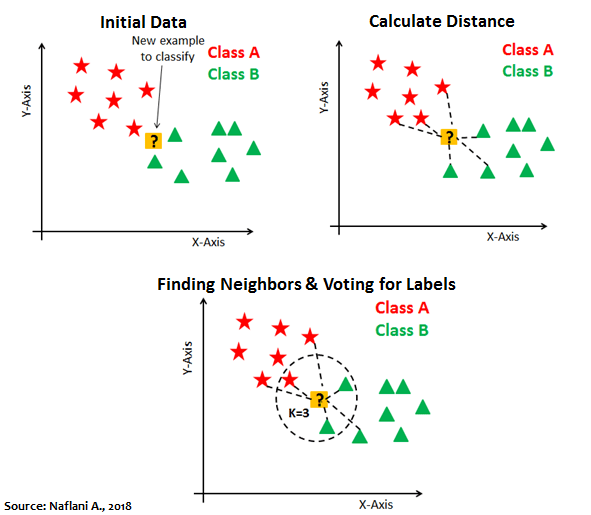

```{r setup, include=FALSE}
# clear-up the environment
rm(list = ls())

# chunk options
knitr::opts_chunk$set(
  message = FALSE,
  warning = FALSE,
  fig.align = "center",
  comment = "#>")
options(scipen = 9999)

# library
library(dplyr)
```

Klasifikasi bertujuan untuk memprediksi kelas (**target variable kategorik**):

* binary classification: 2 kelas
* multiclass classification: > 2 kelas

# Logistic Regression

## Basic Intuition

### Probability

Pada dasarnya, ketika kita melakukan klasifikasi, kita menghitung **peluang**. 

**Contoh:**

Anda adalah student Algoritma yang akan mengerjakan kuis C1. Pada batch sebelumnya, ada 24 dari 30 student yang berhasil mengerjakan kuis. Apakah Anda akan lulus pada kuis C1 ini?

```{r}
# peluang lulus
24/30
```
```{r}
# peluang tidak lulus
(30-24)/30
```
```{r}
# tentukan kelas
ifelse(0.8 > 0.5, "LULUS", "TIDAK LULUS")
```

kesimpulan: diprediksi lulus

Berapa range peluang?

* min: 0
* max: 1

Berapa range hasil prediksi model regresi?

* min: -inf
* max: inf

Dibutuhkan suatu jembatan agar regression dapat digunakan untuk memprediksi peluang. Jembatan itu adalah **Odds** dan **Log of Odds**.

### Odds & Log of Odds

> Peluang: jumlah kejadian terjadi / total kejadian

Odds adalah bentuk lain dari peluang, yaitu perbandingan peluang antara **peluang kejadian terjadi/peluang kejadian tidak terjadi**.  

$$\frac{p}{(1-p)}$$ 

`p` = peluang suatu kejadian terjadi

**Contoh 1:**

Berapa odds dari Anda lulus mengerjakan kuis C1?

```{r}
# peluang = 0.8
# peluang tidak lulus = 0.2
# odds
0.8/0.2
```

Interpretasi: Kejadian seseorang lulus kuis adalah **4 KALI lebih mungkin** dibandingkan tidak lulus kuis. 

Dapat dianalogikan juga, bila odds = 4 (4:1), maka bila ada 4 orang lulus ada yang 1 tidak lulus.

**Contoh 2:** 

Anda hendak berpergian menggunakan pesawat dari Soekarno Hatta Airport. Bila diketahui dari 100 penerbangan di Soekarno Hatta, terdapat 25 pesawat `Delay`. Berapa odds pesawat Anda `On Time`?

```{r}
# peluang
p <- (100-25)/100
# odds
p/(1-p) #0.75/0.25
```

Interpretasi:

* peluang on time 3x lebih mungkin drpd tidak on time

Note: Kalau oddsnya 1 berarti peluangnya? fifty-fifty (0.5)

Berapa range nilai dari odds? 

```{r}
# odds: p/1-p
# min
0/(1-0)
# max
1/(1-1)
```

* Probability: 0 1
* Odds       : 0 Inf

Log of odds adalah nilai odds yang dilogaritmikkan:

\(logit(p) = log(\frac{p}{1-p})\)

```{r}
# log of odds - lulus kuis
log(4)
# log of odds - pesawat on time
log(3)
```

Berapa range nilai log of odds?

```{r}
# min
log(0/(1-0))
# max
log(1/(1-1))
```

* Probability: 0 1
* Odds       : 0 inf
* Log of odds: -inf inf

* Regresi    : -inf inf

Odds dan log of odds mampu menjembatani antara nilai yang dihasilkan oleh model regresi, ke rentang nilai peluang. **Logistic regression menghasilkan Log of Odds**. Nilai log of odds dapat dikembalikan ke bentuk odds (untuk diinterpretasikan) dan peluang sehingga dapat digunakan untuk klasifikasi.

```{r}
# log of odds -> odds
odds <- exp(1.386294) # untuk merubah nilai log ke nilai aslinya bisa menggunakan exponen
odds
```

```{r}
# odds -> peluang dengan `odds/(odds+1)`
odds/(odds+1)
```

Terdapat cara lain:

* `logit()`: peluang -> log of odds
* `inv.logit()`: log of odds -> peluang

```{r}
library(gtools)

# peluang -> log of odds dengan `logit()`
logit(0.8)
```

```{r}
# log of odds -> peluang dengan `inv.logit()`
inv.logit(1.386294)
```

Fungsi `inv.logit()` ini juga biasa disebut *sigmoid function*.

```{r}
# sigmoid function
curve(inv.logit(x), from = -10, to = 10, 
      xlab = "Log of Odds", 
      ylab = "Peluang")
```
Logistic Regression:

- prediksi biner 
+ interpretable    
- non-robust

## `glm()` & Interpretation

Anda adalah seorang analis performa student di universitas. Anda ditugaskan untuk memprediksi status kelulusan siswa dengan honors (cumlaude).

```{r}
# read & inspect data
honors <- read.csv("data_input/sample.csv") %>% 
  select(-femalexmath)

glimpse(honors)
```

Deskripsi kolom:

* `female`: gender of student (1 for female)
* `read`: score in reading test
* `write`: score in writing test
* `math`: score in math test
* `hon`: status of graduating in honors (1 for honors)

```{r}
# cek missing value
anyNA(honors)
colSums(is.na(honors))
```

```{r}
# utk klasifikasi, target variable harus bertipe factor
# data wrangling base
honors$hon <- as.factor(honors$hon)
honors$female <- as.factor(honors$female)

library(dplyr) # memudahkan data wrangling/pre-processing/cleaning
# piping untuk menyambungkan proses, shortcut: ctrl + shift m
honors <- honors %>%
  # mengubah tipe data/isi kolom
  mutate(hon = as.factor(hon),
         female = as.factor(female))
```

```{r}
str(honors)
```

Cara membuat model logistic regression:

`glm(target ~ prediktor, data, family = "binomial")`

### Tanpa Prediktor

```{r}
# generalized linear model
honors.logit <- glm(formula = hon ~ 1, # satu, karena tanpa prediktor
                    data = honors, 
                    family = "binomial") # karena prediksi biner (2 kelas)

summary(honors.logit)
```

**Intercept**: log of odds dari target (student mendapatkan honors (1))

Berikut pembuktiannya:

```{r}
# peluang
table(honors$hon)
```

```{r}
# log of odds student honors
logit(49/(151+49))
```

**Interpretasi**: Log of odds tidak dapat diinterpretasikan. Untuk interpretasi, nilai log of odds kita ubah ke odds.

```{r}
# log of odds -> odds
exp(-1.12546)
```
Kejadian seseorang lulus kuis adalah **4 KALI lebih mungkin** dibandingkan tidak lulus kuis. 

> Kejadian seseorang mendapatkan honors 0.32 KALI lebih mungkin dibandingkan yang tidak honors

> Kejadian seseorang mendapatkan honors lebih tidak mungkin dibandingkan tidak honors (karena oddsnya < 1)

### 1 Prediktor Kategorik

Buat model untuk memprediksi `honors` berdasarkan gender `female`:

```{r}
honors.logit2 <- glm(formula = hon ~ female, data = honors, family = "binomial")
summary(honors.logit2)
```

**Female**: log of *odds ratio* dari student female mendapatkan honors dibandingkan student male mendapatkan honors.

```{r}
# proportion
table(female = honors$female, honors = honors$hon)
```

```{r}
# peluang
p_female <- 32/(77+32)
p_male <- 17/(17+74)

# odds 
o_female <- p_female/(1-p_female)
o_male <- p_male/(1-p_male)

# log of odds
log(o_female/o_male)
```

**Intercept**: log of odds dari student male yang mendapatkan honors (basis)

```{r}
log(o_male)
```

**Interpretasi:**

```{r}
# odds female dapat honors
exp(0.5928)
```

> Kejadian student female mendapatkan honors 1.8 KALI lebih mungkin dibandingkan student male mendapatkan honors

> Kejadian student female mendapatkan honors lebih mungkin dibantdingkan male mendapatkan honors

### 1 Prediktor Numerik

Buat model untuk memprediksi `honors` berdasarkan nilai `math`:

```{r}
honors.logit3 <- glm(formula = hon ~ math, data = honors, family = "binomial")
summary(honors.logit3)
```

**Intercept**: log of odds student honor yang nilai matematikanya 0

**Math**: peningkatan log of odds student honors setiap kenaikan 1 poin nilai math

Contoh: 

`hon = -9.79394 + 0.15634 * math`

Student A memiliki nilai math 52, student B 53. Hitung masing-masing log of oddsnya, berapa selisihnya?

```{r}
# hint: substitusi formula model saja
# log of odds
hon52 <- -9.79394 + 0.15634 * 52  
hon53 <- -9.79394 + 0.15634 * 53

hon53-hon52 # ini masih log of odds
```

**Interpretasi:**

```{r}
# log of odds -> odds
exp(0.15634)
```

> Kejadian student dengan nilai math 53 mendapatkan honors itu 1.17 KALI lebih mungkin dibandingkan student dengan nilai math 52 (1 poin di bawahnya)

> Semakin tinggi nilai matematika akan meningkatkan peluang student mendapatkan honors

> Setiap kenaikan nilai math 1 point memperbesar kemungkinan mendapatkan honors 1.17 KALI

### Banyak Prediktor

Buat model untuk memprediksi `honors` berdasarkan  gender `female` dan nilai `math`:

```{r}
honors.logit4 <- glm(hon ~ female + math, data = honors, family = "binomial")
summary(honors.logit4)
```

**Interpretasi koefisien:**

cari odds dari masing masing predictor:

```{r}
# female
exp(0.96531)
# math
exp(0.16422)
```

`female` = 2.63

> Kejadian student female mendapatkan honors 2.63 KALI lebih mungkin dibandingkan student male mendapatkan honors **dengan catatan** variable lain memiliki nilai yang sama

`math` = 1.18

> Setiap kenaikan nilai math 1 point memperbesar kemungkinan mendapatkan honors 1.18 KALI **dengan catatan** variable lain memiliki nilai yang sama

Yang dimaksud dengan variable lain memiliki nilai yang sama: misal sama-sama female,

Nabiilah
F - 60

Ina
F - 61

Tapi bila disimpulkan sederhana:

> menjadi female mingkatkan peluang mendapatkan honors
> memiliki nilai math lebih tinggi meningkatakan peluang mendapatkan honors

**Aplikasi:**

Final formula: -10.80595 + 0.96531 * female + 0.16422 * math

1. Husain adalah seorang male yang nilai math-nya 60, berapa peluang dia mendapatkan honors? Apakah dia akan lulus dengan honors?

```{r}
# log of odds
lods_husain <- -10.80595 + (0.96531 * 0) + (0.16422 * 60)
lods_husain # log of odds
```

```{r}
# library(gtools)
# peluang 
p_husain <- inv.logit(lods_husain) # peluang
p_husain
```

```{r}
ifelse(test = p_husain > 0.5, yes = "honors", no = "tidak honors")
```

Jawaban:

2. Nabiilah adalah seorang female dan nilai math-nya 80, berapa peluang dia mendapatkan honors? Apakah dia akan lulus dengan honors?

```{r}
# log of odds
lods_nabiilah <- -10.80595 + (0.96531 * 1) + (0.16422 * 80)
lods_nabiilah
```

```{r}
# peluang 
p_nabiilah <- inv.logit(lods_nabiilah)
p_nabiilah
```

```{r}
ifelse(test = p_nabiilah > 0.5, yes = "honors", no = "tidak honors")
```

Jawaban:

Bonus! Apa yang harus dilakukan Husain agar ia dapat lulus dengan predikat honors? ...

```{r}
lods_husain <- -10.80595 + (0.96531 * 0) + (0.16422 * 66)
inv.logit(lods_husain)
```

**Cara Prediksi Manual:**

```{r}
# log of odds (contoh untuk model honors.logit3, student dengan nilai math 52)
hon52
```
```{r}
# peluang
# gunakan inv.logit() dari package gtools untuk mengubah log of odds -> peluang
inv.logit(hon52)
```

```{r}
# klasifikasi; set threshold 0.5
ifelse(0.159191 > 0.5, "honors", "non-honors")
```

Notes: nilai 0.5 (threshold) itu tidak mutlak, ini tergantung user

**Summary:**

1. Logistic regression menghasilkan log of odds
  - fungsi: `glm(formula = y ~ x, data, family = "binomial")`
  - binomial karena memprediksi 2 kelas (binary classification)

2. Untuk interpretasi model logistic regression,

- dilakukan: log of odds -> odds
- menggunakan fungsi: exp()

Interpretasi koefisien dapat dilakukan dan berbeda untuk masing-masing kondisi: 

- tanpa prediktor
- 1 prediktor kategorik
- 1 prediktor numerik
- banyak prediktor

Bila koefisien variable:

- positif: meningkatkan peluang
- negatif: menurunkan peluang

3. Untuk menentukan kelas (klasifikasi) dari hasil logistic regression, nilai *log of odds* diubah kebentuk *peluang* kemudian ditentukan kelasnya berdasarkan batas tertentu (misal = 0.5).

**END OF DAY 1**
---

## Model Selection

```{r}
summary(honors.logit4)
```

### AIC

AIC = Jumlah informasi yang hilang. Semakin kecil AIC, semakin baik model.

```{r}
honors.logit$aic # wo/ predictor
honors.logit2$aic # w/ female
honors.logit3$aic # w/ math
honors.logit4$aic # w/ female + math
```

Note: Nilai AIC kecil tidak berarti hasil prediksinya paling baik.

### Perfect Separation

* **Null deviance**: deviasi model saat tanpa prediktor (model terburuk).
* **Residual deviance**: deviasi model saat menggunakan prediktor.

Umumnya semakin banyak prediktor maka residual deviance akan semakin kecil.

```{r}
# null deviance
honors.logit$null.deviance
```

```{r}
# residual deviance
honors.logit$deviance # wo/ predictor
honors.logit2$deviance # w/ female
honors.logit3$deviance # w/ math
honors.logit4$deviance # w/ female + math
```

Mari buat model `honors.logit5` untuk memprediksi `honors` berdasarkan semua prediktor yang ada:

```{r message=TRUE, warning=TRUE}
honors.logit5 <- glm(formula = hon ~ ., # gunakan semua prediktor
                     data = honors, 
                     family = "binomial")
summary(honors.logit5)
```

NOTE: 

* *glm.fit: fitted probabilities numerically 0 or 1 occurred* -> warning bahwa bisa dihasilkan probability yang tepat 1 atau 0 (indikasi kondisi **perfect separation**)
* *glm.fit: algorithm did not converge* -> warning bahwa algoritmanya tidak mencapai kondisi stabil hingga iterasi ke-25 (default), dapat terjadi salah satunya karena kondisi **perfect separation**.

**Perfect Separation** adalah sebuah kondisi dimana ada 1 variabel yang dapat memisahkan kelas target secara sempurna. Cara mendeteksi:

* ada warning glm did not converge, probability 1/0 occured
* bintangnya hilang (tidak ada variable yang signifikan)
* ada koefisien yang nilainya amat besar -> indikasi variable yang menyebabkan perfect separation
* aic amat kecil
* residual deviance amat kecil

```{r}
# log of odds -> odds
exp(36.30917)
```
Pada kasus ini, nilai write dapat memisahkan kelas honor dengan sempurna:

```{r}
table(honors$hon, honors$write)
```

```{r}
plot(honors$hon, honors$write)
```

> Tidak disarankan menggunakan model dengan perfect separation, karena model amat bias pada salah satu variable dan tidak mempertimbangkan variable lain. Hal ini dapat membuat model tidak akurat (buruk) dalam memprediksi ke data baru.

Apa yang kita lakukan bila bertemu kondisi perfect separation:

* kalau kasus seperti ini kita terima, tidak usah membuat machine learning, cukup `ifelse` saja.
* kalau kasus ini tidak kita terima, maka jangan gunakan variabel ini sebagai prediktor.
* observasi (data) nya kita tambah

```{r}
# revisi model
honors.logit6 <- glm(formula = hon ~ female + read + math, data = honors,
                     family = "binomial")

summary(honors.logit6)
```

**Important Notes:**

Dalam menseleksi model, model yang baik adalah:

* model dengan nilai AIC rendah
* model tanpa kondisi Perfect Separation

## Assumption

Logistic Regression menganut 3 asumsi:

* **Linearity of Predictor & Log of Odds**: cara interpretasi model mengacu pada asumsi ini (contoh: untuk variabel numerik, peningkatan 1 nilai akan meningkatkan log of odds)
* **Multicollinearity**: antar prediktor tidak saling berkorelasi kuat (hingga nilai 1 / -1) -> uji `vif()`
* **Independence of Observations**: antar observasi saling independen & tidak berasal dari pengukuran berulang (repeated measurement) -> kita harus ambil data secara random sampling

Asumsi logistic regression menuntut kita untuk memahami data secara mendalam dan memastikan data sudah siap dipakai untuk membuat model. Coba analisis kasus di bawah:

```{r}
honors[1:5,]
```

**Dive Deeper**

Berikut data penerbangan pesawat dalam `flight_sm.csv`:

```{r}
flight <- read.csv("data_input/flight_sm.csv") %>% 
  mutate(DepDel15 = as.factor(DepDel15)) # target

glimpse(flight) # temannya str()
```

Dekspripsi kolom:

* `Year, Month, DayofMonth, DayofWeek`: self-explanatory
* `Carrier`: maskapai
* `CRSDepTime & CRSArrTime`: jadwal departure & arrival (hhmm)
* `DepDel15`: status delay (1 = delay)
* `OriginState, DestState`: lokasi keberangkatan & tujuan

Buat model `flight.model` untuk memprediksi `DepDel15` berdasarkan `Month` + `DayofWeek`, kemudian tampilkan summary-nya:

```{r}
flight.model <- glm(formula = DepDel15 ~ Month + DayofWeek, 
                     data = flight, family = 'binomial')
summary(flight.model)
```

Perhatikan model dan analisis:

1. Interpretasi koefisien tiap variabel!

```{r}
exp(-0.060895)
exp(-0.004576)
```

* Kejadian pesawat delay untuk yang bulannya 1 poin lebih tinggi dari bulan sebelumnya adalah 0.94 KALI lebih mungkin
* Kejadian pesawat delay untuk yang harinya 1 poin lebih tinggi dari hari sebelumnya adalah 0.99 KALI lebih mungkin

2. Apakah terdapat kesalahan dalam pembuatan model tersebut (cek bagian asumsi)?

* untuk independence of observation dianggap sudah terpenuhi
* untuk multicollinearity:

```{r}
library(car)
vif(flight.model) # asumsi multicollinearity terpenuhi
```

* untuk linearity of predictor and log of odds dirasa belum terpenuhi karena interpretasi model masih belum tepat. seharusnya masing-masing bulan punya pengaruhnya sendiri terhadap kemungkinan pesawat delay.

3. Bila terdapat kesalahan, bagian mana? Apa yang harus dilakukan untuk memperbaiki model?
  
```{r}
# memperbaiki tipe data
flight$DayofWeek <- as.factor(flight$DayofWeek)
flight$Month <- as.factor(flight$Month)

# membuat model ulang
flight.model <- glm(formula = DepDel15 ~ Month + DayofWeek, 
                     data = flight, family = 'binomial')
summary(flight.model)
```

```{r}
# Month4 sebagai basis
unique(flight$Month)
```

```{r}
# interpretasi prediktor Month6
exp(0.35314)
```

> Kejadian pesawat delay pada bulan ke-6 lebih mungkin 1.4 KALI dibandingkan bulan ke-4 **dengan catatan** variable lainnya memiliki nilai yang sama

# Classification Workflow

1. Business Question
2. Read Data
3. Data Wrangling
4. EDA
5. Cross Validation
6. Data Pre-Processing
7. Build Model
8. Predict
9. Model Evaluation
10. Model Tuning -> Final Model

**Studi Kasus: Credit Risk Analysis**

Buat model untuk memprediksi peluang customer akan gagal bayar pinjaman (loan default), untuk mengindikasikan apakah customer tersebut baik atau tidak untuk diberikan pinjaman.

### Read Data

```{r}
loans <- read.csv("data_input/loan2017Q4.csv", stringsAsFactors = T)
```

### Data Wrangling

```{r}
glimpse(loans)
```

Target: not_paid (paid = 0, not_paid = 1)

Adakah variabel yang tipe datanya belum sesuai?

* not_paid as factor
* verified as factor

Adakah variabel yang dapat dibuang? (Ini tergantung kebutuhan user. Intinya, buang variable yang redundan)

* grade
* verification_status
* log_inc

```{r}
loans <- loans %>% 
  select(-c(grade, verification_status, log_inc)) %>% 
  mutate(not_paid = as.factor(not_paid),
         verified = as.factor(verified),
         grdCtoA = as.factor(grdCtoA))

glimpse(loans)
```

### Exploratory Data Analysis

**Cek missing value**

```{r}
colSums(is.na(loans))
```

**Cek persebaran/pattern data**

```{r}
# explore with summary
summary(loans)
```

Insight: `delinq_2yrs` punya range yang amat sempit, mungkin nanti tidak sebegitu informatif pada model.

Literature: Higher debt-to-income ratio (dti) and amount of credit card debts are both associated with a greater likelihood of loan defaults.

```{r}
# numeric predictor vs target variable
plot(loans$not_paid, loans$dti)
```

Insight: dti tidak jauh berbeda untuk not_paid(1) atau paid (0) namun bila secara bisnis berpengaruh maka sebaiknya dimasukkan ke prediktor.

**Cek class-imbalance** 

```{r}
table(loans$not_paid)
```

Proporsi yang seimbang penting agar **model dapat mempelajari karakteristik kelas positif maupun negatif secara seimbang**, tidak belajar dari satu kelas saja. Hal ini mencegah model dari *hanya baik memprediksi 1 kelas saja*. 

Proporsi yang imbalance umumnya 90/10 atau 95/5.

Kalau datanya imbalance:

- tambah data
- downSampling -> buang observasi dari kelas mayoritas, sehingga seimbang
- upSampling -> duplicate observasi dari kelas minoritas, sehingga seimbang

778 vs 50 -> downsampling -> 50 50
778 vs 50 -> upsampling -> 778 778

akan dipelajari di C2.

Note: proporsi akhir g harus 50:50, 70:30 / 60:40 juga boleh.

### Cross Validation

- split data menjadi 2 bagian yaitu **data train** dan **data test**. 
- data train akan digunakan untuk training model.
- data test akan digunakan untuk pengujian performa model. model akan diuji untuk memprediksi data test. hasil prediksi dan data aktual dari data test akan dibandingkan untuk validasi performa model.

Analogi:

* 100 soal
* 80 soal saya pakai untuk belajar (data train)
* 20 soal saya pakai untuk ujian (data test)

tujuan dari cross validation adalah untuk mengetahui seberapa baik model yg sudah kita buat.

```{r}
# intuisi set seed: mengunci random number kita
set.seed(417) # pakai set.seed -> random number dikunci, hasil sampling selalu sama
sample(c("Janu", "Kiki", "Sayyid", "Ani"), 2)
```

```{r}
RNGkind(sample.kind = "Rounding") # tambahan khusus u/ R 3.6 ke atas 
set.seed(417) # mengunci random number yang dipilih

# index sampling
index <- sample(nrow(loans), 
       nrow(loans)*0.8)

# splitting
loans.train <- loans[index,]
loans.test <- loans[-index,]
```

NOTE: Proporsi 0.8/0.2 tidak mutlak, tergantung kebutuhan kita. Umumnya yang lebih banyak adalah untuk data train.

```{r}
# re-check class imbalance
table(loans.train$not_paid)
```

proporsi kelas yang balance penting untuk data train karena kita akan melatih model menggunakan data train.

**Summary**

1. Seleksi model logistic regression:

- AIC -> kecil
- Perfect Separation -> tidak ada (perfect separation adalah kondisi dimana ada suatu variable yang bisa memisahkan kelas target kita dengan sempurna)

2. Asumsi model logistic regression:

- Multicollinearity: antar prediktor tidak boleh ada yang berkorelasi kuat
- Independence of observation: antar observasi tidak saling berpengaruh -> diatasi dengan random sampling (saat pengambilan data)
- Linearity of predictor & log of odds -> kita harus pastikan tipe data prediktor sudah tepat (numerik/kategorik), agar interpretasi variablenya tepat.

3. Workflow klasifikasi (yang sudah dibahas):
 
* Business Question
* Read Data
* Data Wrangling/cleaning data
* EDA:
  - cek class-imbalance -> agar model mempelajari kelas target secara seimbang sehingga bisa memprediksi baik untuk kedua kelas
* Cross validation (splitting train - test): agar bisa evaluasi performa model
  - data train: untuk pembuatan model
  - data test: evaluasi model
* Data Pre-processing (bila perlu)

--- End of Day 2 ---

### Build Model [PR!]

Buatlah model logistic regression untuk memprediksi status loan (not_paid). Silahkan lakukan feature selection berdasarkan pertimbangan bisnis atau/dan statistik!

```{r}
model.loans <- glm(formula = not_paid~., data = loans.train, family = 'binomial')
summary(model.loans)
```

```{r}
model.step <- step(model.loans, direction = "backward", trace = F)
summary(model.step)
```

Pilih masing-masing 1 untuk prediktor kategorik dan prediktor numerik, kemudian interpretasikan:

```{r}
# numerik:


# kategorik:

```

> ...

> ...

### Predict

`predict(model, newdata, type)`

pada `type` terdapat pilihan:

* link: menghasilkan log of odds (link)
* response: menghasilkan peluang

Contoh: prediksi probability `not_paid` untuk 6 data teratas:

```{r}
predict(object = model.step, # model
        newdata = loans.test[1:6,],  # data baru
        type = "response") # karena ingin menghasilkan peluang
```

**Dive Deeper**

Lakukan prediksi probability `not_paid` untuk data **loans.test** dan disimpan pada kolom baru bernama `pred.Risk`.

```{r}
loans.test$pred.Risk <- predict(object = model.step,
                    newdata = loans.test,
                    type = "response")

head(loans.test)
```

Klasifikasikan data loans.test berdasarkan `pred.Risk` dan simpan pada kolom baru bernama `pred.Label`.

```{r}
# ifelse(kondisi, benar, salah)
loans.test$pred.Label <- ifelse(loans.test$pred.Risk > 0.5, "1", "0")
# pastikan kelas target (aktual dan prediksi) bertipe factor
loans.test$pred.Label <- as.factor(loans.test$pred.Label)

head(loans.test)
```

**Note:**

Penentuan label yang menjadi angka 1 pada **model logistic regression** adalah berdasarkan levels.

kelas "0", "1" -> basis = 0, 
                  peluang mendekati 0 -> 0
                  peluang mendekati 1 -> 1

kelas "paid" "unpaid" 
levels: 0       1
                         -> basis = paid
                            peluang mendekati 0 -> paid
                            peluang mendekati 1 -> unpaid

```{r}
# lihat hasil prediksi
loans.test %>% 
  select(not_paid, pred.Risk, pred.Label) %>% 
  head(6)
```

### Model Evaluation

Setelah dilakukan prediksi menggunakan model, masih ada saja prediksi yang salah. Pada klasifikasi, kita mengevaluasi model berdasarkan **confusion matrix**:

* true positive (TP): prediksi positif; aktual positif
* true negative (TN): prediksi negatif; aktual negatif 
* false positive (FP): prediksi positif; aktual negatif
* false negative (FN): prediksi negatif; aktual positif

```{r, out.width = "40%", echo = FALSE, fig.align = "center"}
knitr::include_graphics("img/tnfp.PNG")
```

kelas positif: label preferensi kita. yg lebih dipentingkan. di kasus ini kelas positif nya adalah not_paid

```{r}
library(caret)
confusionMatrix(data = loans.test$pred.Label, 
                reference = loans.test$not_paid,
                positive = "1")
```

Contoh lain:

          Reference
Prediction   0   1
         0 143 118
         1  18  33
         
TN: 143
TP: 33
FN: 118
FP: 18

4 metrics performa model: Accuracy, Sensitivity/Recall, Precision, Specificity 

**Accuracy**

Seberapa banyak yang benar diprediksi dari keseluruhan data (positif maupun negatif).

          Reference
Prediction  0  1
         0 93 53
         1 68 98

`TP+TN/TOTAL`

```{r}
(93+98)/(93+98+53+68)
```

Digunakan ketika:

- kelas target sama penting
- data balance

Ada kondisi ketika accuracy bukanlah metrics terpenting. Umumnya ketika:

- kita mementingkan salah satu kelas (kelas positif)
- data kita imbalance

Slide link: https://docs.google.com/presentation/d/1XEZn6HHzR91L-x06mOCf8ZCkqmBzQhbN4lym5adw3w0

Saat kita mementingkan kelas tertentu (kelas positif), maka kita dapat memilih antara menggunakan metrics Recall / Precision: 

**Sensitivity/Recall**

Seberapa banyak yang **benar diprediksi positif**, dari yang **re**ality-nya (aktualnya) positif.

          Reference
Prediction  0  1
         0 93 53
         1 68 98

`TP/(TP+FN)`

```{r}
98/(98+53)
```

**Pos Pred Value/Precision**

Seberapa banyak yang **benar diprediksi positif**, dari yang di**pre**diksi positif. 

          Reference
Prediction  0  1
         0 93 53
         1 68 98

`TP/(TP+FP)`

```{r}
98/(98+68)
```

Untuk memahaminya mari berdiskusi:

**Diskusi**

ROLE PLAY:

1. Seorang dokter ingin mendiagnosa pasien kanker menggunakan model machine learning. Pasien yang kanker akan diarahkan untuk pemeriksaan lanjutan. Untuk melihat kebaikan model, metrics mana yang lebih kita utamakan? 

* Target variabel = kanker/non-kanker
* Kelas positif = kanker
* Metrics = Recall

2. Kita ingin membuat model prediksi untuk mengklasifikasikan e-mail spam/ham. Metrics mana yang lebih kita utamakan?
  
* Target variabel = spam/ham
* Kelas positif = spam
* Metrics = bisa dua-duanya, tergantung kepentingan bisnis:

precision: maka ingin sedikit mungkin email ham masuk spam (FP). Agar tidak ada email penting yang tidak terbaca. 

recall: maka ingin sedikit mungkin emal spam masuk ham (FN). Agar inbox tidak terpenuhi email spam. Misal, untuk menghindari e-mail yang aslinya malware/virus (spam) tapi masuk ham. Kalau ada email penting masuk spam tidak masalah karena orang yang bersangkutan bisa memberikan notice atau kita yang mengecek folder spamnya.

3. Bila ada seorang **seller** dan **bos** nya yang hendak menawarkan produk perusahaan ke 1000 calon pelanggan. Ingin dibuat model prediksi dimana positive = pelanggan membeli produk. Maka siapa yang mementingkan recall, siapa yang mementingkan precision, dan mengapa?

**Bos**: 

* Recall, karena mau sebanyak mungkin ambil klien prospektif agar tidak ada peluang yang terlewat.
* Precision, karena mau utilitas resource seoptimal (minimal) mungkin sehingga hemat

**Seller**: 

* Recall, karena sebanyak mungkin ambil klien prospektif agar bisa dapat bonus
* Precision, karena mau tidak usah capek menelpon banyak orang, tapi dengan usaha seperti itu sudah banyak yang beli produk

**Specificity**

Seberapa banyak yang **tepat diprediksi negatif**, dari yang **reality-nya negatif**. Jarang dipakai karena kita tidak sering fokus pada kelas negatif.

          Reference
Prediction  0  1
         0 93 53
         1 68 98

`TN/(TN+FP)`

```{r}
93/(93+68)
```

4. Metrics yang baik untuk kasus loans adalah? (positif: not paid) 

Recall: mendeteksi sebanyak mungkin kemungkinan gagal bayar.

Bila hasil evaluasi (nilai metrics) belum memuaskan, dapat dilakukan **Model Tuning**:

1. ganti prediktor
2. ubah data pre-processingnya: misal upsample/downsample, scaling dll.
3. ganti modelnya (pakai model yang lebih robust)
4. ganti treshold prediction (tidak terlalu dianjurkan, karena bisa memaksakan):
  * geser mendekati 0: meningkatkan recall
  * geser mendekati 1: meningkatkan precision
  * Lebih detailnya lihat slides.

# k-NN

k-NN adalah *K-nearest neighboor*. Metode ini akan mengkasifikasi data baru dengan membandingkan karakteristik data baru (data test) dengan data yang ada (data train). Kedekatan karakteristik tersebut diukur dengan **Euclidean Distance** hingga didapatkan **jarak**. Kemudian akan dipilih **k** tetangga terdekat dari data baru tersebut, kemudian ditentukan kelasnya menggunakan majority voting.

```{r, out.width = "80%", echo = FALSE, fig.align = "center"}

```

## Picking Optimum k

* jangan terlalu besar: pemilihan kelas hanya berdasarkan kelas yang dominan dan mengabaikan pola kecil yang ternyata penting. 
* jangan terlalu kecil: rentan mengklasifikasikan data baru ke kelas outlier.
* **k optimum** adalah akar dari jumlah data kita: `sqrt(nrow(data))`
* untuk menghindari seri ketika majority voting:
  - k harus ganjil bila jumlah kelas target genap
  - k harus genap bila jumlah kelas target ganjil 
  - k tidak boleh angka kelipatan jumlah kelas target
* bila hasil majority voting seri, maka kelas akan dipilih secara random.

## Karakteristik k-NN

* tidak membuat model: langsung mengklasifikasi *saat itu juga*, tidak belajar dari data, setiap ingin mengklasifikasi harus menyediakan data train lagi.
* tidak ada asumsi
* dapat memprediksi multiclass
* baik untuk prediktor numerik (karena mengklasifikasikan berdasarkan jarak), tidak baik untuk prediktor kategorik
* robust
* tidak interpretable

## Breast Cancer Prediction 

### Business Question 

Kanker payudara adalah kanker yang paling umum menyerang wanita di dunia. Kanker payudara dapat berupa kanker jinak (benign) atau sudah ganas (malignant). Kanker ganas dapat menyebar ke organ-organ tubuh lainnya. Ingin dibuat model prediksi untuk memprediksi apakah kanker masih jinak (benign) atau sudah ganas (malignant).

```{r, out.width = "80%", echo = FALSE, fig.align = "center"}
knitr::include_graphics("img/histology-examples.png")
```

### Read Data

```{r}
wbcd <- read.csv("data_input/wisc_bc_data.csv")
```

```{r}
# inspect data
glimpse(wbcd)
```

Variabel target: diagnosis

B = benign
M = Malignant

### Data Wrangling 

```{r}
wbcd <- ...
```

### Exploratory Data Analysis

* **cek proporsi kelas**

```{r}

```

Insight: ...

* **cek range nilai tiap variable prediktor**: range harus sama karena knn mengklasifikasikan berdasarkan **jarak**. kalau ada nilai yang tinggi sendiri dibanding yang lain, maka variable tersebut akan sangat mempengaruhi hasil klasifikasi dan mengabaikan variable yang lain. 

```{r}
# cek range nilai tiap variable
summary(wbcd)
```

Range tiap variabel berbeda sehingga perlu dilakukan feature rescaling di tahap *data pre-processing*.

### Cross Validation

```{r}
RNGkind(sample.kind = "Rounding")
set.seed(417)


  
  
```

```{r}
# recheck class balance

```

Insight: ...

### Data Pre-processing

#### Scaling

Scaling bisa menggunakan *min-max normalization* atau *z-score standarization*.

1. Min-Max Normalization

Rumus = x-min(x) / max(x)-min(x)

```{r}
normalize <- function(x){
  return ( 
    (x - min(x))/(max(x) - min(x)) 
           )
}
```

```{r}
# contoh:
normalize(c(1,2,3,4,5)) # memampatkan range nilai menjadi 0-1
```

-> digunakan ketika tau angka pasti min dan max nya. misalnya nilai ujian matematika pasti nilai min-max nya 0 - 100.

2. Z-score Standarization: dapat menggunakan function `scale()`

Rumus = x-mean(x) / sd(x)

```{r}
# contoh:
scale(c(1,2,3,4,5)) # data kita seberapa menyimpang (sd) dari pusatnya (mean)
```

-> digunakan ketika tidak diketahui angka min dan max pastinya. misalnya temperature bisa dari kisaran -inf s.d +inf

Untuk k-NN, dipisahkan antara prediktor dan label (target variabelnya).

```{r}
# prediktor
wbcd_train_x <- ...

wbcd_test_x <- ...

# target
wbcd_train_y <- ...

wbcd_test_y <- ...
```

Data prediktor akan discaling menggunakan z-score standarization. Data test juga harus discaling menggunakan parameter dari data train (karena menganggap data test adalah unseen data).

```{r}
# scaling data prediktor
wbcd_train_xs <- scale(x = wbcd_train_x)
wbcd_test_xs <- scale(x = wbcd_test_x,
                     center = attr(wbcd_train_xs, "scaled:center"),
                     scale = attr(wbcd_train_xs, "scaled:scale"))
```

k-NN tidak membuat model sehingga langsung ke predict.

### Predict

```{r}
# find optimum k

```

* jumlah kelas target: 2
* k: ...

```{r}
library(class) # package untuk fungsi `knn()`

wbcd_pred <- ...
```

### Model evaluation

```{r}
# confusion matrix
library(caret)

```

# Logistic Regression & k-NN Comparation

```{r, out.width = "80%", echo = FALSE, fig.align = "center"}

```

**Summary**

**Classification Workflow:**

* **Predict** untuk logistic regression dengan fungsi `predict()`
* **Model Evaluation** untuk klasifikasi menggunakan **confusion matrix**. Terdapat 4 metrics:
  - Accuracy: TP + TN / total data
    - dipakai bila kedua kelas sama penting
    - dipakai bila data balance
  - Sensitivity/Recall: TP / TP + FN
    - benar diprediksi positif / aktualnya postitif
    - sebanyak mungkin mengambil yang kemungkinan kelas positif
  - Precision: TP / TP + FP
    - benar diprediksi positif / diprediksi positif
    - seselektif mungkin dalam menentukan kelas positif
  - Specificity: TN / TN + FP
  - Nilai Recall & Precision seringkali trade off. Kita memilih Recall/Precision tergantung kebutuhan bisnis.

**k-NN:**

1. k-NN mengkasifikasi berdasarkan **jarak**
  - tentukan ingin menggunakan berapa **k** tetangga terdekat (data termirip)
  - hitung jarak ke seluruh data dan tentukan k tetangga terdekat
  - dilakukan majority voting dari kelas k tetangga terdekatnya
2. Optimum k = `sqrt(nrow(data))`
3. Workflow: layaknya workflow klasifikasi dengan tambahan,
  - EDA: - cek range variable prediktor -> jangan ada yang berbeda jauh
  - Data pre-processing: scaling (bila range variable berbeda jauh)
4. Masing-masing model memiliki karakteristik, keunggulan dan limitasi masing-masing. Gunakan yang menjawab kebutuhan kita.