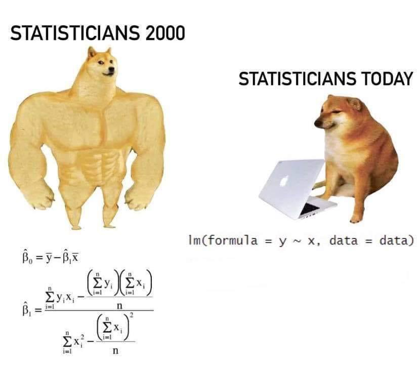
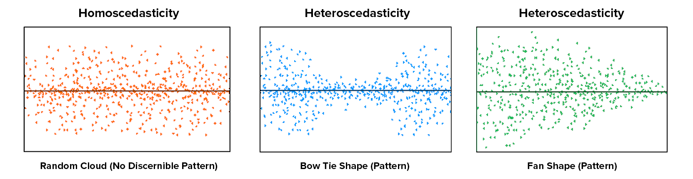

```{r setup, include=FALSE}
knitr::opts_chunk$set(echo = TRUE, 
                      warning = FALSE, 
                      message = FALSE, 
                      fig.align = "center",
                      comment = "#>")
options(scipen = 99)
```

```{r}
library(dplyr)
library(leaps)
library(MASS)
```

# Machine Learning

```{r echo=FALSE}
knitr::include_graphics("assets/cheatsheet.png")
```

Machine learning digunakan karena kebutuhan data yang semakin banyak, sehinga kita gunakan untuk mempercepat pengerjaan dalam analisis(prediksi) maupun exploratory data.

Machine learning secara umum dibagi menjadi dua jenis yaitu:

1. **Supervised learning** : memiliki target variabel (y). Dibagi menjadi dua berdasarkan target variabel : 
  
  - Regression : target variabelnya numerik
  - Classification : target variabel kategorik
  
2. **Unsupervised Learning** : tidak memiliki target variabel (y)

  - Clustering
  - Dimensionality Reduction
  
## Interpretability vs Robust

1. Interpretability   
* (+) model dapat diinterpretasikan
* (-) cenderung memiliki eror yang cukup besar

2. Robust     
* (-) tidak bisa diinterpretasikan
* (+) hasil eror cenderung kecil 


```{r echo=FALSE}
knitr::include_graphics("assets/RM.png")
```

Regression model merupakan **Supervised Learning** karena data yang dibutuhkan harus memiliki target variabel (y). Target variabel dari Regression Model harus bertipe numerik, namun untuk prediktornya (x) boleh numerik/kategorik

**Business Problem**

Pemilihan variabel target biasanya dikaitkan dengan masalah bisnis yang ingin diselesaikan:

1. Sebuah agen properti berusaha membangun sebuah model untuk menebak harga sebuah properti untuk digunakan sebagai acuan kontrol dalam menjaga harga pasar. Untuk itu mereka mengembangkan sebuah model dengan:

- Variabel target: harga property
- Variabel prediktor: luas tanah, lokasi, usia dari property, suku bunga, banyak kamar, status property

2. Seorang pemilik restoran ingin menebak ingin menebak berapa banyak penjualan yang akan dihasilkan di bulan depan oleh restorannya.  Untuk itu mereka mengembangkan sebuah model dengan:

- Variabel target: banyak penjualan
- Variabel prediktor: harga, segment customer, musim, pilihan menu

# Linear Regression

Linear Regression adalah salah satu model machine learning yang dipakai untuk menyelesaikan kasus `regression` atau membuat model dengan target variabel numerik.

## Simple Linear Regression

Simple Linear Regression artinya kita hanya menggunakan 1 variabel atau hanya memiliki 1 prediktor untuk memprediksi target variabel.

Sebagai gambaran awal, kita ingin memprediksi harga (price) dari berlian dengan mempertimbangkan berat (carat) dari berlian tersebut. Untuk mempermudah dalam pemahaman dan visualisasi data, kita ambil 500 data secara acak saja.

* Import data

Kita akan gunakan data `diamonds` dari package ggplot2.

```{r}
library(ggplot2)
head(diamonds)
```

Data Description:

* `price`: price in US dollars 
* `carat`: weight of the diamond
* `cut`: quality of the cut (Fair, Good, Very Good, Premium, Ideal)
* `color`: diamond color, from D (best) to J (worst)
* `clarity`: a measurement of how clear the diamond is (I1 (worst), SI2, SI1, VS2, VS1, VVS2, VVS1, IF (best))
* `x`: length in mm
* `y`: width in mm
* `z`: depth in mm 
* `depth`: total depth percentage = $\frac{2 \times z }{x + y}$
* `table`: width of top of diamond relative to widest point 

Pada kasus ini, kita akan mencoba menggunakan 500 sample data acak.

```{r}
# Hanya ambil 500 data secara acak
RNGkind(sample.kind = "Rounding")
set.seed(100) # untuk mengunci hasil randomisasi data
insample <- sample(nrow(diamonds), 500) # melakukan random data sebanyak 500 data
small_diamond <- diamonds[insample, ]
head(small_diamond)
```

```{r}
# Visualization
plot(x = small_diamond$carat, y = small_diamond$price)
```

* Inspect data berdasarkan struktur datanya
```{r}
str(small_diamond)
```

* Cek missing value
```{r}
colSums(is.na(small_diamond))

anyNA(small_diamond)
```

**Business Problem**

Ingin  memprediksi harga (**price**) dari berlian dengan mempertimbangkan berat (**carat**) dari berlian tersebut.. Tentukan:

- Variabel target: `price`
- Variabel prediktor: `carat`

* Eksplorasi data

**Cek persebaran data**

  + Cek persebaran variabel price:   

    - histogram atau boxplot
```{r}
boxplot(small_diamond$price)
```

  + Cek persebaran variabel carat
```{r}
hist(small_diamond$carat, breaks = 50)
```

Pada variabel price dan carat terdapat outlier. 

**Cek korelasi antar variabel target dan prediktor**

    - menggunakan nilai korelasi
```{r}
cor(small_diamond$carat, small_diamond$price)
```
Hubungan anatar price dan carat yaitu positif dan kuat karena mendekati 1.

    - menggunakan visualisasi
```{r}
plot(small_diamond$carat, small_diamond$price)
```

Kesimpulan dari plot:

Ketika kita mendapatkan ada dua variabel yang saling berhubungan erat. Maka dapat dikatakan kedua variabel tersebut memiliki indikasi pasangan prediktor - target yang baik. 

> Nilai korelasi yang besar adalah indikasi yang baik untuk hubungan prediktor dan target.

## Behind The Machine

### Slope and Intercept

Garis atau tren linear yang didapatkan dari model regresi linear secara matematis didapatkan dari persamaan berikut:

$$
y = \alpha + \beta\ x \\
price = \alpha + \beta\ carat
$$

- y: target variabel
- $\alpha$: intercept
- $\beta$: slope atau koefisien
- x: prediktor

Formula model regresi secara umum:

$$
\hat{y}=\beta_0+\beta_1.x_1+...+\beta_n.x_n
$$
 
dimana, $x_1,...,x_n$ merupakan variabel prediktor yang digunakan.

### Membuat Model Regresi

```{r echo=FALSE}

```

Pertama, kita akan coba prediksi harga diamond (`price`) terhadapberat diamond (`carat`). Untuk membuat model regresi, dimana kita hanya memprediksi menggunakan satu variabel prediktor saja, kita bisa gunakan function `lm(formula = y~x, data)`

argumen dalam fungsi `lm()`:

* `formula` = y~x : target~prediktor
* `data` = data frame yang digunakan

```{r}
model_diamond <- lm(formula = price~carat, data = small_diamond)
model_diamond
```

Untuk memprediksi nilai price atau harga berlian, maka bisa menggunakan rumus berikut sesuai hasil dari `lm()`.

$$
price =  -2141 + 7611 \times carat
$$

* $\alpha$ / intercept: intercept, berapa harga berlian jika nilai carat atau prediktornya adalah 0? 

Ketika carat dari sebuah berlian adalah 0, maka harga berlian tersebut adalah -2141

price = -2141 + 7611* carat
price = -2141 + 7611*0
price = -2141

* $beta$: slope atau koefisien dari setiap prediktor. Jika nilai carat naik sebanyak 1 unit, berapa besar perubahannya terhadap harga?

Setiap kenaikan carat sebanyak 1 akan diikuti kenaikan harga sebesar 7611

   - Jika carat = 1, maka price = -2141 + 7611 x 1 = 5470
   - Jika carat = 2, maka price = -2141 + 7611 x 2 = 13081
   - Jika carat = 0.5, maka price = -2141 + 7611 x 0.5 = 1664.5
   - Jika carat = 1.5, maka price = -2141 + 7611 x 1.5 = 9275.5
   
```{r}
-2141 + 7611*2
```

## Ordinary Least Square

Bagaimana regresi linear menentukan nilai `slope` dan `intercept` yang digunakan? Padahal saya bisa menggunakan nilai slope dan intercept berapapun untuk membuat sebuah model.

```{r}
# Membuat slope dan intercept secara random
set.seed(123)
df_random <- data.frame(intercept = model_diamond$coefficients["(Intercept)"] * runif(100, max = 2),
                        slope = model_diamond$coefficients["carat"] * runif(100, max = 2)
                        )

# Visualization
small_diamond %>% 
  ggplot(aes(x= carat, y = price)) +
  geom_abline(data = df_random, aes(slope = slope, intercept = intercept), alpha = 0.2, color = "red") +
  geom_point(alpha = 0.5) +
  geom_abline(intercept = model_diamond$coefficients["(Intercept)"], 
              slope = model_diamond$coefficients["carat"],
              color = "blue"
              ) +
  theme_minimal()
```

Jika diperhatikan, dari setiap titik memiliki jarak terhadap garis linearnya. Jarak ini menunjukkan bahwa dari prediksi yang dibuat model terdapat perbedaan dengan data aktualnya. Jarak atau kesalahan prediksi ini kita sebut dengan error atau `residual`.

```{r}
small_diamond %>% 
  ggplot(aes(x= carat, y = price)) +
  geom_segment(aes(xend = carat, yend = model_diamond$fitted.values),
               alpha = 0.5, color = "red"
               ) +
  geom_point(alpha = 0.5) +
  geom_abline(intercept = model_diamond$coefficients["(Intercept)"], 
              slope = model_diamond$coefficients["carat"],
              color = "blue"
              ) +
  theme_minimal() 
```

Statistik tidak mungkin memprediksi tepat 100%. Maka dari itu, untuk memperoleh model yang baik kita perlu menghasilkan error yang minimum. Cara memperoleh error yang minimum menggunakan pendekatan OLS (Ordinary Least Square).

Konsep dari ordinary least square regression yaitu melakukan prediksi dengan memperoleh hasil prediksi yang memiliki nilai eror terkecil. Pendekatan yang digunakan yaitu menggunakan nilai mean.

```{r eval=FALSE}
#  run code pada console
library(manipulate)

expr1 <- function(mn) {
  
  mse <- mean((small_diamond$price - mn)^2)
  
  hist(small_diamond$price, breaks = 20, main = paste("mean = ", mn, "MSE = ", round(mse, 2), sep = ""))
    abline(v = mn, lwd = 2, col = "darkred")
    
}

manipulate(expr1(mn), mn = slider(3600, 4650, step = 10))
mean(small_diamond$price)
```

> Membuat prediksi menggunakan nilai rata-rata akan menghasilkan error terkecil merupakan konsep dari OLS

```{r}
model_ols <- lm(price~1, small_diamond) # membuat model price tanpa menggunakan prediktor
model_ols
```

## Interpretasi Model

```{r}
summary(model_diamond)
```
Formula model regresi price = $price = -2141 + 7611*carat $

**Interpretasi model regresi**

- Intercept: Titik awal garis regresi terbentuk, menunjukkan nilai target variabel ketika nilai prediktor = 0

> Ketika nilai carat = 0, maka nilai price sama dengan -2141

- Slope: kenaikan setiap 1 satuan, kenaikan 1 prediktor meningkatkan target variabel sebesar slope

> Setiap kenaikan 1 satuan pada berat diamond(carat), maka price diamond akan naik sebesar 7611

- Koefisien bernilai positif = korelasi positif

> Dengan nilai slope sebesar 7611, artinya hubungan antara berat diamond (carat) dan price diamond positif, ketika berat diamond (carat) naik maka price diamond akan naik, ketika berat diamond (carat) turun price diamond akan turun.

- **Nilai p-value** sebagai tolak ukur apakah variabel prediktor berpengaruh signifikan terhadap variabel target. Dikatakan signifikan ketika nilai p-value < 0.05. 

> Hipotesis :
- H0 : berat diamond (carat) tidak mempengaruhi price diamond
- H1 : berat diamond (carat) mempengaruhi price diamond

- **R-squared**: seberapa baik prediktor dapat menjelaskan keberagaman kelas target. Ukuran yang bisa kita gunakan untuk mengukur "goodness of fit" atau "kebaikan model". 

Range dari R-Squared adalah 0-1 atau 0-100%, dimana:

- semakin mendekati 0, maka model yang diperoleh masih kurang terjelaskan menggunakan prediktor yang ada (poor fit)
- semakin mendekati 1, maka model yang diperoleh sudah dapat terjelaskan dengan baik menggunakan prediktor yang ada 

$$
R^2 = 1 - \frac{\sum(y_i - \hat y_i)^2}{\sum(y_i - \overline y)^2}
$$
Dari `model_diamond` kita peroleh R-Squared sebesar 84%, artinya model regresi kita hanya mampu menjelaskan variansi dari harga diamond (price) sebesar 84% berdasarkan berat diamond (carat) sisanya 16% dijelaskan oleh faktor lain yang belum kita ketahui. 

Ketika kita ingin membeli diamond dengan berat 2.4, besaran uang (price) yang harus disiapkan yaitu 
```{r}
price = -2141 + 7611*2.4
price
```

---

## Dive Deeper 1

Pada case ini kita ingin coba prediksi nilai `inequality` berdasarkan variabel `gdp` dari data `crime.csv`

* Read data

```{r}
library(dplyr)
crime <- read.csv("data_input/crime.csv") %>% 
  dplyr::select(-X)
names(crime) <- c("percent_m", "is_south", "mean_education", "police_exp60", "police_exp59", "labour_participation",
                  "m_per1000f", "state_pop", "nonwhites_per1000", "unemploy_m24", "unemploy_m39", "gdp", "inequality",
                  "prob_prison", "time_prison", "crime_rate")
head(crime)
```

Glossary data `crime` :

- `percent_m`: percentage of males aged 14-24
- `is_south`: whether it is in a Southern state. 1 for Yes, 0 for No.  
- `mean_education`: mean years of schooling  
- `police_exp60`: police expenditure in 1960  
- `police_exp59`: police expenditure in 1959
- `labour_participation`: labour force participation rate  
- `m_per1000f`: number of males per 1000 females  
- `state_pop`: state population  
- `nonwhites_per1000`: number of non-whites resident per 1000 people  
- `unemploy_m24`: unemployment rate of urban males aged 14-24  
- `unemploy_m39`: unemployment rate of urban males aged 35-39  
- `gdp`: gross domestic product per head  
- `inequality`: income inequality  
- `prob_prison`: probability of imprisonment  
- `time_prison`: avg time served in prisons  
- `crime_rate`: crime rate in an unspecified category


* Tentukan varibael prediktor dan variabel target apabila kita ingin membuat model yang memprediksi `inequality` berdasarkan `gdp`

- variabel target: `inequality`
- variabel prediktor: `gdp`

* Buatlah model linear regresi tersebut menggunakan fungsi `lm()`
```{r}
model_ineq <- lm(formula = inequality~gdp, data = crime)
summary(model_ineq)
```

a. Model regesi yang diperoleh:

$$inequality = 386.03 - 0.366*gdp$$

b. Apakah variabel prediktor berpengaruh signifikan terhadap variabel target?

> gdp berpengaruh signifikan terhadap variabel inequality karena p-value < 0.05.

c. Goodness of fit (R-Squared)

> Dengan R-Squared sebesar 78.15% artinya model yang kita miliki dengan menggunakan variabel gdp mampu menjelaskan target variabel (inequality) sebesar 78.15%, sisanya dijelaskan oleh faktor lain. 

```{r}
# Visualizing fitting line
ggplot(crime, aes(x = gdp, y = inequality))+
  geom_point(alpha = 0.5)+
  geom_smooth(method = "lm")+
  theme_minimal()
```

---

Prediksi harga diamond, apabila kita memiliki berat diamond sebagai berikut:

```{r}
carat <- c(0.97, 1.2, 0.69, 0.89)
```

Gunakan function `predict()` untuk melakukan prediksi
```{r}
predict(object = model_diamond, newdata = data.frame(carat))
```

```{r}
# Visualizing fitting line
ggplot(small_diamond, aes(x = carat, y = price))+
  geom_point(alpha = 0.5)+
  geom_smooth(method = "lm")+
  theme_minimal()
```

* Informasi yang terkandung pada model regresi
```{r eval=FALSE}
summary(model_diamond)
model_diamond$coefficients[1] # menyimpan informasi intercept dan slope
model_diamond$call # menyimpan informasi code pembuatan model
model_diamond$fitted.values # menyimpan informasi hasil prediksi dari data yang digunakan dalam membuat model
model_diamond$residuals # menyimpan informasi eror dari prediksi model
summary(model_diamond)$r.squared # nilai R-Squared model
```


<center> **--- End of Day 1 ---** </center>

---


## Leverage vs Influence

Leverage adalah nilai yang jauh dari kerumunan datanya, sering disebut sebagai **outlier**. Nilai leverage dapat mempengaruhi model linear regresi atau pun tidak.

Nilai leverage bisa mempengaruhi model secara signifikan atau pun tidak.   
* Ketika leverage mempengaruhi model secara signifikan : high influence
* Ketika leverage tidak mempengaruhi model secara signifikan : low influence

Nilai leverage ketika berpengaruh baik dalam artian meningkatkan nilai R-squared atau Adjusted R-square maka sebaiknya outlier tersebut kita pakai dalam pemodelan. Ketika nilai leverage berpangaruh buruk dalam artian menurun nilai R-squared atau Adjusted R-squared maka sebaiknya leverage tersebut kita buang.

Untuk melakukan pengecekan leverage :

* `hist()`
* `boxplot()`

Buatlah model regresi dengan menghilangkan nilai outlier pada variabel carat

* Melakukan pengecekan outlier pada variabel carat
```{r}
ggplot(small_diamond, aes(x = carat))+
  geom_boxplot()

# mendapatkan nilai data yang termasuk outlier
boxplot(small_diamond$carat, graph = F)$out
```

* Subset data `small_diamond` tanpa melibatkan nilai outlier pada variabel carat
```{r}
small_diamond_no <- small_diamond %>% 
  filter(carat < 2.1)
head(small_diamond_no)
```

* Membuat model tanpa outlier
```{r}
model_diamond_no <- lm(formula = price ~ carat, data = small_diamond_no)
model_diamond_no
```

```{r}
model_diamond
```

Formulasi model no outlier :

$$price = -2286 + 7818*carat$$

Kita akan coba bandingkan model regresi yang menggunakan nilai outlier pada variabel carat dan tanpa nilai outlier
```{r}
ggplot(small_diamond, aes(x = carat, y = price))+
  geom_point(alpha = 0.5)+ 
  geom_abline(intercept = model_diamond$coefficients[1], slope = model_diamond$coefficients[2], col = "blue")+ # menampilkan garis regresi dengan outlier
  geom_abline(intercept = model_diamond_no$coefficients[1], slope = model_diamond_no$coefficients[2], col = "red")+ # menampilkan regresi tanpa outlier
  theme_minimal()
```

**Kesimpulan:** : bahwa outlier yang ada pada data diamond memiliki sifat **low leverage low influence**, artinya outlier yang dimiliki bisa saja masih termasuk data asli kita hanya saja nilainya yang cenderung lebih besar.

```{r}
model_diamond$coefficients
model_diamond_no$coefficients
```

```{r}
summary(model_diamond)$r.squared
summary(model_diamond_no)$r.squared
```


# Multiple Linear Regression

Multiple linear regression merupakan metode linear regresi dengan menggunakan **lebih dari 1** variabel prediktor. 

**Business Problem**

Bayangkan Anda dipekerjakan sebagai pegawai magang di dewan kota yang merencanakan beberapa balapan pada suatu bukit di Jawa Barat. Pertanyaan bisnis yang terbentuk: Mengingat **jarak** dan **ketinggian** dari setiap balapan berikutnya, apakah Anda dapat memprediksi waktu balapan (dalam menit) untuk setiap balapan ini?

Kita akan menggunakan data `hills` dari package `MASS`
```{r}
library(MASS)
data(hills)
hills
```


Deskripsi data:

* `dist`: jarak dalam mil
* `climb`: total ketinggian dalam seluruh rute (satuan dalam kaki)
* `time`: waktu tempuh yang tercatat dalam menit

Katakanlah kita ingin melakukan prediksi waktu tempuh (**time**) berdasarkan jarak dan total ketinggian (**dist** dan **climb**). 

* Variabel target : `time`
* Variabel prediktor : `dist` dan `climb`

Buatlah model multiple linear regressionnya.

Formula model regresi:

`formula = y~x1+x2` atau `formula = y~.`
```{r}
# cara 1
model_time <- lm(formula = time ~ dist+climb, data = hills)
# cara 2
model_time <- lm(formula = time ~ ., data = hills)

model_time
```

Formula regresi yang terbentuk:

y = a+bx

y = a +b1x1 +b2x2 +b3x3 + ... +bnxn

$$time = -8.99204 + 6.21796*dist + 0.01105*climb$$

**Interpretasi model**

* intercept = nilai time yang diperlukan ketika peserta lomba tidak memiliki jarak = 0, dan climb  = 0, dia akan memerlukan time sebesar -8.99204
* slope dist = setiap kenaikan 1 nilai dari dist akan menaikkan lama waktu sampai finish sebesar 6.218 dengan menganggap nilai climb konstan
* slope climb = setiap kenaikan 1 nilai dari climb akan menaikkan lama waktu sampai finish sebesa 0.011 dengan menganggap nilai dist konstan

```{r}
summary(model_time)
```

## R-Squared vs Adjusted R-Squared

Ketika kita menggunakan lebih dari satu prediktor, R-Square akan selalu bertambah seiring dengan bertambahnya variabel prediktor baru meskipun belum tentu memiliki pengaruh terhadap model. Untuk mengatasi hal ini, dibuat metrik baru bernama `Adjusted R-Square` yang menghitung nilai R-Square tetapi juga mempertimbangkan jumlah variabel yang digunakan sehingga nilai R-Square yang ditampilkan lebih tepat.

$$
Adjusted\ R^2 = 1 - \frac{(1-R^2)(n-1)}{n-k-1}
$$

Keterangan:

- n: Jumlah data
- k: Jumlah variabel prediktor
- $R^2$: Nilai $R^2$

> R-squared digunakan untu simple linear regression, sedangkan Adjusted R-squared digunakan untuk multiple regression. Karena Adjusted R-squared memperhitungkan banyak observasi dan variabel prediktor yang digunakan.

```{r}
# membuat beberapa model
model_time2 <- lm(time~dist, hills)
```

```{r}
# membandingkan nilai r-quared model
summary(model_time2)$r.squared # model dg 1 prediktor
summary(model_time)$r.squared # model dg 2 prediktor
```

```{r}
# membandingkan nilai adj r-quared model
summary(model_time2)$adj.r.squared
summary(model_time)$adj.r.squared
```

## Data Science Workflow

Setelah kemarin kita hanya menggunakan 1 prediktor untuk membuat model regresi, sekarang kita coba menggunakan beberapa prediktor secara bersamaan. Kita akan menggunakan data `train_insurance.csv` yang berisi informasi catatan biaya medis yang ditagih oleh sebuah lembaga asuransi kepada pemegang premi asuransinya.

```{r}
insurance <- read.csv("data_input/train_insurance.csv")

str(insurance)
```

Data Description:

- `age`: Age of primary beneficiary
- `sex`: Insurance contractor gender, female, male
- `bmi`: Body mass index, providing an understanding of body, objective index of body weight (kg/m^2)
- `children`: Number of children covered by health insurance / Number of dependents
- `smoker`: Does the beneficiary actively smoking?
- `region`: The beneficiary's residential area in the US, northeast, southeast, southwest, northwest.
- `charges`: Individual medical costs billed by health insurance

Berikut adalah gambaran umum workflow atau alur kerja dalam sebuah project data science.

```{r echo=FALSE}
knitr::include_graphics("assets/data-science.png")
```

## Data Preprocessing/Wrangling (Tidy and Transform)

Sebelum membuat sebuah model, kita pastikan terlebih dahulu apakah terdapat kolom atau variabel yang tipe datanya kurang tepat

-  ubah kolom yang kategorik menjadi tipe data factor

```{r}
# your code here
insurance <- insurance %>% 
  mutate_if(is.character, as.factor) # mengambil kolom karakter diubah menjadi factor
head(insurance)
```

## Exploratory Data Analysis (Transform and Visualize)

Sebelum membuat model, kita biasakan terlebih dahulu untuk memeriksa data yang kita gunakan. Tahapan ini disebut dengan Exploratory Data Analysis (EDA) dan biasa dilakukan dengan memvisualisasikan atau melihat summary dari data. Beberapa tujuan dari EDA:

- Memeriksa adanya missing value (NA)
- Melihat distribusi data
- Memeriksa adanya outlier
- Memeriksa hubungan antar variabel
- Memeriksa perbandingan kategori di target variabel pada kasus klasifikasi

```{r}
anyNA(insurance)
```

### Scatterplot

Melihat persebaran data melalui nilai BMI dan Medical Charges

```{r}
# your code here
plot(insurance$bmi, insurance$charges)
```

```{r}
insurance %>% 
  ggplot(aes(bmi, charges)) +
  geom_point() +
  geom_smooth(method = "lm") +
  theme_minimal()
```

### Korelasi

Melihat hubungan antar variabel melalui nilai korelasinya. Tahapan ini hanya bisa dilakukan untuk memeriksa variabel dengan tipe data numerik

```{r}
library(GGally)

# Mencari korelasi dari variabel numerik
ggcorr(insurance, label = T)
```

Pairwise correlation : mencari korelasi antar variabel secara satu per satu

### Heatmap

Membandingkan rata-rata medical charge antara orang yang merokok dan tidak merokok.

```{r}
# your code here
insurance %>% 
  group_by(smoker) %>% 
  summarise(mean_charges = mean(charges))
```

Membandingkan rata-rata medical charge dari masing-masing daerah dan jenis kelamin.
```{r}
# your code here
insurance %>% 
  group_by(sex) %>% 
  summarise(mean_charges = mean(charges))
```


```{r}
df_agg <- insurance %>% 
  group_by(region, sex) %>% 
  summarise(charges = mean(charges)) %>% 
  ungroup()

df_agg %>% 
  ggplot(aes(x = region, y = sex, fill = charges )) +
  geom_tile() + # untuk membuat heatmap
  scale_fill_gradient(low = "firebrick", high = "lightyellow") +
  theme_minimal()
```

## Build Model

Membuat model dengan variabel numerik saja: age, children, bmi untuk memprediksi medical charge.

```{r}
# Membuat model regresi linear
model_charges <- lm(formula = charges ~ age + children + bmi, data = insurance)
summary(model_charges)
```

```{r}
model_charges2 <- lm(formula = charges ~ age + bmi, data = insurance)
summary(model_charges2)
```

### Categorical Variable

Kita coba menambahkan variabel kategorik ke dalam model yaitu variabel `sex`.

```{r}
# membuat model dengan tambahan variabel sex
model_charges3 <- lm(formula = charges ~ age + children + bmi + sex, data = insurance)
model_charges3
```
Pada `summary()`, yang muncul bukan variabel `sex` tetapi `sexmale`. Kita coba cek pada variabel `sex` terdapat nilai male dan female.

```{r}
levels(insurance$sex)
```

```{r}
# cek summary model
summary(model_charges3)
```

Jika kita memasukkan sebuah variabel kategori ke dalam model, variabel tersebut akan diubah menjadi variabel `dummy`. Salah satu cara yang paling mudah digunakan untuk membuat dummy variable adalah menggunakan metode `one-hot encoding`.

Misalkan pada variabel sex terdapat 2 nilai: male, female. 

Jika terdapat 2 nilai saja, maka hanya terdapat 1 dummy variable

* `sex_male`: 1 menunjukkan bahwa nilai sex = male
* `sex_male`: 0 menunjukkan bahwa nilai sex = female

```{r}
# model coefficient
model_charges3$coefficients
```


$$
charge =  -7099.20 + 222.69 \times age + 348.2\times bmi + 513.6 \times children +   1165.8\times sexmale
$$

Ketika sex = male, medical charges bertambah sebesar 1165.7748 

Profil:

age: 20
bmi: 25
children: 0
sex: male => sexmale: 1

$$
charge =  -7099.2 + 222.69 \times 20 + 348.2\times 25 + 513.6 \times 0 +   1165.8\times 1
$$

Profil:

age: 20
bmi: 25
children: 0
sex: female => sexmale: 0

$$
charge =  -7099.2 + 222.69 \times 20 + 348.2\times 25 + 513.6 \times 0 +   1165.8\times 0
$$

Cara mendefinisikan sex = male dan sex = female menjadi nilai 0 dan 1.
```{r}
insurance %>% 
  mutate(sexmale = ifelse(sex == "male", 1, 0))
```

Jika terdapat 4 nilai seperti pada kolom region: northeast, northwest, southwest, southeast, maka **dummy variabel**-nya akan ada 3 karena variabel dummy akan terbentuk sebanyak `k-1` variabel, dimana:

* `k`: banyak kategori pada variabel kategorik

* Jika regionnya adalah northwest, maka nilai variabel dummy-nya

- region_northwest: 1
- region_southwest: 0
- region_southeast: 0

* Jika regionnya adalah southwest, maka nilai variabel dummy-nya

- region_northwest: 0
- region_southwest: 1
- region_southeast: 0

* Jika regionnya adalah northeast, maka nilai variabel dummy-nya

- region_northwest: 0
- region_southwest: 0
- region_southeast: 0

* Jika regionnya adalah southeast, maka nilai variabel dummy-nya

- region_northwest: 0
- region_southwest: 0
- region_southeast: 1

Mengkonversi data kategori menjadi dummy variable

```{r}
model.matrix(charges ~ ., insurance) %>% 
  as.data.frame()
```

```{r}
levels(insurance$region)
```

```{r}
# Menggunakan semua variabel untuk menjadi prediktor
lm(charges~., insurance)
```

Interpretasi:

- smoker = yes, jika klien adalah perokok , medical charge bertambah 23848

<center> **---End of Day 2---** </center>


# Prediksi dan Confidence Interval

```{r}
head(insurance)
```

```{r}
model_charges$call
model_charges2$call
summary(model_charges3)
```
Cara memilih variabel prediktor:

1. Dengan melihat korelasi antara variabel target dengan variabel prediktor
2. Menggunakan business knowledge dari data yang dimiliki
3. Membuat model dengan seluruh variabel prediktor dan melakukan evaluasi berdasarkan p-value yang tidak berpengaruh

```{r}
model_charges_all <- lm(charges~., data = insurance)
summary(model_charges_all)
```

> Note: Untuk menghapus variable prediktor yang tidak signifikat (p-value > alpha (0.05)), kita bisa melihat variabel prediktor yang memiliki p-value paling tinggi yang akan kita hapus pertama kali.

```{r}
model_charges_new <- lm(formula = charges ~ age + bmi + children+smoker + region, data = insurance)
model_charges_update <- lm(formula = charges ~ age + bmi + children+smoker, data = insurance)
summary(model_charges_update)
```

```{r}
summary(model_charges_all)$adj.r.squared
summary(model_charges_new)$adj.r.squared
summary(model_charges_update)$adj.r.squared
```

Tahapan yang tidak kalah penting dari suatu workflow analysis pembuatan model prediktif yaitu melakukan **prediksi**. Setelah membuat model menggunakan variabel yang signifikan, maka kita akn coba melakukan prediksi menggunakan data baru yaitu `test_insurance.csv`. Tujuan dari melakukan prediksi pada data baru adalah untuk mengukur **seberapa baik model kita dalam memprediksi data baru yang belum pernah dipelajari oleh model**.

Untuk melakukan prediksi, kita bisa menggunakan fungsi `predict()`.
```{r}
test_insurance <- read.csv("data_input/test_insurance.csv", stringsAsFactors = T)
head(test_insurance)
```

```{r}
predict_charges <- predict(object = model_charges_update, newdata = test_insurance)
head(predict_charges)
```

Selain mendapatkan prediksi, kita bisa mengetahui rentang prediksi data kita berdasarkan range prediksi atau yang disebut sebagai confidence interval. Berikut hasil prediksi kita beserta range prediksi dari data menggunakan confidence level 95%.
```{r}
model_charges_update
```
Formula regresi yang terbentuk:

charges = -12351.1 + 244*age + 341.8*bmi+555.4*children+24162.3*smokeryes

```{r}
range_predict_charges <- predict(object = model_charges_update, newdata = test_insurance, 
                                 interval = "prediction", level = 0.95)
head(range_predict_charges)
```
```{r}
# contoh convidence interval hasil prediksi
ggplot(small_diamond, aes(x = carat, y = price))+geom_point()+
  geom_smooth(method = "lm", level = 0.95)
```

Tujuan dari melihat convidence interval : mengetahui range dari hasil prediksi agar ketika ingin menggeser hasil tebakan/prediksi kita tahu batas bawah dan atas dari prediksinya. 

# Model Evaluation

Tujuan dari suatu pemodelan prediktif adalah melakukan prediksi untuk data yang belum dimiliki. Setelah melakukan prediksi dari data, kita harus mengetahui apakah model machine learning yang sudah dibuat dapat menghasilkan prediksi dengan error yang paling kecil. Untuk melakukan model evaluation pada regression model ada beberapa cara :

* menggunakan nilai R-Squared dan Adj R-Squared
  * untuk menentukan seberapa baik model dalam menjelaskan variansi dari target variabel
* menggunakan nilai error
  * untuk melihat apakah prediksi yang dibuat menghasilkan nilai error terkecil
  
Beberapa nilai error yang ada :

* Sum of Squared Error (SSE)
* Mean Squared Error (MSE)
* Root Mean Squared Error (RMSE) 
* Mean Absolute Error (MAE)
* Mean Absolute Percentage Error (MAPE)

## Error/Residual

Error/residual adalah selisih antara hasil prediksi dengan nilai aktual.

$$
Error/residual = prediction - actual = \hat y - y
$$
```{r}
data.frame("prediction" = predict_charges, "actual" = test_insurance$charges, 
           "eror" = predict_charges - test_insurance$charges)
```
Menghitung error manual

```{r}
#menghitung error manual
predict_charges - test_insurance$charges
```

## Mean Absolute Error

Mean Absolute Error (MAE) menunjukkan rata-rata dari nilai absolut error. MAE bisa diinterpretasikan sebagai seberapa besar penyimpangan hasil prediksi terhadap nilai aktualnya.

$$
MAE = \frac{\sum |\hat y - y|}{n}
$$

```{r}
mae <- mean(abs(predict_charges - test_insurance$charges))
mae
```
MAE 3948.97 menunjukkan bahwa model kita secara rata-rata hasil prediksinya akan menyimpang sebesar nilai MAE tersebut (3948.97) (baik positif maupun negatif). 

## Mean Absolute Percentage Error (MAPE)

MAPE menunjukkan seberapa besar penyimpangannya dalam bentuk persentase.

$$
MAPE = \frac{1}{n} \sum\frac{|\hat y - y|}{y} 
$$

```{r}
# install.packages("MLmetrics")
library(MLmetrics)
MAPE(y_pred = predict_charges, y_true = test_insurance$charges)*100
```
> MAPE range nya dalam persen, semakin kecil nilai MAPE, semakin bagus model yang kita miliki.

MAPE artinya model kita secara rata-rata menyimpang sebesar nilai MAPE dari nilai aktualnya. MAE dan MAPE adalah metrik yang baik untuk interpretasi karena mudah dipahami. 

## Mean Squared Error (MSE)

MSE menghitung berapa selisih kuadrat dari hasil prediksinya kemudian dirata-rata. MSE sensitif terhadap perubahan atau selisih hasil prediksi yang besar sehingga meskipun sulit diinterpretasikan tetapi menjadi lebih baik dalam mendeteksi selisih yang besar. 

$$
MSE = \frac{1}{n} \sum (\hat y - y)^2
$$

```{r}
MSE(y_pred = predict_charges, y_true = test_insurance$charges)
```

## Root Mean Squared Error (RMSE)

RMSE adalah bentuk akar kuadrat dari MSE. Karena sudah diakarkan, maka interpretasinya kurang lebih sama dengan MAE. RMSE dapat digunakan jika kita lebih concern dengan error yang sangat besar.

$$
RMSE = \sqrt{\frac{1}{n} \sum (\hat y - y)^2}
$$

```{r}
RMSE(y_pred = predict_charges, y_true = test_insurance$charges)
```

Perbedaan MAE dengan RMSE, RMSE sensitive terhadap error yang cukup besar/kecil.
```{r echo=FALSE}
knitr::include_graphics("assets/mae-vs-rmse.png")
```

# Workflow Pembuatan Model Linear Regression

1. Import data
2. Cleansing data

- cek missing value
- cek outlier
- melakukan transformasi data
3. Exploratory data analysis

- cek korelasi antar target dan prediktor
4. Splitting data menjadi train dan test
5. Modeling menggunakan data train

- cek R-squared/Adjusted R-squared
- cek nilai p-value pada model (signifikansi prediktor yang digunakan)
- feature selection menggunakan stepwise
- interpretasi model
6. Uji asumsi

- linearity
- normality of residuals
- homoscedasticity of residuals
- no multikolinearity
7. Prediksi menggunakan data test (`predict()`)
8. Model evaluation menggunakan nilai error


<center> **--- End of Day 3 ---** </center>

```{r}
summary(model_charges_all)
```

# Feature Selection (Step-wise Regression) {.tabset}

Feature selection merupakan tahapan dalam memilih variabel yang akan digunakan

Mengevaluasi model stepwise menggunakan nilai AIC (Akaike Information Criterion/ Information Loss). AIC menunjukkan banyak informasi yang hilang pada model.

* **backward elimination**: Dari keseluruhan predictor yang digunakan, kemudian dievaluasi model dengan cara mengurangi variabel prediktor sehingga diperoleh model AIC (Akaike Information Criterion) terkecil.
* **forward selection**: Dari model tanpa predictor, kemudian dievaluasi model dengan cara menambahkan variabel prediktor sehingga diperoleh model dengan AIC terkecil.
* **both**: Dari model yang dibuat, bisa melakukan evaluasi model dengan cara menambahkan atau mengurangi variabel prediktor sehingga diperoleh model dengan AIC terkecil.

```{r}
crime
```

```{r}
# model tanpa prediktor

# model dengan semua prediktor

```

## Backward

Dari keseluruhan predictor yang digunakan, kemudian dievaluasi model dengan cara mengurangi variabel prediktor sehingga diperoleh model AIC terkecil.

1. Menggunakan seluruh variabel

2. Memilih variabel yang ketika dihilangkan, menghasilkan AIC terbaik

3. Menghilangkan variabel yang dipilih dari tahap kedua

4. Mengulangi step 2 dan step 3 hingga nilai AIC terbaik dihasilkan ketika tidak menghilangkan variabel apapun.

```{r}
model_ineq_all <- lm(formula = inequality~., data = crime)
summary(model_ineq_all)
```

Bentuk model
```{r}
model_backward <- step(object = model_ineq_all, direction = "backward", trace = 0)
summary(model_backward)
```

## Forward

Dari model tanpa predictor, kemudian dievaluasi model dengan cara menambahkan variabel prediktor sehingga diperoleh model dengan AIC terkecil.

1. Tidak menggunakan variabel apapun

2. Memilih variabel yang ketika ditambahkan menghasilkan AIC terbaik

3. Menambahkan variabel yang dipilih dari tahap kedua

4. Mengulangi step 2 dan 3 hingga nilai AIC terbaol dihasilkan ketika tidak menambahkan variabel

```{r}
model_ineq_none <- lm(formula = inequality~1, data = crime)
```

Bentuk model
```{r}
model_forward <- step(object = model_ineq_none, direction = "forward", 
     scope = list(lower = model_ineq_none, upper = model_ineq_all), trace = 0)
summary(model_forward)
```

## Both 

Gabungan backward dan forward

1. Menggunakan model tanpa prediktor/model dengan keseluruhan prediktor.

2. Memilih penambahan variabel atau pengurangan variabel yang menghasilkan AIC terbaik.

3. Menambahkan atau mengurangi variabel yang dipilih dari tahap kedua

4. Meneruskan step 2 dan 3 hingga nilai AIC terbaik dihasilkan ketika tidak menambahkan variabel apa-apa.

```{r}
model_both <- step(object = model_ineq_all, direction = "both", 
     scope = list(lower = model_ineq_none, upper = model_ineq_all), trace = 0)
```

Bentuk model
```{r}
summary(model_both)
```

Perbandingan nilai adjusted r-squared pada ketiga model yang sudah dibuat
```{r}
summary(model_backward)$adj.r.squared
summary(model_forward)$adj.r.squared
summary(model_both)$adj.r.squared
```
Model terbaik berdasarkan adjusted r-squared terbesar adalah `model_backward` dan `model_both`
```{r}
summary(model_backward)
```

**Notes:** Model yang dihasilkan oleh serangkaian proses stepwise (backward, forward, atau both) merupkana model yang masih belum paling baik (local optima). Kita masih bisa melakukan improvement model hingga menghasilkan model yang benar-benar paling optimal (global optima).

**Hal yang bisa dilakukan untuk improve model:**

1. Menggunakan variabel prediktor yang signifikan
2. Menambahkan data
3. Menggunakan model lain (polinomial regression, random forest regression, dll)


# Asumsi linear regression {.tabset}

Sebagai salah satu model statistik, regresi linear memiliki beberapa asumsi yang perlu dipenuhi agar interpretasi yang didapatkan tidak bersifat bias. Asumsi ini hanya perlu dipenuhi jika tujuan membuat model regresi linear adalah menginginkan interpretasi atau melihat efek dari setiap prediktor terhadap nilai target variabel. Jika hanya ingin menggunakan regresi linear untuk melakukan prediksi, maka asumsi model tidak wajib dipenuhi.

Misalkan saya menggunakan data laporan kriminalitas di beberapa states di US pada tahun 1960

```{r}
crime <- read.csv("data_input/crime.csv")
crime <- crime %>% 
  dplyr::select(-X) %>% 
  setNames(c("percent_m", "is_south", "mean_education", "police_exp60", 
             "police_exp59", "labour_participation", "m_per1000f", "state_pop", 
             "nonwhites_per1000", "unemploy_m24", "unemploy_m39", "gdp", "inequality", 
             "prob_prison", "time_prison", "crime_rate"))

str(crime)
```

Data Description:

- `percent_m`: percentage of males aged 14-24 
- `is_south`: whether it is in a Southern state. 1 for Yes, 0 for No.
- `mean_education`: mean years of schooling
- `police_exp60`: police expenditure in 1960
- `police_exp59`: police expenditure in 1959 
- `labour_participation`: labour force participation rate
- `m_per1000f`: number of males per 1000 females
- `state_pop`: state population
- `nonwhites_per1000`: number of non-whites resident per 1000 people
- `unemploy_m24`: unemployment rate of urban males aged 14-24
- `unemploy_m39`: unemployment rate of urban males aged 35-39
- `gdp`: gross domestic product per head
- `inequality`: income inequality
- `prob_prison`: probability of imprisonment
- `time_prison`: avg time served in prisons
- `crime_rate`: crime rate in an unspecified category Produce a linear model

```{r}
# Melakukan pemilihan variabel dengan stepwise backward
model_backward
```
## Linearity

**Dilakukan sebelum membuat model**. Untuk menguji apakah variabel target dan prediktor memiliki hubungan linear. Dapat dilihat dengan nilai korelasi menggunakan function `ggcorr()` atau dapat menggunakan uji statistik `cor.test()`. (ingin mendapatkan p-value < alpha agar tolak $H_0$)

Linearity artinya target variabel dengan prediktornya memiliki hubungan yang linear atau hubungannya bersifat garis lurus. Selain itu, efek atau nilai koefisien antar variabel bersifat additive. Jika linearity ini tidak terpenuhi, maka otomatis semua nilai koefisien yang kita dapatkan tidak valid karena model berasumsi bahwa pola yang akan kita buat adalah linear.

Linearity hypothesis test: 

$$
H_0: korelasi\ tidak\ signifikan\\
H_1: korelasi\ signifikan
$$
```{r}
model_backward
```

```{r}
library(GGally)
ggcorr(crime, label = T, label_size = 3, hjust = 0.9)
```


Melakukan pengecekan asumsi linearity menggunakan correlation test (`cor.test()`)
```{r}
cor.test(x = crime$state_pop, crime$inequality) # tidak signifikan linear
cor.test(x = crime$crime_rate, crime$inequality) # tidak signifikan linear
```

> Karena p-value state.pop dan crime_rate lebih besar dari alpha (0.05), artinya kedua prediktor tersebut tidak memiliki hubungan linear yang signifikan

Cara handling untuk case asumsi linearity, ketika ada variable prediktor yang tidak linear terhadap target variable :

1. bisa di take out dari pemodelan 
2. bisa ganti model dengan tipe regresi yang lain

## Normality of Residual (Residual Normal) 

Harapannya ketika membuat model linear regression, error yang dihasilkan berdistribusi normal. Artinya error banyak berkumpul disekitar angka 0. Untuk menguji asumsi ini dapat dilakukan:

1. Visualisasi histogram residual, dengan menggunakan fungsi `hist()`.
```{r}
hist(model_backward$residuals)
```

2. Uji statistik menggunakan `shapiro.test()`. (harapannya pvalue > alpha agar keputusan yang diambil adalah gagal tolak H0)


Shapiro-Wilk hypothesis test:

$$
H_0: error/residual\ berdistribusi\ normal\\
H_1: error/residual\ tidak\ berdistribusi\ normal
$$

```{r}
shapiro.test(model_backward$residuals)
```
> asumsi normality of residuals terpenuhi karena p-value > alpha.

**Kesimpulan:** 

Jika asumsi normalitas tidak terpenuhi, maka hasil uji signifikansi serta nilai standard error dari intercept dan slope setiap prediktor yang dihasilkan bersifat bias atau tidak mencerminkan nilai sebenarnya. Jika residual memiliki distribusi yang tidak normal, bisa **lakukan transformasi data pada target variabel** atau **menambahkan sample data**.

Transformasi data :

* min-max transformation
* z-score standarization (`scale()`)
* transformasi log (`log()`)
```{r}
crime %>% 
  mutate(inequality_scale = log(inequality)) %>% 
  dplyr::select(inequality, inequality_scale)
```


## Homoscedasticity of Residual

Homocesdasticity menunjukkan bahwa residual atau error bersifat konstan atau tidak membentuk pola tertentu. Jika error membentuk pola tertentu seperti garis linear atau mengerucut, maka kita sebut dengan `Heterocesdasticity` dan akan berpengaruh pada nilai standard error pada estimate/koefisien prediktor yan bias (terlalu sempit atau terlalu lebar).

Homocesdasticity bisa dicek secara visual dengan melihat apakah ada pola antara hasil prediksi dari data dengan nilai residualnya. Pada plot berikut terlihat bahwa tidak terdapat pola tertentu sehingga kita bisa menyimpulkan bahwa model sudah memiliki error yang konstan.

Berikut adalah beberapa pola yang dapat terbentuk dan menyebabkan `Heteroscesdasticity`.

```{r echo=FALSE}

```

Untuk menguji asumsi ini dapat dilakukan:

1. Visualisasi dengan scatterplot antara nilai prediksi(fitted values) dengan nilai error

```{r}
plot(x = model_backward$fitted.values, y = model_backward$residuals)
```

2. Uji statistika dengan Breusch-Pagan dari package `lmtest`

Breusch-Pagan hypothesis test: (harapannya p-value > alpha agar gagal tolak H0)

$$
H_0: Variansi\ error\ menyebar\ konstan\ (Homoscedasticity)\\
H_1: Variansi\ error\ menyebar\ tidak\ konstan\ membentuk\ pola\ (Heteroscedasticity)
$$

```{r}
library(lmtest)
bptest(formula = model_backward)
```
> asumsi homoscedasticity of residuals terpenuhi karena p-value > alpha

Kesimpulan: Asumsi homoskedasticity terpenuhi pada model_backward dengan p-value > alpha. Artinya eror yang kita miliki menyebar secara acak dan konstan.

Handling asumsi homoscedasticity yang tidak terpenuhi yaitu dengan melakukan **transformasi pada variabel prediktor**.

## No Multicolinearity

Harapannya pada model linear regression, tidak terjadi multikolinearitas. Multikolinearitas terjadi ketika antar variabel prediktor yang digunakan pada model memiliki hubungan yang kuat. Ada atau tidak multikolinearitas dapat dilihat dari nilai VIF(Variance Inflation Factor):

Ketika nilai VIF lebih dari 10 artinya terjadi multikolinearitas. Harapannya mendapatkan VIF < 10
```{r}
library(car)
vif(model_backward)
```

> Apabila memiliki model yang terindikasi multiko dimana terdapat prediktor yang memiliki vif > 10, maka kita bisa membuat model kembali **menggunakan salah satu prediktor** yang terindikasi multiko atau **tidak menggunakan prediktor-prediktor** tersebut atau **melakukan feature engineering** dengan membuat variabel baru yang berisi rata-rata dari kedua variabel yang terindikasi multiko.

```{r}
vif(model_ineq_all)
```

**TIPS!**

```{r}
# install.packages("performance")
library(performance)
# asumsi multikolinearity
check_collinearity(model_backward)
```

> Ketika output menunjukkan terdapat "High Correlation" artinya asumsi terdapat prediktor yang mengalami multikolinearity

```{r}
# asumsi normality
check_normality(model_backward, )
```

> Ketika output menunjukkan "OK" artinya asumsi terpenuhi, napun ketika output menunjukkan "Warning" maka asumsi tidak terpenuhi

```{r}
# asumsi homoscedastocity
check_heteroscedasticity(model_backward)
```

> Ketika output menunjukkan "OK" artinya asumsi terpenuhi, napun ketika output menunjukkan "Warning" maka asumsi tidak terpenuhi

```{r}
# untuk cek seluruh asumsi linear regression
check_model(model_backward)
```

```{r}
# untuk melihat beberapa metric model performance pada model regesi
model_performance(model_backward)
```


# Referensi

1. [Regression Model](https://seeing-theory.brown.edu/regression-analysis/index.html#section1)
2. [Interval in Predict](http://www.sthda.com/english/articles/40-regression-analysis/166-predict-in-r-model-predictions-and-confidence-intervals/)
3. [Metric Evaluation for Regression Model](https://towardsdatascience.com/what-are-the-best-metrics-to-evaluate-your-regression-model-418ca481755b)
4. [Greedy Algorithm](https://brilliant.org/wiki/greedy-algorithm/#:~:text=A%20greedy%20algorithm%20is%20a,to%20solve%20the%20entire%20problem)
5. [Ordinary Least Square (OLS)](https://setosa.io/ev/ordinary-least-squares-regression/)
6. [Regression Random Forest](http://zevross.com/blog/2017/09/19/predictive-modeling-and-machine-learning-in-r-with-the-caret-package/)
7. [Linear Regression](http://r-statistics.co/Linear-Regression.html)
8. [Regresi Linear dalam Bahasa](https://bookdown.org/moh_rosidi2610/Metode_Numerik/datamod.html)


