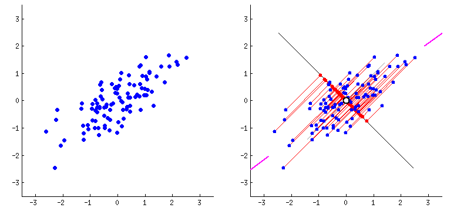

```{r setup, include=FALSE}
# clear-up the environment
rm(list = ls())

# chunk options
knitr::opts_chunk$set(
  message = FALSE,
  warning = FALSE,
  fig.align = "center",
  comment = "#>"
)

options(scipen = 999)
```

<style>
body {
text-align: justify}
</style>

# Introduction

## Supervised vs Unsupervised

```{r, out.width = "70%", echo = FALSE, fig.align = "center"}
knitr::include_graphics("additional_assets/versus.png")
```

**Supervised Learning**

- Memiliki target variabel
- Tujuannya untuk membuat model prediksi dengan training data
- Model di-evaluasi dengan testing data

**Unsupervised Learning**

- Tidak memiliki target variabel
- Tujuannya untuk mencari pola dalam data, yang berguna untuk menghasilkan informasi. Digunakan pada tahap Pre-processing maupun Exploratory Data Analysis (EDA)
- Tidak perlu melakukan evaluasi model, karena tidak ada label aktual

## Mindmap

```{r, out.width = "100%", echo = FALSE, fig.align = "center"}
knitr::include_graphics("additional_assets/UL.png")
```

Secara umum, unsupervised learning yang akan kita pelajari terbagi menjadi dua:

1. Dimensionality Reduction: mereduksi dimensi dengan tetap mempertahankan informasi sebanyak-banyaknya. Algoritma: Principal Component Analysis (PCA)
2. Clustering: pengelompokkan data berdasarkan kemiripan karakteristik data. Algoritma: K-means Clustering

# Dimensionality Reduction

Tujuan dimensionality reduction adalah untuk *mereduksi banyaknya variabel* (dimensi/fitur) pada data dengan tetap *mempertahankan informasi sebanyak mungkin*. Dimensionality reduction dapat mengatasi masalah high-dimensional data. Kesulitan yang dihadapi pada high-dimensional data:

- Memerlukan waktu dan komputasi yang besar dalam melakukan pemodelan
- Melakukan visualisasi lebih dari tiga dimensi

Istilah:

- **Dimensi**: variabel/kolom/fitur. Semakin banyak kolom, maka dimensi semakin tinggi.
- **Informasi**: variance. Semakin besar variance, maka informasi semakin banyak.

💡 Mari kita ulas sedikit terkait materi Practical Statistics yaitu variance:

```{r}
a <- c(1,2,3,4,5,6,7,2,9,10)
b <- c(4,5,5,6,6,4,6,5,4,4)

stripchart(a, method = "jitter")
stripchart(b, method = "jitter")

var(a)
var(b)
```

Tapi, hati-hati nilai variance bergantung pada range dari variabel.

```{r}
x <- a*100
x

var(x)
```

Notes:

Informasi adalah nilai variance yang sudah discaling


## Motivation Example: Image Compression

Pada data gambar, setiap kotak pixel akan menjadi 1 kolom. Foto berukuran 40x40 pixel memiliki 1600 kolom (dimensi). Sekarang mari renungkan, berapa spesifikasi kamera handphone anda? Berapa besar dimensi data yang dihasilkan kamera Anda?

Image compression adalah salah satu penerapan dimensionality reduction. Data gambar direduksi dimensinya namun tetap menghasilkan gambar yang serupa (informasi inti tidak hilang), sehingga gambar lebih mudah diproses. Salah satu algoritma dimensionality reduction adalah **Principal Component Analysis (PCA)**.

```{r, out.width = "60%", echo = FALSE, fig.align = "center"}
knitr::include_graphics("assets/lenna.png")
```

Untuk lebih detail terkait image compression, silahkan kunjungi artikel dari salah satu tim kami: https://medium.com/analytics-vidhya/image-compression-using-k-means-clustering-and-principal-component-analysis-in-python-893fd37e8e15

## Principal Component Analysis (PCA)

### Concept

Ide dasar dari PCA adalah untuk membuat sumbu (axis) baru yang dapat menangkap informasi sebesar mungkin. Sumbu baru ini adalah yang dinamakan sebagai **Principal Component (PC)**. Untuk melakukan dimensionality reduction, kita akan memilih beberapa PC untuk dapat merangkum informasi yang dibutuhkan.

```{r, out.width = "80%", echo = FALSE, fig.align = "center"}

```

**Figure 1A (kiri)**:

- Sumbu: X1 dan X2
- Variance data dijelaskan oleh X1 dan X2
- Dibuatlah sumbu baru untuk menangkap informasi X1 dan X2, yang dinamakan PC1 dan PC2

**Figure 1B (kanan)**:

- Sumbu baru: PC1 dan PC2
- PC1 menangkap variance lebih banyak daripada PC2
- Misalkan PC1 menangkap 90% variance, dan sisanya ditangkap oleh PC2 yaitu 10%

> Hanya dengan menggunakan 1 PC (yaitu PC1), kita dapat mereduksi dimensi data sebesar 50% (dari 2 dimensi menjadi 1 dimensi), namun tetap mempertahankan informasi sebesar 90% informasi data asli.

💡 **Catatan**:

- PC dibuat untuk merangkum sebanyak mungkin informasi data
- Banyaknya PC yang dibentuk = Banyaknya dimensi data asli
- PC1 menangkap variance paling besar, daripada PC2, dan seterusnya
- Antar PC **tidak saling berkorelasi**, karena saling tegak lurus
- Metode PCA cocok untuk data numerik yang **saling berkorelasi**

Di antara kedua data berikut, mana yang lebih cocok untuk dilakukan PCA:

```{r echo=FALSE}
RNGkind(sample.kind = "Rounding")
set.seed(100)

par(mfrow=c(1,2))
x <- runif(100)
plot(x=x, y=runif(100), pch=19, cex=0.5, xlim=c(-0.5, 1.5), ylim=c(-0.5, 1.5), main="Blind Tasting", xlab="wine age", ylab="score")
plot(x=x, y=x+runif(100, -0.1, 0.1), pch=19, cex=0.5, xlim=c(-0.5, 1.5), ylim=c(-0.5, 1.5), main="Logistic Machinery", xlab="temperature", ylab="pressure")
```
Tujuan PCA: untuk reduksi dimensi, kira-kira data yang seperti apa yang tepat digunakan untuk reduksi dimensi menggunakan PCA?


**Jawaban**: Logistic Machinery

### Illustration

💡 Kunjungi link berikut untuk ilustrasi secara visual untuk data 2D dan 3D: https://setosa.io/ev/principal-component-analysis/

⚠️ **Miskonsepsi garis PCA dengan garis Linear Regression**

```{r, out.width = "49%", out.height = "20%", echo = FALSE, fig.align = "center", fig.show = "hold"}
knitr::include_graphics(c(
"additional_assets/lr_vs_pca_1.png",
"additional_assets/lr_vs_pca_2.png"))
```

Berikut adalah animasi bagaimana garis PCA secara intuitif dibentuk:

```{r, out.width = "80%", echo = FALSE, fig.align = "center"}

```

Source: [Medium](https://medium.com/analytics-vidhya/dimensionality-reduction-principal-component-analysis-d1402b58feb1)


Notes:

PCA bertujuan untuk dimensionality reduction dengan cara fitur extraction (mengekstrak fitur yang ada)

x1,x2,x3 ---> PC1, PC2, PC3

x1, x2, x3,x4, ... , x10 ----> PC1, PC2, ... , PC10

yang mana 
PC1 (variance paling banyak) 70%
PC2 (variance menengah jumlahnya) 20%
PC3 (variance paling kecil) 10%
PC4 (variance lebih kecil dr PC3) 0%

PC1 = 0.4x1 + 0.3x2 + 0.2 x3 + 0.1 x4
PC2 = ...x1 + ..x2 + ...

Misal kita punya 4 variabel (X1, X2, X3, X4), kemudian kita lakukan PCA sehingga kita memiliki 4 variabel baru (PC1, PC2, PC3, PC4). Ketika kita ingin mempertahankan minimal 80% informasi, berapa PC/dimensi yang kita kurangi?

PC1 (variance paling banyak) 70%
PC2 (variance menengah jumlahnya) 20%
PC3 (variance paling kecil) 10%
PC4 (variance lebih kecil dr PC3) 0%


Jadi PCA akan mengubah data asli menjadi data proyeksinya

## Workflow PCA

### Business Question

Kita sebagai data scientist diminta untuk melakukan dimensionality reduction terhadap data unit bangunan yang terjual di New York Property Market selama periode 12 bulan. Sumber data diperoleh dari New York City Department of Finance.

### Read data

```{r message=FALSE}
library(dplyr)

property <- read.csv("data_input/nyc.csv")
glimpse(property)
```

Deskripsi data:

* `X`: ID baris
* `BOROUGH`: Kode digit untuk wilayah dimana properti berada; Manhattan (1), Bronx (2), Brooklyn (3), Queens (4), dan Staten Island (5)
* `NEIGHBORHOOD`: Nama lingkungan
* `BUILDING.CLASS.CATEGORY`: Kategori kelas properti
* `TAX.CLASS.AT.PRESENT`, `TAX.CLASS.AT.TIME.OF.SALE`: Jenis pajak bangunan
* `BLOCK`, `LOT`: Kombinasi borough, blok, dan lot membentuk kode unik untuk properti di New York City
* `EASE.MENT`: Ragam hak yang dimiliki bangunan (contoh: hak jalan, dsb.)
* `BUILDING.CLASS.AT.PRESENT`, `BUILDING.CLASS.AT.TIME.OF.SALE`: Kategori kepemilikan bangunan (A: rumah satu keluarga; O: gedung kantor; R: kondominium (kepemilikan bersama); dsb.)
* `ADDRESS`: Alamat properti
* `APARTMENT.NUMBER`: Nomor apartemen
* `ZIP.CODE`: Kode pos properti
* `RESIDENTIAL.UNITS`: Jumlah unit hunian di properti yang terdaftar
* `COMMERCIAL.UNITS`: Jumlah unit komersial di properti yang terdaftar
* `TOTAL.UNITS`: Jumlah unit hunian dan komersial
* `LAND.SQUARE.FEET`: Luas tanah properti (square feet)
* `GROSS.SQUARE.FEET`: Total area semua lantai bangunan yang diukur dari permukaan luar dinding luar bangunan, termasuk area tanah dan ruang di dalam setiap bangunan atau struktur pada properti
* `YEAR.BUILT`: Tahun properti dibangun
* `SALE.PRICE`: Harga properti terjual; bila 0 maka properti merupakan warisan
* `SALE.DATE`: Tanggal properti dijual

### Data Cleansing

Buang kolom yang tidak diperlukan:

* `X` (hanya ID baris)
* `EASE.MENT` (semua NA)


Memperbaiki tipe data yang belum tepat:

Perhatikan yang integer:

* `BOROUGH`, `BLOCK`, `LOT`: int -> factor
* `ZIP.CODE`: int -> factor
* `RESIDENTIAL.UNITS`, `COMMERCIAL.UNITS`, `TOTAL.UNITS`: int -> int (sudah benar)
* `YEAR.BUILT`: int -> int (tapi bisa faktor, tergantung analisa yang digunakan)
* `TAX.CLASS.AT.TIME.OF.SALE`: int -> factor

Perhatikan yang character:

* `NEIGHBORHOOD`: chr -> fct
* `BUILDING.CLASS.CATEGORY`, `BUILDING.CLASS.AT.PRESENT`, `BUILDING.CLASS.AT.TIME.OF.SALE`: chr -> fct
* `TAX.CLASS.AT.PRESENT`: chr -> fct
* `ADDRESS`: chr -> chr (sudah benar)
* `APARTMENT.NUMBER`: chr -> chr (sudah benar)
* `LAND.SQUARE.FEET`, `GROSS.SQUARE.FEET`: chr -> num 
* `SALE.PRICE`: chr -> num
* `SALE.DATE`: chr -> date/ posixct (date and time)

```{r warning=FALSE}
library(lubridate)
property_clean <- property %>% 
  select(-c(X, EASE.MENT)) %>% 
  mutate_at(.vars = c("BOROUGH", "BLOCK", "LOT", "ZIP.CODE", "TAX.CLASS.AT.TIME.OF.SALE", "NEIGHBORHOOD", "BUILDING.CLASS.CATEGORY", "BUILDING.CLASS.AT.PRESENT", 'BUILDING.CLASS.AT.TIME.OF.SALE', "TAX.CLASS.AT.PRESENT"), as.factor) %>% 
  mutate_at(.vars = c("LAND.SQUARE.FEET", "GROSS.SQUARE.FEET", "SALE.PRICE"), 
            as.numeric) %>% 
  mutate(SALE.DATE = ymd_hms(SALE.DATE))

head(property_clean)
```

Cek missing values:

```{r}
property_clean %>% 
  is.na() %>% 
  colSums()
```

Kolom dengan missing values: GROSS.SQUARE.FEET,  LAND.SQUARE.FEET , SALE.PRICE

Beberapa cara untuk handle missing values:

1. Imputasi: mengisi nilai NA dengan suatu nilai
2. Drop column: hapus kolom apabila NA pada kolom tersebut terlalu banyak (di atas 5%)
3. Drop row: hapus baris apabila mengandung nilai NA

**Catatan**: Fokus pada course ini bukan di handle `NA`, namun untuk memahami PCA dan visualisasinya, sehingga mari kita gunakan cara yang cukup simpel, yaitu cara ketiga. Dengan justifikasi bahwa kita tetap membutuhkan informasi dari kolom tersebut dalam analisis kita. 

```{r warning=FALSE}
# drop baris yang mengandung NA
property_clean <- property_clean %>% 
  filter(complete.cases(.)) # complete cases utk filter data-data yang barisnya tidak ada NA

anyNA(property_clean)
dim(property_clean)
head(property_clean)
glimpse(property_clean)
```

Dikarenakan analisis PCA menggunakan nilai variance, kita hanya dapat mereduksi kolom bertipe data numerik.

```{r}
# data untuk PCA
ppt <- property_clean %>% 
  select_if(is.numeric)
  
head(ppt)
```

### Exploratory Data Analysis

Apakah antar variable memiliki skala yang sama? Mari kita cek range untuk tiap kolom:

```{r}
summary(ppt)
```

Kesimpulan: beda

Mari kita cek juga matriks covariance dari `ppt`:

```{r}
cov(ppt)
```

Variance dari masing-masing variabel berbeda jauh karena range/skala dari tiap variabel berbeda, begitupun covariance. **Nilai variance dan covariance dipengaruhi oleh skala dari data**. Semakin tinggi skala, nilai variance atau covariance akan semakin tinggi.

⚠️ Data dengan perbedaan skala antar variabel yang tinggi **tidak baik untuk langsung dianalisis PCA karena dapat menimbulkan bias**. PC1 akan dianggap menangkap variansi tertinggi dan PC selanjutnya dianggap tidak memberikan informasi.

Perhatikan plot di bawah ini bahwa semua informasi hanya dirangkum oleh PC1. Hal ini terjadi karena `SALE.PRICE` memiliki skala hingga milyaran (variansinya tinggi) dibandingkan variabel lainnya. 

```{r echo=FALSE}
# melihat variance yang dirangkum tiap PC
# fungsi prcomp() akan dijelaskan saat masuk bagian PCA
plot(prcomp(ppt))
```

💡 Oleh sebab itu, harus kita scaling terlebih dahulu sebelum melakukan PCA.    

### Data Preprocessing: Scaling

Scaling dilakukan agar antar variabel memiliki skala yang tidak jauh berbeda. Nilai scaling yang digunakan adalah Z-score (mean = 0, standar deviasi = 1)

$$Z = \frac{x-mean}{sd}$$

```{r}
# scaling
ppt_z <- scale(ppt)
head(ppt)
head(ppt_z)
```


```{r}
# melihat variance yang dirangkum tiap PC
plot(prcomp(ppt_z))
```

Sekarang, PC1 sudah tidak mendominasi PC lainnya dalam besarnya variance yang ditangkap.

### Principal Component Analysis using `prcomp()`

PCA dapat dilakukan dengan menggunakan fungsi `prcomp()`.

**Cara 1**: menggunakan data yang di-scale secara terpisah, yaitu `ppt_z`

```{r}
# lakukan scaling (tadi sudah dilakukan, disimpan dalam object ppt_z)

# buat PCA dgn prcomp()

prcomp(ppt_z)
```

**Cara 2**: menggunakan data yang belum discale, lalu tambahkan parameter `scale = T` 

```{r}
# memasukkan data yang belum discaling ke dalam fungsi prcomp, dan tambahkan scale =T
pca <- prcomp(ppt, scale = T)
```

Terdapat tiga komponen utama dalam objek `pca`:

1. `pca$sdev`: standar deviasi (akar variance) yang ditangkap oleh masing-masing PC, disebut juga sebagai **eigen value**. Digunakan untuk mengetahui seberapa **besaran informasi** yang ditangkap masing-masing PC.

```{r}
pca$sdev # akar dr variance

# variance yang ditangkap, disebut juga eigen value

pca$sdev^2 
```

PC1 akan secara otomatis merangkum paling banyak informasi (nilai variancenya paling besar), kemudian diikuti oleh PC2, PC3, ..., PC7

2. `pca$rotation`: matrix rotasi yang berfungsi untuk memproyeksikan titik ke masing-masing PC, matrix ini terdiri dari **eigen vector**. Digunakan untuk mengetahui **kontribusi** masing-masing variabel ke PC.

```{r}
pca$rotation
```

PC1 = -0.50181439 x residential.unit - 0.18992921 x commercial.unit +...

baris 1 di data awal = 2 residential unit, 3 commercial unit + ...
baris 1 untuk PC1 = -0.50181439 x 2 - 0.18992921 x 3 +... = xxx


3. `pca$x`: nilai hasil proyeksi titik ke PC untuk tiap baris. Digunakan untuk mendapatkan nilai data yang baru.

```{r}
as.data.frame(ppt_z)
as.data.frame(pca$x)
```

### Reduce Dimension

Misal kita hanya ingin mereduksi 7 dimensi menjadi 5 dimensi, maka kita gunakan kolom PC1 sampai PC5 pada `pca$x`. Namun bagaimana kita memilih berapa dimensi yang kita pertahankan? Kita melihat **cumulative variance** untuk melakukan dimensionality reduction dengan fungsi `summary()`.

```{r}

```

- **Standard deviation**: standar deviasi (akar variance) yang ditangkap oleh masing-masing PC, sama seperti `pca$sdev`
- **Proportion of Variance**: informasi yang ditangkap oleh tiap PC
- **Cumulative Proportion**: jumlah informasi yang ditangkap secara kumulatif dari PC1 hingga PC tersebut

Pemilihan banyaknya PC disesuaikan dengan kebutuhan informasi. Misal, bila kita ingin merangkum 75% informasi, maka jumlah PC yang kita gunakan adalah 4 (PC1 sampai PC4)

```{r}
pc_keep <- 
```

Setelah dipilih PC yang merangkum informasi yang dibutuhkan, PC dapat digabung dengan data awal dan digunakan untuk analisis lebih lanjut (misal: supervised learning).

```{r}
property_clean %>% 
  select_if(purrr::negate(is.integer)) %>% # ambil kolom selain integer
  cbind(pc_keep) # gabungkan dengan PC1 - PC3
```

Kelebihan melakukan PCA sebelum modeling:

+ Beban komputasi yang lebih rendah
+ Dapat meningkatkan performa model dalam melakukan prediksi
+ Dapat mengatasi multicollinearity, karena nilai antar PC tidak saling berkorelasi

```{r}
# korelasi sebelum PCA

# korelasi setelah PCA

```

Kekurangan melakukan PCA sebelum modeling:

- Model tidak dapat diinterpretasikan, karena nilai PC merupakan campuran dari beberapa variabel

## [Optional] Mathematics of PCA

💡 Video: [3Blue1Brown: Eigenvectors and eigenvalues](https://www.youtube.com/watch?v=PFDu9oVAE-g)

Untuk membentuk PC dan nilai pada PC dibutuhkan **eigen values** & **eigen vector**. Secara manual, eigen values dan eigen vector didapatkan dari operasi matrix.

Teori matrix:

* skalar: nilai yang memiliki magnitude/besaran
* vektor: nilai yang memiliki besaran dan arah (umum digambarkan dalam suatu koordinat)
* matrix: kumpulan nilai/bentukan data dalam baris dan kolom

```{r, out.width = "60%", echo = FALSE, fig.align = "center"}
knitr::include_graphics("additional_assets/ul12.png")
```

**Perkalian skalar-vektor**: mengubah besaran vektor (tidak merubah arah kecuali berbalik arah)

$$2\left(\begin{array}{cc}2\\3\end{array}\right) = \left(\begin{array}{cc}4\\6\end{array}\right)$$
$$-2\left(\begin{array}{cc}2\\3\end{array}\right) = \left(\begin{array}{cc}-4\\-6\end{array}\right)$$

**Perkalian matrix-vektor**: mengubah besaran dan arah

$$\left(\begin{array}{cc}1 & 2\\-1 & 2\end{array}\right)\left(\begin{array}{cc}2\\3 \end{array}\right) = \left(\begin{array}{cc}8\\4\end{array}\right)$$ 

**Perkalian Matrix-Vektor Spesial**

* **Matrix Rotasi**: mengubah arah vektor tanpa mengubah besaran

$$
\left(\begin{array}{cc} 
0 & -1\\ 
1 & 0 
\end{array}\right)
\left(\begin{array}{cc} 
2\\ 
3
\end{array}\right)=
\left(\begin{array}{cc} 
-3\\ 
2
\end{array}\right)
$$

```{r}
# perkalian matrix di R
matrix(c(0,1,-1,0), nrow=2) %*% as.vector(c(2,3))
```

* **Matrix Identitas**: tidak mengubah besaran maupun arah vektor

$$
\left(\begin{array}{cc} 
1 & 0\\ 
0 & 1 
\end{array}\right)
\left(\begin{array}{cc} 
2\\ 
3
\end{array}\right)=
\left(\begin{array}{cc} 
2\\ 
3
\end{array}\right)
$$

```{r}
# perkalian matrix di R
matrix(c(1,0,0,1), nrow=2) %*% as.vector(c(2,3))
```

**Eigen dari suatu Matrix**

Untuk setiap matrix, terdapat vektor spesial (eigen vector) yang jika dikalikan dengan matrixnya, hasilnya akan sama dengan vektor tersebut dikalikan suatu skalar (eigen value). Sehingga didapatkan rumus:

$$Ax = \lambda x$$
Dimana $x$ adalah eigen vector dan $\lambda$ adalah eigen value dari matrix $A$.

$$
\left(\begin{array}{cc} 
2 & 3\\ 
2 & 1 
\end{array}\right)
\left(\begin{array}{cc} 
3\\ 
2
\end{array}\right)
=
\left(\begin{array}{cc} 
12\\ 
8
\end{array}\right)
=4
\left(\begin{array}{cc} 
3\\ 
2
\end{array}\right)
$$

Teori eigen dipakai untuk menentukan PC dan nilai-nilai pada PC.

**Penerapan Eigen dalam PCA:**

**Matrix covariance** adalah matrix yang dapat merangkum informasi (variance) dari data. Kita menggunakan matrix covariance untuk mendapatkan mendapatkan eigen vector dan eigen value dari matrix tersebut, dimana:

* **eigen vector**: arah sumbu tiap PC, yang menjadi formula untuk mentransformasi data awal ke PC baru. 
* **eigen value**: variansi yang ditangkap oleh setiap PC.
* tiap PC memiliki 1 eigen value & 1 eigen vector.
* alur: matrix covariance -> eigen value -> eigen vector -> nilai di tiap PC

Eigen vector akan menjadi formula untuk kalkulasi nilai di setiap PC. Contohnya, untuk data yang terdiri dari 2 variabel, bila diketahui eigen vector dari PC1 adalah:

$$x_{PC1}= \left(\begin{array}{cc}b_1\\b_2\end{array}\right)$$

Maka formula untuk menghitung nilai pada PC1 (untuk tiap barisnya) adalah:

$$PC1= b_1X1 + b_2X2$$

Keterangan:

* $x_{PC1}$ : eigen vector PC1 dari matrix covariance
* $b_1$, $b_2$ : konstanta dari eigen vector
* $PC1$ : nilai di PC1
* $X1$, $X2$ : nilai variabel X1 dan X2 di data awal

**Mencari Eigen dengan R**

```{r fig.height=5, fig.width=5}
# membuat data dummy
RNGkind(sample.kind = "Rounding")
set.seed(100)

x <- runif(200) # buat data random dengan distribusi normal
data <- data.frame(x=x, y=-x+runif(100, 1.05, 1.25)) # buat data frame
data <- scale(data) # agar skala antar variable sama
plot(data)
```

```{r}
# matrix covariance
A <- cov(data)
A
```

```{r}
# menghitung eigen
eigen(A)
```

**Keterangan**:

* `eigen(A)$values`: Eigen value untuk tiap PC, besar variansi yang dapat ditangkap oleh tiap PC. Eigen value tertinggi adalah milik PC1, kedua tertinggi milik PC2, dan seterusnya. 

* `eigen(A)$vectors`: Eigen vector untuk tiap PC. Eigen vector untuk PC1 adalah kolom pertama `[,1]`; untuk PC2 adalah kolom kedua `[,2]`.

## 📝 SUMMARY DAY 1

**Supervised vs Unsupervised**

- Supervised: memiliki target variable, untuk prediksi
- Unsupervised: tidak memiliki target variable, untuk memahami pola data

**Dimensionality Reduction dengan PCA**

* Konsep:

- Tujuan dimensionality reduction: mereduksi dimensi dengan tetap mempertahankan informasi sebesar mungkin
- PCA merangkum variance (informasi) dari variabel awal dengan membuat sumbu baru (Principal Component), di mana informasi paling besar ditangkap oleh PC1, diikuti dengan PC2, dst
- Banyaknya PC = Banyaknya variabel awal
- PCA baik digunakan untuk data numerik yang saling berkorelasi. Dihasilkan nilai PC yang saling tidak berkorelasi

* Istilah:

- Eigen value = variance (informasi) yang ditangkap oleh tiap PC
- Eigen vector = matrix rotasi untuk memproyeksikan data asli menjadi nilai PC

**Workflow PCA**

1. Business question
2. Read data
3. Data cleansing: menyesuaikan tipe data, cek dan handle NA
4. EDA: cek satuan data
5. Preprocessing: scaling apabila satuan berbeda
6. PCA dengan `prcomp()`:
  - `pca$sdev` adalah akar dari eigen value
  - `pca$rotation` adalah eigen vector tiap PC
  - `pca$x` adalah nilai di tiap PC untuk tiap baris
7. Reduksi dimensi: menentukan berapa PC yang sebaiknya digunakan dengan melihat cumulative proportion `summary(prcomp())`
8. Pemilihan PC dapat digunakan untuk analisis selanjutnya (misal untuk supervised learning)

<center>**<----------- END OF DAY 1 ----------->**</center>

***

## Visualizing PCA

PCA tidak hanya berguna untuk dimensionality reduction namun baik untuk visualisasi high-dimensional data. Visualisasi dapat menggunakan **biplot** yang menampilkan:

1. **Individual factor map**, yaitu sebaran data secara keseluruhan menggunakan 2 PC. Tujuannya untuk mengetahui observasi yang serupa dan outlier.
2. **Variables factor map**, yaitu plot yang menunjukkan korelasi antar variable dan kontribusinya terhadap PC.

### Biplot

Mari kita buat biplot dari 100 observasi pertama dari `ppt`

```{r}
ppt_100 <- ppt %>% 
  head(100)

ppt_100_pca <- 
```

Biplot menggunakan **PC1** dan **PC2** secara default, karena PC tersebut yang merangkum informasi terbanyak dari data sehingga mampu mewakili data kita.

- Titik-titik = index angka dari **observasi**. Semakin berdekatan maka karakteristiknya semakin mirip, sedangkan yang jauh dari gerombolan data dianggap sebagai outlier
- Panah merah = **loading score**, menunjukkan kontribusi variabel tersebut terhadap PC, atau banyaknya informasi variabel tersebut yang dirangkum oleh PC. 

#### Individual

1. **Outlier detection**: observasi yang jauh dari kumpulan observasi lainnya mengindikasikan outlier dari keseluruhan data. Observasi ini dapat ditandai untuk nantinya dicek karakteristik datanya untuk keperluan bisnis, atau apakah mempengaruhi performa model/clustering, dll.

> Dari biplot di atas, outlier terletak pada observasi ...

2. **Observasi searah panah** mengindikasikan observasi tersebut nilainya tinggi pada variabel tersebut. Bila bertolak belakang, maka nilainya rendah pada variable tersebut.

```{r}
# outlier: 96 dan 32
# non-outlier: 26 dan 27
ppt_100[c(96, 32, 26, 27),]
```

> Observasi 96 dan 32 merupakan outlier dan ternyata karena ...

#### Variable

1. **Variable Contribution**

Loading score dilihat dari jarak titik nol (pusat) ke ujung panah, secara horizontal (PC1) / vertikal (PC2). Semakin jauh panah, semakin banyak informasi yang dirangkum. Bila panah kearah negatif, maka bila nilai variabel awal tinggi, nilai di PC akan rendah, dan sebaliknya.

Berdasarkan penjelasan tersebut, maka:

- PC1 merangkum variable: ...
- PC2 merangkum variable: ...

Dari panah merah tersebut, kita tahu variable mana yang paling banyak berkontribusi untuk tiap PC. Namun kita kesulitan untuk mengurutkan kontribusinya, mari kita gunakan fungsi `fviz_contrib()` untuk melihat urutan **kontribusi variabel ke tiap PC**

```{r}
library(factoextra)

```

**Catatan**: garis putus-putus merah adalah batas nilai kontribusi yang diharapkan apabila PC menangkap informasi dari tiap variable dengan sama rata. Cara menghitungnya adalah 100%/jumlah variable awal. Pada kasus ini 100/7 = 14.28%. Bila melebihi batas tersebut, maka dapat dikatakan variable tersebut berkontribusi terhadap PC tersebut.

2. **Korelasi antar variabel** dapat dilihat dari sudut antar panah 

- Panah saling berdekatan (sudut antar panah < 90), maka korelasi positif
- Panah saling tegak lurus (sudut antar panah = 90), maka tidak berkorelasi
- Panah saling bertolak belakang (sudut antar panah mendekati 180), maka korelasi negatif

Panah yang berhimpit pada biplot adalah:

- ...

```{r}
# opsional: untuk validasi

```

Panah yang (hampir) tegak lurus adalah:

- ...

```{r}
# opsional: untuk validasi

```

### Dive Deeper I: Biplot `property`

Buatlah biplot dengan menggunakan 300 data pertama dari `ppt`:

```{r}
# your code here
ppt_300 <- 
```

**Insight: Outlier**

Dari biplot, identifikasilah:

- Tiga observasi yang memiliki nilai residential dan total unit yang sangat tinggi: ...
- Tiga observasi yang memiliki nilai jual (SALE.PRICE) yang sangat tinggi: ...

**Insight: Variable Contribution**

1. Variabel yang berkontribusi tinggi ke PC1: ...
2. Variabel yang berkontribusi tinggi ke PC2: ...
3. Variabel yang berkontribusi rendah pada PC1 maupun PC2: ...

Untuk memvalidasi insight di atas, visualisasikan kontribusi variabel tiap PC menggunakan `fviz_contrib()` dari library `factoextra`:

```{r}
# your code here
library(factoextra)

# PC1


# PC2

```

**Insight: Variable Correlation**

Gunakan biplot, identifikasilah:

1. Pasangan variabel yang berkorelasi tinggi:
  - ...

2. Pasangan variabel yang tidak berkorelasi:
  - ...

### Dive Deeper II: Biplot `USArrests`

Lakukan PCA untuk built-in dataset `USArrests` dan visualisasikan menggunakan `fancy_biplot()`!

```{r}
# get function & data
source("R/biplot.R")

data("USArrests")
head(USArrests)
```

Dataset `USArrests` merupakan data tentang jumlah tiga tindak kejahatan (`Murder`, `Assault`, dan `Rape`) per 100 ribu penduduk yang berhasil dicatat di 50 negara bagian US pada tahun 1973.

Deskripsi data:

- `Murder`: murder arrests per 100,000
- `Assault`: assault arrests per 100,000
- `UrbanPop`: percent of population in urban areas
- `Rape`: rape arrests per 100,000

```{r}
# PCA & Visualization
fancy_biplot(prcomp(USArrests, scale = T))
```

Insight dari biplot:

1. Perhatikan cluster di mana Arizona, Colorado, Illinois, dan Texas berada. Negara bagian mana lagi yang ada dalam cluster tersebut? ...

2. Di antara Ohio, Louisiana, North Dakota, dan Colorado, manakah yang memiliki:

- Tingkat `Murder` tertinggi: ...
- Tingkat `Assault` tertinggi: ...
- Tingkat `Rape` tertinggi: ...
- Tingkat kriminalitas terendah, meliputi ketiga tipe kejahatan: ...

## PCA using `FactoMineR` package

`FactoMineR` adalah R package yang dibuat untuk *exploratory multivariate data analysis*. Mari kita lakukan analisis PCA untuk Dataset Loan dari sebuah platform di quarter ke-4 tahun 2017. 

### Read Data

```{r}
loan <- 
```

Data berisikan 1556 customer dengan 16 variabel, dengan kolom `not_paid` yang mengindikasikan apakah customer tersebut gagal bayar pinjaman atau tidak. Berikut adalah deskripsi data yang lengkap:

- `initial_list_status`: Either w (whole) or f (fractional). This variable indicates if the loan was a whole loan or fractional loan. For background: Some institutional investors have a preference to purchase loans in their entirety to obtain legal and accounting treatment specific to their situation - with the added benefit of “instant funding” to borrowers
- `purpose`: Simplified from the original data; One of: credit_card, debt_consolidation, home_improvement, major_purchase and small_business
- `int_rate`: Interest rate in percentages
- `installment`: Monthly payment owed by the borrower
- `annual_inc`: Self-reported annual income provided by the borrower / co-borrowers during application
- `dti`: A ratio of the borrower’s total monthly debt payments on his/her total obligations to the self-reported monthly income (debt to income ratio)
- `verification_status`: is the reported income verified, not verified, or if the income source was verified
- `grade`: software-assigned loan grade
- `revol_bal`: total credit revolving balance (in the case of credit card, it refers to the portion of credit card spending that goes unpaid at the end of a billing cycle)
- `inq_last_12m`: number of credit inquiries in the last 12 months
- `delinq_2yrs`: number of 30+ days past-due incidences of delinquency in the borrower’s credit file for the past 2 years
- `home_ownership`: one of MORTGAGE, OWN and RENT
- `not_paid`: 1 for charged-off, past-due / grace period or defaulted, 0 for fully-paid loans
- `log_inc`: log of annual_inc
- `verified`: 0 for “Not verified” under verification_status, 1 otherwise
- `grdCtoA`: 0 for a grade of A, B or C, 1 otherwise

### Data Cleansing

Adakah tipe data yang belum tepat?

- ...

```{r}
loan_clean <- 
```

### PCA

`FactoMineR` menyediakan dua fungsi utama dalam PCA:

1. `PCA()` untuk analisis PCA
2. `plot.PCA()` untuk visualisasi

💡 Kelebihan `FactoMineR` dari fungsi base `biplot()` adalah:

- memisahkan dua grafik yang terdapat pada biplot yaitu individual factor map dan variables factor map
- dapat melibatkan variable kategorik untuk mewarnai plot sehingga plot lebih informatif

```{r}
# indeks kolom numerik
quantivar <- c(3:6,9:11,14)

# indeks kolom kategorik
qualivar <- c(1,2,7,8,12,13,15,16)
```

Sebagai alternatif, apabila tidak ingin manual:

```{r}
# nama kolom numerik
quanti <- loan_clean %>% 
  select_if(is.numeric) %>% 
  colnames()

# indeks kolom numerik
quantivar <- which(colnames(loan) %in% quanti)

# nama kolom kategorik
quali <- loan_clean %>% 
  select_if(is.factor) %>% 
  colnames()

qualivar <- which(colnames(loan) %in% quali)
```

**Buat PCA dengan `PCA()`**

Parameter:

- `X`: dataframe awal
- `scale.unit = T`: untuk melakukan scaling
- `quali.sup`: index kolom variable kategorikal (qualitative)
- `graph = F`: untuk tidak menampilkan plot secara langsung
- `ncp`: banyaknya PC yang digunakan, default = 5

```{r}
# PCA using FactoMineR
library(FactoMineR)

loan_pca <- 
```

```{r}
# cek nilai di tiap PC, ekuivalen dengan pca$x

```

### Visualisasi PCA

Biplot dapat divisualisasikan menggunakan `plot.PCA()`

#### Individual Factor Map

Plot sebaran observasi untuk mengetahui index yang dianggap sebagai outlier

Parameter:

- `x`: object PCA (`FactoMineR`)
- `choix = "ind"`: plot individual factor map
- `invisible = "quali"`: menghilangkan label kolom kategorik, karena mengganggu visual
- `select = "contrib n"`: menampilkan indeks dari $n$ outlier terluar
- `habillage`: mewarnai titik berdasarkan index kolom (bisa kategorikal maupun numerik)

```{r}

```

Lima outlier terluar: ...

#### Variables Factor Map

- Mengetahui variable contribution ke tiap PC, serta besar informasi yang dirangkum dari tiap variable ke tiap PC (loading)
- Mengetahui correlation antar variable awal

Parameter:

- `x`: object PCA (`FactoMineR`)
- `choix = "var"`: plot variable factor map

```{r}

```

Insight:

- PC1 paling banyak merangkum variable: ...
- PC2 merangkum variable: ...
- Variabel yang saling berkorelasi:
  - ...
  - ...
  - ...
  
Untuk lebih jelas dan objektif, kontribusi/korelasi tiap variable ke tiap PC dapat dilihat menggunakan `dimdesc()`. Semakin tinggi nilai korelasi, semakin banyak informasi yang dirangkum pada PC tersebut.

```{r}
# dimdisc: dimension description


# variable yang berkontribusi untuk PC1

```

💡 Mirip dengan `fviz_contrib()` yang kita pelajari sebelumnya

```{r}

```

⚠️ Besar kontribusi tidak dilihat dari tanda pada korelasi, melainkan nilai absolutnya

### Reduce Dimension

Menampilkan cumulative proportion dari PCA:

```{r}
# PCA summary

```

Misalkan kita ingin mempertahankan informasi sebesar 80%, maka berapa PC yang kita gunakan? **PC 1-5**

```{r}
# mengambil data hasil PCA sebanyak PC yang dibutuhkan
loan_keep <- 
```

`loan_keep` kemudian dapat dikembalikan ke data frame awal (menggantikan variable numerik awal) dan digunakan untuk supervised learning.

### Reconstruction

Fungsi `reconst()` memungkinkan kita untuk melakukan rekonstruksi data hasil PCA ke data semula. Umumnya rekonstruksi ini digunakan pada data gambar untuk kasus image compression. 

Misalnya gambar asli adalah 40x40 pixel (1600 kolom), lalu direduksi dengan menggunakan 50 PC saja. Untuk menampilkan data berupa gambar, tetap diperlukan struktur data yang 1600 kolom yang mewakili tiap pixel. Kita bisa melakukan rekonstruksi gambar dari 50 PC ke 1600 kolom kembali. Namun, nilai hasil rekonstruksi tersebut menjadi sedikit berbeda dari nilai awal.

Catatan: rekonstruksi data jarang dilakukan pada data tabular, karena nilai hasil rekonstruksi tidak merepresentasikan nilai asli, sehingga kurang ada manfaatnya.

Berikut contoh rekonstruksi data dengan menggunakan data `loan`: 

```{r}
# reconstruct data menggunakan PC1 - PC5
loan_reconst <- reconst(loan_pca, 
                        ncp = 5) # jumlah PC yang ingin di reconstruct

head(loan_reconst, 3)
```

Bandingkan dengan nilai asli sebelum dilakukan PCA:

```{r}
# data awal (coba bandingkan dengan hasil reconstruct di atas)
loan_clean %>% 
  select_if(is.numeric) %>% 
  head(3)
```

Kita juga dapat rekonstruksi data hingga 100% sama persis bila menggunakan seluruh PC, dengan menggunakan parameter `ncp = 8` di fungsi `reconst()`.

## [Optional] Eigenfaces

**Bagian berikut menyajikan contoh rekonstruksi PCA pada data gambar.**

Pada kasus face recognition, data gambar yang memiliki banyak sekali dimensi dapat mengalami apa yang disebut sebagai **the curse of dimensionality**.

> Setelah melewati batas tertentu, kemampuan suatu model dalam memprediksi hasil akan semakin menurun seiring dengan bertambahnya dimensi.

Dengan melakukan dimensionality reduction (PCA) pada data gambar dan merekonstruksi data gambar dari data hasil PCA, kita dapat meningkatkan performa model face recognition kita. 

```{r}
# read `faceData` 32 pixel
load("data_input/face.rda")

# PCA
face_pca <- PCA(faceData, graph = F, ncp = 32)
face_pca$eig
```

```{r}
# create reconstructed data
face_recon <- reconst(face_pca, ncp = 2)
face_recon2 <- reconst(face_pca, ncp = 4)
face_recon3 <- reconst(face_pca, ncp = 6)
face_recon4 <- reconst(face_pca, ncp = 32) # mengambil semua PC
```

```{r fig.height= 8, fig.width=8}
# make function to visualize image data
showMatrix <- function(x, title){
  image(t(x[nrow(x):1,]), 
        xaxt = 'n', yaxt = 'n', 
        col = gray((0:32)/32),
        main = title, 
        font.main=4, 
        cex.main=0.5
        )
}

# visualize image data
par(mfrow=c(2,2), mar=c(0.5,0.5,1.5,0.5))
showMatrix(faceData, title = 'Original Image')
showMatrix(face_recon, title = 'Reconstructed: 2 dimensions')
showMatrix(face_recon3, title = 'Reconstructed: 6 dimensions')
showMatrix(face_recon4, title = 'Reconstructed: All PCs')
```

## 📝 SUMMARY DAY 2

**Biplot**

* PCA dapat digunakan untuk visualisasi high-dimensional data, dinamakan biplot:

1. Individual Factor Map: plot persebaran data, tujuannya untuk:

  - Mengetahui observasi dengan karakteristik yang mirip (bergerombol)
  - Deteksi outlier, yaitu observasi yang jauh dari kerumunan data

2. Variables Factor Map: 

  - Mengetahui variabel apa saja yang dirangkum oleh tiap PC (variable contribution)
  - Korelasi antar variable, dilihat dari sudut antar panah:
    + < 90 derajat = korelasi positif
    + 90 derajat = tidak berkorelasi
    + mendekati 180 derajat = korelasi negatif
    
* Letak titik observasi terhadap arah panah:

  - Observasi yang searah panah dan letaknya jauh dari pusat data (titik nol) maka memiliki nilai yang tinggi di variable panah tersebut
  - Observasi yang berlawanan arah panah, maka nilainya rendah di variable tersebut
  - Observasi dekat dengan titik nol, maka nilainya mendekati rata-rata variable tersebut

**Fungsi-fungsi**

- `biplot(prcomp())`: membuat biplot dengan base R
- `PCA()`: membuat objek PCA dari package `FactorMineR`
- `plot.PCA()`: membuat biplot dari object `PCA()`:
  + `choix = "ind"`: individual factor map, terdapat `habillage` untuk mewarnai observasi berdasarkan index kolom,
  + `choix = "var"`: variables factor map
- `dimdesc()`: dimension description, untuk melihat korelasi (kontribusi) variable ke tiap PC
- `reconst()`: rekonstruksi data, umumnya untuk data gambar

<center>**<----------- END OF DAY 2 ----------->**</center>

***

# Clustering

Clustering adalah pengelompokan data berdasarkan karakteristiknya. Clustering bertujuan untuk menghasilkan cluster dimana:

- observasi di satu cluster yang sama memiliki karakteristik semirip mungkin
- observasi dari cluster berbeda memiliki karakteristik yang sebeda mungkin

## K-means Clustering

K-means adalah salah satu algoritma clustering yang *centroid-based*, artinya tiap cluster memiliki satu centroid yang mewakili cluster tersebut.

💡 Banyaknya cluster $k$ ditentukan oleh user.

```{r, out.width = "70%", echo = FALSE, fig.align = "center"}
knitr::include_graphics("additional_assets/kmeans.png")
```

### Algoritma

1. **Random initialization**: meletakkan $k$ centroid secara random
2. **Cluster assignment**: assign masing-masing observasi ke cluster terdekat, berdasarkan perhitungan jarak
3. **Centroid update**: menggeser centroid ke rata-rata (means) dari cluster yang terbentuk
4. Ulangi langkah 2 dan 3 sampai tidak ada observasi yang clusternya berubah lagi

```{r message=FALSE, warning=FALSE, eval=FALSE}
# pakai 'interval' yang lebih tinggi bila animasi terlalu cepat
# jalankan command ini di console:

library(animation)
RNGkind(sample.kind = "Rounding")
set.seed(100)
ani.options(interval = 2)
par(mar = c(3, 3, 1, 1.5), mgp = c(1.5, 0.5, 0))
kmeans.ani()
```

💡 Kunjungi link berikut untuk visualisasi yang interaktif: https://www.naftaliharris.com/blog/visualizing-k-means-clustering/

### Workflow K-means Clustering 

#### Business Question: Whisky Recommendation

Kita sebagai seorang data scientist sebuah toko whisky diminta untuk membuat product recommendation untuk whisky berdasarkan preferensi rasa masing-masing customer!

Tujuan: membentuk kelompok whisky yang memiliki karakteristik rasa khas pada tiap clusternya

#### Read Data

Data yang digunakan berupa data penyulingan Malt Whisky dari 86 pabrik penyulingan, diperoleh dari penelitian Dr. Wisehart (Universitas St. Andrews). Setiap whisky diberi skor 0-4 dari 12 kategori cita rasa berdasarkan uji organoleptik: 

* Body: tingkat kekuatan rasa (light/heavy)
* Sweetness: tingkat rasa manis
* Smoky: tingkat rasa asap
* Medicinal: tingkat rasa pahit (obat)
* Tobacco: tingkat rasa tembakau
* Honey: tingkat rasa madu
* Spicy: tingkat rasa pedas
* Winey: tingkat rasa anggur
* Nutty: tingkat rasa kacang
* Malty: tingkat rasa gandum
* Fruity: tingkat rasa buah
* Floral: tingkat rasa bunga

```{r}
whisky <- 
```

#### Data Cleansing

```{r}
# meng-assign nilai dari kolom Distillery menjadi rownames


# membuang kolom yang tidak digunakan

```

#### EDA

Cek missing values:

```{r}

```

Cek skala antar variabel

```{r}

```

Diskusi: Pada data `whisky`, apakah skala nilai antar variable berbeda? Apakah perlu dilakukan scaling?

> 

#### K-means

Parameter:

- `x`: dataset
- `centers`: banyaknya centroid $k$

Note: perlu dilakukan `set.seed()` karena terdapat random initialization pada tahap awal k-means

```{r}
# k-means dengan 3 cluster
RNGkind(sample.kind = "Rounding")
set.seed(100)

whi_km <- 
```

Hasil dari k-means:

1. Banyaknya pengulangan (iterasi) algoritma k-means sampai dihasilkan cluster yang stabil

```{r}

```

2. Banyaknya observasi pada tiap cluster

```{r}

```

3. Letak pusat cluster/centroid, biasa digunakan untuk profiling cluster

```{r}

```

4. Label cluster untuk tiap observasi

```{r}

```

#### Goodness of Fit

* Kebaikan hasil clustering dapat dilihat dari 3 nilai:

- Within Sum of Squares (`$withinss`): jumlah jarak kuadrat dari tiap observasi ke centroid tiap cluster.
- Between Sum of Squares (`$betweenss`): jumlah jarak kuadrat terbobot dari tiap centroid ke rata-rata global. Dibobotkan berdasarkan banyaknya observasi pada cluster.
- Total Sum of Squares (`$totss`): jumlah jarak kuadrat dari tiap observasi ke rata-rata global.

* Ilustrasi lihat pada slide: https://docs.google.com/presentation/d/1XzKN4fYqQ1VnS9x9A3GvkVi0torLmpfIGXwVeYzMkOc/edit#slide=id.gb7882dd136_0_1472

```{r}
# nilai WSS dan BSS/TSS

```

* Clustering yang "baik":

- WSS semakin rendah: jarak observasi di 1 kelompok yang sama semakin rendah, artinya tiap cluster memiliki karakteristik yang semakin mirip
- $\frac{BSS}{TSS}$ mendekati 1, karena kelompok hasil clustering semakin mewakili persebaran data yang sesungguhnya

Diskusi: Coba buatlah k-means dengan $k$ sebesar mungkin, misalnya 80. Kemudian cek WSS dan BSS/TSSnya, apakah clustering yang terbentuk dapat dikatakan ideal?

```{r}
# clustering
whi_km_80 <- 
  
# nilai WSS dan BSS/TSS

```

Jawaban: ...

#### Pemilihan k optimum

Semakin tinggi $k$: 

- WSS semakin mendekati 0
- BSS semakin mendekati TSS (atau BSS/TSS mendekati 1)

Kalau begitu apakah kita selalu memilih $k$ = banyak observasi? Bagaimana menentukan $k$ optimum?

- Kebutuhan dari segi bisnis, dibutuhkan menjadi berapa kelompok
- Secara objektif: Elbow method, visualisasi dengan `fviz_nbclust()`

```{r}
library(factoextra)

```

Pilih nilai $k$ dimana ketika $k$ ditambah, penurunan Total WSS tidak terlalu drastis (atau dapat dikatakan melandai).

> Pilih k = 5

Buat ulang k-means dengan $k$ optimum:

```{r}
RNGkind(sample.kind = "Rounding")
set.seed(100)

whi_km_opt <- 
```

#### Interpretasi/Cluster Profiling

```{r message=FALSE, warning=FALSE}
# memasukkan label cluster ke data awal


# melakukan profiling dengan summarise data

```

Alternatifnya, cukup lihat centroid: `whi_km_opt$centers`

Profiling:

- Cluster 1: 
- Cluster 2: 
- Cluster 3: 
- Cluster 4: 
- Cluster 5: 

```{r}
# optional: mempermudah profiling
whisky_profile %>% 
  tidyr::pivot_longer(-cluster) %>% 
  group_by(name) %>% 
  summarize(cluster_min_val = which.min(value),
            cluster_max_val = which.max(value))
```

#### Product Recommender

Misal ada 1 pelanggan yang menyukai whisky **Laphroig** datang ke toko kita, namun stok whisky tersebut sedang kosong. Kira-kira whisky apa yang akan kita rekomendasikan?

```{r}

```

## Visualize clustering

Misalkan ada kebutuhan untuk memvisualisasikan hasil clustering tersebut. Namun pada dataset `whisky` terdapat 12 variabel numerik, bagaimana cara kita memvisualisasikannya pada plot 2 dimensi?

```{r}

```

Misal kita ingin buat juga variables factor map nya untuk membantu profiling masing-masing cluster dari visualisasi di atas

```{r}

```

Untuk mempermudah cluster profiling, kedua plot di atas (individual + variable) dapat digabung menjadi satu menggunakan fungsi `fviz_pca_biplot()` dari package `factoextra`

```{r}

```

## 📝 SUMMARY DAY 3

**Clustering**

Mengelompokkan data berdasarkan kemiripan karakteristik, harapannya:

- observasi pada satu cluster semakin mirip
- observasi dari cluster yang berbeda semakin beda

**K-means Clustering**

- Mengelompokkan data menjadi $k$ cluster yang ditentukan oleh user
- Pengelompokan berdasarkan jarak terdekat antara centroid (titik pusat) cluster dengan tiap observasi. Jarak yang digunakan adalah jarak Euclidean.
- Kriteria clustering yang "baik":
  + Within sum of squares mendekati 0
  + Rasio Between sum of squares dengan Total sum of squares mendekati 1
- Memilih $k$ optimum:
  + Business need
  + Elbow method
  
**Workflow K-means**

1. Business question
2. Read data
3. Data cleansing
4. EDA: cek skala dan tipe data harus numerik
5. Data Preprocessing: scaling apabila skala berbeda
6. Menentukan $k$ optimum
7. Membuat cluster dengan fungsi `kmeans(data, center = k)`
8. Kolom label hasil clustering digabungkan dengan data awal
9. Profiling cluster untuk memahami karakteristik tiap cluster, dapat digunakan untuk rekomendasi produk, dll
10. Tambahan: clustering dapat divisualisasikan dengan biplot untuk mempermudah profiling

<center>**<----------- END OF DAY 3 ----------->**</center>

***

# Further Reading

- [Askalgo: Unsupervised Learning](https://askalgo.netlify.app/#unsupervised-learning)
- [Medium: Image Compression using K-means and PCA](https://medium.com/analytics-vidhya/image-compression-using-k-means-clustering-and-principal-component-analysis-in-python-893fd37e8e15)

## Dimensionality Reduction

- [Askalgo: Time Efficiency and Accuracy Improvement using PCA](https://algotech.netlify.app/blog/time-and-accuracy-improvement-using-pca/)

## Clustering

- [Algotech: Clustering Saham (K-means dan K-medoid)](https://algotech.netlify.app/blog/stock-cluster/)
- [Algotech: DBSCAN Clustering](https://algotech.netlify.app/blog/dbscan-clustering/)
- [Algotech: Fuzzy C-means Clustering](https://algotech.netlify.app/blog/fuzzy-clustering/)


Inclass Questions:

1. Algoritme untuk dimensionality reduction bertipe categorical