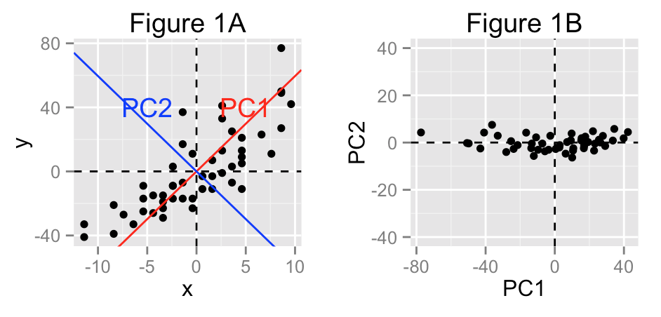
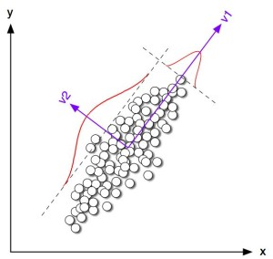
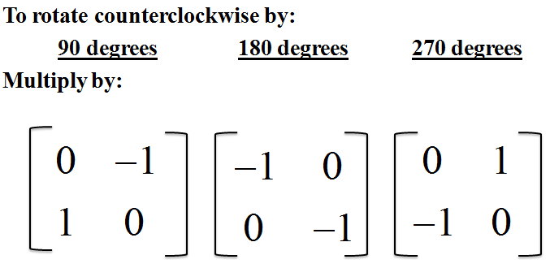
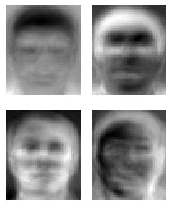

# Background {.tabset}
## Algoritma
The following coursebook is produced by the team at [Algoritma](https://algorit.ma) for its Data Science Academy workshops. The coursebook is intended for a restricted audience only, i.e. the individuals and organizations having received this coursebook directly from the training organization. It may not be reproduced, distributed, translated or adapted in any form outside these individuals and organizations without permission. 

Algoritma is a data science education center with bootcamp programs offered in:

- Bahasa Indonesia (Jakarta campus)  
- English (Singapore campus)

### Lifelong Learning Benefits
If you're an active student or an alumni member, you also qualify for all our future workshops, 100% free of charge as part of your **lifelong learning benefits**. It is a new initiative to help you gain mastery and advance your knowledge in the field of data visualization, machine learning, computer vision, natural language processing (NLP) and other sub-fields of data science. All workshops conducted by us (from 1-day to 5-day series) are available to you free-of-charge, and the benefits **never expire**. 

### Second Edition
This coursebook is initially written in 2017.

This is the second edition, written in late August 2020. Some of the code has been refactored to work with the latest major version of R, version 4.0. I would like to thank the incredible instructor team at Algoritma for their thorough input and assistance in the authoring and reviewing process.


## Libraries and Setup
We'll set-up caching for this notebook given how computationally expensive some of the code we will write can get.
```{r setup}
knitr::opts_chunk$set(cache=TRUE)
options(scipen = 9999)
```

You will need to use `install.packages()` to install any packages that are not already downloaded onto your machine. You then load the package into your workspace using the `library()` function:
```{r}
library(dplyr)
library(FactoMineR)
```

## Training Objectives
In this workshop we'll focus our study on a set of widely-used unsupervised learning methods ranging from PCA (Principal Component Analysis), to Clustering, and other pattern discovery approaches where the target variable is not known or defined. Our goal is to develop a solid intuition behind the problem of dimensionality, the mechanism that is at our disposal, and finally solidify our understanding by working on two of the most common real-life business scenarios.  

- **Dimensionality**
- The Curse of Dimensionality  
- Principal Component Analysis  
- Eigenvector and Eigenvalues  
- `prcomp` in R

- **Unsupervised Learning Algorithms I**
- Rethinking covariance  
- Visualizing PCA 
- Using `FactoMineR`
- Practical Applications: eigenfaces
- PCA for Image Processing

- **Unsupervised Learning Algorithms II**
- Clustering Methods
- k-means  
- Combining PCA with k-means


# Unsupervised Learning
Throughout the Machine Learning Specialization, we've been learning about algorithms that are greatly useful in situations of regression and classification. More generally, we learn to find the parameters for X1, X2 ... Xn to explain or predict a "target" response Y. 

In the case of unsupervised learning, the situation differs in that there is no such a response Y but rather, we're interested in discovering the structure between X1, X2, to Xn - possibly to identify opportunities for dimensionality reduction or for clustering, or to discover patterns that are anomalous to the rest of the observations. Some people have likened unsupervised learning to an exploratory process because it is primarily concerned with pattern identification and less concerned with fitting a prediction model.

Since we don't have a "ground truth" that we use as a measuring stick, techniques such as cross-validation and AUC do not apply due to the lack of a "ground truth" label. 

With that said, unsupervised learning methods can still be very powerful especially in the field of clustering and dimensionality reduction. In this workshop, we'll take an in-depth look at two unsupervised algorithms, the PCA and k-means - and see why unsupervised methods such as these are great tools to add to your toolbox.

# Dimensionality Reduction  
## Principle and Motivation
Machine learning is gaining more and more adoption in fields that deal with high-dimensional data such as handwritten digit recognition, internet-of-things (IOT), and face recognition. As a result, the modern data scientists working with these technologies are faced with a "dimensionality" problem that begs for a methodical solution, not just to reduce the dimensionality of the data but to do so while minimizing the loss of information. 

As a motivational example, think of the case of a low-resolution image. Do a simple google search for black and white faces at 40x40 pixels[^1]. When we treat each image as an input, then our dataset has 1,600 dimensions. 


If you zoom in on the faces, we're looking at 1600 individual pixels. When dealing with grayscale images, a strategy can be assigning a value of lightness on the scale of 0 to 1 to each of the 1,600 columns, with 0 being "full white" and 1 being "full black", and depending on the saturity or lightness of each pixel - assign them a value in between.


There are numerous good papers and resources that deal with the topic of PCA use in image compression, such as the one by researchers as Institute of Chemical Technology, Prague[^2], the one by Czech Institute of Informatics, Robotics and Cybernetics[^3], and this one here[^4]. By the end of this PCA section, we'll also apply PCA on human faces to see how image compression works in practice. 

A 40x40 image is probably not interesting. If you're building an image classifier using photos from an iPhone 7 plus, that's a resolution of 1,920 x 1,080 pixels (more than 2 million dimensions). And that's for a single observation. Recall from your Practical Statistics course that a way we can measure "information" is through variance, so a dimensionality reduction method is essentially concerned with representing as much "variance" as possible in as few dimensions as possible. 

The outcome of this transformation is that our original data (a matrix $X$) is represented by a linearly transformed matrix, $Z$, where $Z$ is typically a matrix with a lot fewer dimensions (commonly <10) than $X$. The first column of $Z$ explains most of the variance within $X$, and the second explains a smaller amount of variance than the first, and so on until the last column.  

The objective of PCA is to find $Q$, so that such a linear transformation is possible. 

If you remember the lessons from last week (Classification 2), I demonstrated the use of `nearZeroVar` and **shown that while eliminate ~50% of the original predictors we still retain enough information** to build a multi-class classifier that has a 99.98% out-of-box accuracy. The features that were eliminated are redundant in that they add little value or that they may just represent "noise". PCA shares the same objective, but does it differently: it looks for correlation within our data and use that redundancy to create a new matrix $Z$ with just enough dimensions to explain most of the variance in the original data. The new variables of matrix $Z$ are called **principal components**.


If you look at Figure 1A, our original data sits on a plane with `x`and `y` coordinates. Two dimensions (x and y, respectively) are required in Figure 1A to describe the variance in our data fully. 

However, supposed we identify two other axes to describe the same data, and one of them is directly orthogonal to the other one: we can now measure the variance in our data using just these axes (we call them **principal components**). We identify the PC1 axis as the first principal component because using only one principal component, this would be the one that explain the most amount of variation. The PC2 axis is then selected, again with the objective of explaining the most amount of variation. 

If we hold PC2 as constant (say, 0) then we reduce the dimensions from two to only one, which is by projecting each data point onto PC1. We do lose some variation as our observations are not exactly 0 on the PC2 axis, but since they are very close to being 0, the variation we lose from reducing one dimension is a tradeoff we want to accept.  

(Recall our lessons from Regression Model, when I introduce `VIF` to show how if variable "Police Expenditure this year" can be sufficiently explained by variable "Police Expenditure last year" then we don't need both variables)

Other applications of PCA:  
- Pattern discovery on high dimensional data  
- Identify variables that are highly correlated with others  
- Visualizing high dimensional data  

**Dive Deeper:** Which of the two following data set are going to be helped most by Principal Component Analysis (PCA)?

```{r}
set.seed(100)
par(mfrow=c(1,2))
x <- runif(100)
plot(x=x, y=runif(100), pch=19, cex=0.5, xlim=c(-0.5, 1.5), ylim=c(-0.5, 1.5), main="Blind Tasting", xlab="wine age", ylab="score")
plot(x=x, y=x+runif(100, -0.1, 0.1), pch=19, cex=0.5, xlim=c(-0.5, 1.5), ylim=c(-0.5, 1.5), main="Logistic Machinery", xlab="temperature", ylab="pressure")
```

## Step-by-step: PCA Analysis on Property Sales in NYC
Let's start by reading in a dataset which is concatenated[^5] from the New York City Department of Finance and mada available by City of New York. This dataset is a record of every building or building unit (apartment, etc.) sold in the New York City property market over a 12-month period:  
```{r}
property <- read.csv("data_input/nyc.csv")
```

`BOROUGH`: A digit code for the borough the property is located in; in order these are Manhattan (1), Bronx (2), Brooklyn (3), Queens (4), and Staten Island (5)  
`NEIGHBORHOOD`: The neighborhood name  
`BUILDING.CLASS.CATEGORY`: Category class of the property[^6]  
`TAX.CLASS.AT.PRESENT`, `TAX.CLASS.AT.TIME.OF.SALE`:
`BLOCK`, `LOT`: The combination of borough, block, and lot forms a unique key for property in New York City  
`EASE.MENT`:An easement is a right, such as a right of way, which allows an entity to make limited use of another's real property  
`BUILDING.CLASS.AT.PRESENT`, `BUILDING.CLASS.AT.TIME.OF.SALE`: The type of building at various points in time, (for example "A"" signifies one-family homes, "O" signifies office buildings. "R" signifies condominiums)[^6]  
`ADDRESS`: Street address of the property  
`APARTMENT.NUMBER`: Apartment number if applicable  
`ZIP.CODE`: The property's postal code  
`RESIDENTIAL.UNTIS`: The number of residential units at the listed property  
`COMMERCIAL.UNITS`: The number of commercial units at the listed property  
`LAND.SQUARE.FEET`: The land area of the property listed in square feet  
`GROSS.SQUARE.FEET`: The total area of all the floors of a building as measured from the exterior surfaces of the outside walls of the building, including the land area and space within any building or structure on the property  
`YEAR.BUILT`: Year the property was built  
`SALE.PRICE`: Price paid for the property  
`SALE.DATE`: Date the property sold  

Many of these property is sold with a nonsensically small dollar amount, commonly $0. These sales actually represent a transfer of ownership without a cash consideration - such as when parents transfer ownership to a child[^7]. 

This dataset uses the financial definition of a building/building unit, for tax purposes. In case a single entity owns the building in question, a sale covers the value of the entire building. In case a building is owned piecemeal by its residents (a condominium), a sale refers to a single apartment (or group of apartments) owned by some individual.

I'm going to do some cleaning and pre-processing using `dplyr`, and have the final dataset stored in a variable named `ppt`:  

```{r warning=FALSE}
ppt <- property %>% 
  mutate(LAND.SQUARE.FEET = as.integer(LAND.SQUARE.FEET),
         GROSS.SQUARE.FEET = as.integer(GROSS.SQUARE.FEET),
         SALE.PRICE = as.integer(SALE.PRICE)
         ) %>% 
  select_if(is.integer) %>% 
  select(!c(X, BOROUGH, BLOCK, LOT, ZIP.CODE)) %>% 
  filter(complete.cases(.))

str(ppt)
```

We've established earlier that correlations in the data makes some variables redundant. In our regression models class, we observe that if we can predict "police expenditure this year" accurately from "police expenditure last year", then one of these variables is redundant. Post-PCA, the matrix $Z$ should be one where every dimension is uncorrelated. 

**Discussion:** Which of the following plot shows variables that are uncorrelated?  

```{r}
set.seed(100)
par(mfrow=c(1,3))
x <- runif(100)
plot(x=x, y=-x+runif(100, 1, 1.2), pch=19, cex=0.5, xlim=c(-0.5, 1.5), ylim=c(-0.5, 1.5), main="Sale Price of Vehicles", xlab="Age", ylab="Sale Price")

plot(x=x, y=runif(100), pch=19, cex=0.5, xlim=c(-0.5, 1.5), ylim=c(-0.5, 1.5), main="Blind Tasting", xlab="wine age", ylab="score")

plot(x=x, y=x+runif(100, -0.1, 0.1), pch=19, cex=0.5, xlim=c(-0.5, 1.5), ylim=c(-0.5, 1.5), main="Logistic Machinery", xlab="temperature", ylab="pressure")
```

The variables Age and Price in `Sale Price of Vehicle` are not uncorrelated. If you plot a regression line on it, that line exhbits a downward slope, and the correlation between Age and Sales Price would be a value close to -1. 

The variables Temperature and Pressure in `Logistic Machinery` are also not uncorrelated. If you plot a regression line on it, that line exhbit an upward slope, and the correlation between Temperature and Pressure would be a value close to 1. 

Intuitively, we conclude that the variables "Blind Tasting" are uncorrelated because knowing the value of x does not give us any indication of what the value of y may be. 

Now if we follow the example in **pca1.png** (from the Principle and Motivation) section and pick a new axis combination for `Logistic Machinery` (which is the purple line labelled `v1` and `v2` in the following picture), then the distributions for temperature and pressure becomes uncorrelated under the two new axes:



### [Optional] Eigenvalues and Eigenvectors
If you have limited exposure to Matrix Algebra - feel free to skip this sub-section. Concepts presented under this sub-section will not be graded; In fact, R has really convenient built-in functions that help you compute eigenvectors and eigenvalues so the inner-working is for the most part optional for any practitioner. 

In linear algebra and matrix theory, we learn that a vector when multiplied by a matrix, changes its direction. When we take a vector(2,3) and multiply it by a scale, say 2, then the resulting vector would be (4,6) - the scalar scales the vector by a magnitude of 2.

Now if we take the same vector and multiply it by a matrix, the vector being acted on changes direction:
$$\left(\begin{array}{cc} 
11\\
16
\end{array}\right)
= \left(\begin{array}{cc} 
1 & 3\\
2 & 4
\end{array}\right)

\left(\begin{array}{cc} 
2\\ 
3 
\end{array}\right)$$ 
In R, we use `%*%` to denote a matrix multiplication:
```{r}
matrix(1:4, nrow=2) %*% as.vector(c(2,3))
```

In a sense, we can think of the above operation as a matrix transforming a vector into another vector: the resulting vector will (generally) have a different direction and length than the original vector. There are however a few notable exception to this:  

- The matrix that acts on a vector without actually changing it at all is called the **identity matrix**. An identity matrix is a square matrix in which all the elements of the principal diagonal are ones and all other elements are zeros. 

The (2,3) matrix multiplied by an identity matrix of size 2 is going to result as a (2,3); neither the direction or the magnitude is changed.  

```{r}
c(2,3) %*% diag(nrow=2,ncol=2)
```

- The matrix that rotates every vector through a fixed angle is called a **rotation matrix**. The direction of a vector changes, but not its magnitude. Take the matrix, A, below and multiply it with (-3, 2) to get (3, -2). If you draw the two vectors you'll notice that they are of the same length with the second vector rotated at 180 degree to the first. Multiply A with (-20, 18) and the vector gets transformed to (20, -18), again rotated by 180 degree. As it turns out A is a rotation matrix that will transform a vector by 180 degree but without changing the magnitude of the vector. 
$$
\left(\begin{array}{cc} 
-1 & 0\\ 
0 & -1 
\end{array}\right)
\left(\begin{array}{cc} 
-3\\ 
2
\end{array}\right)
$$ 

```{r}
matrix(c(-1,0,0,-1),2,2) %*% c(-3,2)
```




- For most matrices there are certain vectors, called **eigenvectors** whose directions don't change (except when it's scaled by -1, in which case its direction reversed) when acted on by the matrix. The effect on multiplying that matrix by such a vector, its eigenvector, is the same as multiplying the vector by a scalar. This scalar is a constant and is formally referred to as an **eigenvalue**. WHen we multiply matrix A by an eigenvector x, the result would be a constant $\lambda$ multiply by x. The equation is hence:  

$Ax = \lambda x$, where the number $\lambda$ is an eigenvalue of A.

$$
\left(\begin{array}{cc} 
2 & 3\\ 
2 & 1 
\end{array}\right)
\left(\begin{array}{cc} 
3\\ 
2
\end{array}\right)
=
\left(\begin{array}{cc} 
12\\ 
8
\end{array}\right)
=4
\left(\begin{array}{cc} 
3\\ 
2
\end{array}\right)
\\
2\left(\begin{array}{cc} 
3\\ 
2
\end{array}\right) = \left(\begin{array}{cc} 
6\\ 
4
\end{array}\right) \\
\left(\begin{array}{cc} 
2 & 3\\ 
2 & 1 
\end{array}\right)
\left(\begin{array}{cc} 
6\\ 
4
\end{array}\right)
=\left(\begin{array}{cc} 
24\\ 
16
\end{array}\right)
=4
\left(\begin{array}{cc} 
6\\ 
4
\end{array}\right)
$$ 
Observe how a scaled eigenvector is still an eigenvector. 

### Intuition and Practice: PCA
Remember earlier I mention that intuitively, the objective of a PCA is to select new axis (new dimensions) for our plot and that these new dimensions of our data are called **principal components**? The new dimensions should have no correlation to each other (in the context of dimensionality, correlation leads to redundancy!). If we have a covariance matrix:

```{r}
A <- matrix(c(1.04, 0.77, 0.77, 0.68), nrow=2)
A
```

Recall from our Practical Statistics workshops that this means the variance of our first variable is 1.04, the variance of the second variable is 0.68 and the covariance between these two is 0.77. 

Now `A` is a square symmetrical matrix, so it can be diagonalized by choosing a new coordinate system given by its eigenvectors, the corresponding eigenvalues will then replace the values on the diagonal. Using this new coordinate system, our covariance matrix A will look like:
```{r}
round(matrix(c(eigen(A)$values[1], 0, 0, eigen(A)$values[2]), nrow=2),2)
```

Now observe that with this transformation, the correlation between the two variables is now zero. The maximum variance of 1.65 can be achieved if we would take the projection on the first coordinate axis (reducing the second axis), so it makes sense that the direction of the first **principal component** is thus selected from the first eigenvector of the covariance matrix. 

Let's see one more example, and this time we'll make this more visual to strengthen the intuition:
```{r}
set.seed(100)
x <- runif(200)
A <- data.frame(x=x, y=-x+runif(100, 1.05, 1.25))
A <- scale(A, center = T)
plot(A, cex=0.4)
```

Let's take a look at the covariance matrix of A:
```{r}
cov(A)
```

No surprised in the matrix above, as x and y are correlated with themselves (hence 1), and that both of them are negatively (and strongly) correlated. If we extract the first eigenvector and derive the slope (we can think of this as  principal component 1) and do the same for the second eigenvector (principal component 2), we can then use these two as the new coordinates for our plot later:
```{r}
slope1 <- eigen(cov(A))$vectors[1,1]/eigen(cov(A))$vectors[2,1]
slope2 <- eigen(cov(A))$vectors[1,2]/eigen(cov(A))$vectors[2,2]
```

And now observe how we plot `slope1` and `slope2` onto the original data. Take a second to observe that the two are orthogonal and imagine remove the second axis (green), that would mean our observation are projected onto a one-dimensional line (blue line) - we would lose some information, but as it turns out, that blue line captures the most amount of variation in our data and so that information loss from removing the green line is the most minimal compared to other possible combinations of axes / other possible combinations of coordinate system.
```{r fig.width=1.5, fig.height=1.5}
par(mar=c(1,1,1,1))
plot(A, pch=19, cex=0.25, xlim=c(-1.5,1.5), ylim=c(-1.5,1.5))
abline(h = 0, lty=3, lwd=0.6)
abline(v = 0, lty=3, lwd=0.6)
lines(A[,1], A[,1] * slope1, col="blue")
lines(A[,1], A[,1] * slope2, col="green")
```

## Application of PCA: Dimensionality Reduction on NYC Property Sales
With all the newly equipped knowledge, we'll now see how PCA is applied to to our property sales dataset. First, let's take a look at the covariance matrix of the `ppt` dataset. Realize that the `ppt` matrix is not centered / scaled yet:

```{r}
cov(ppt)[1:3,]
```

If we extract our principal components from the above matrix, the result is not going to be useful. When we think of PCA as a variance maximizing exercise, this become clearer: when we our PCA on the above data (un-scaled), the amount of variance explained by the different principal components is going to be dominated by variables that are on a larger range.

```{r}
plot(prcomp(ppt))
```


If we had standardized the data first, and perform our principal component analysis, we would get a much more sensible output:
```{r}
ppt_z <- scale(ppt, center = T, scale=T)
plot(prcomp(ppt_z))
# equivalent: plot(prcomp(ppt, scale=T))
```


This here gives us a clearer idea that the other components contributed in retaining the variance within our data as well. So as a rule of thumb: when we're looking for features to retain in a dimensionality reduction exercise, make sure we scale or normalize our data before running PCA.

Earlier we use the `prcomp()` function, if we want the data to be centered around the mean, we can specify `center=TRUE` in our function call; If we wanted the data to be scaled to have unit variance before PCA takes place, we can add `scale=TRUE`. This is generally advisable when our data has different units. 

Look at the last plot a couple of lines above and pay special attention to the _equivalent code_ commented out. 

Let's learn another plot commonly used in PCA analysis, the `biplot()`. A `biplot()` function expects a `prcomp` object, renders the following:

```{r}
ppt_small <- ppt[1:100, ]
biplot(prcomp(ppt_small, scale=T), cex=0.5)
```

The plot shows:  
- Where the first 100 property sales within our data is positioned in terms of PC1 and PC2, represented by text labels  
- The loading of each variable on PC1 and PC2, represented by the red arrow  

The x and y axes are now replaced with PC1 and PC2, in that order. The top and right axes indicate the loadings. In many cases, practitioners can use only the first two principal components and still retain enough "information" within the data - the first two principal components, as it turned out very often have retain most of the variance in our data and so the reduced dimensionality can result in a visual representation like the one above. 

Since it is useful to "visually" represent the variability in our observations (rows) and our variables (columns), we can make use of R's built-in function, `biplot` to achieving that. 

For example, if we're paying attention to the plot, we can see that most of the property sales tend to be quite characteristically similar as measured by PC1 and PC2 - that explains how most points are concentrated in the "top right" corner. We also see that `GROSS.SQUARE.FEET` and `LAND.SQUARE.FEET` are close to almost overlapping each other, suggesting that these two variables are characteristically similar and capture very identical information in the data. Observe also that `RESIDENTIAL.UNITS` and `TOTAL.UNITS` are also very close together in space, and both are variables that contribute strongly to the second principal component. 

```{r}
cor(ppt_small$GROSS.SQUARE.FEET, ppt_small$LAND.SQUARE.FEET)
cor(ppt_small$RESIDENTIAL.UNITS, ppt_small$TOTAL.UNITS)
```

In addition to looking for observations and variables that have high proximity in this new vector space, we can also look for ones that are distant. We can observe a few outliers that are quite distinguished from the others (property sales #51, #32 and #96). We can inspect these property sales by flagging them for a closer look later. The arrows representing `RESIDENTIAL.UNITS` and the one representing `COMMERCIAL.UNITS` are pointing in rather separate directions (and magnitude), which means (really sketching the surface of intuition here) that their contribution to each of the 2 principal components are sufficiently differentiated.

Let's do one more practice. This time we'll plot the first 300 of those property sales. Try and observe the plot - did you see any outlier?

```{r}
ppt_small <- ppt[1:300, ]
biplot(prcomp(ppt_small, scale=T), cex=0.5)
```

We can further inspect some of these outliers (110, 114, 115, and 116 and 118). In real world applications, we would likely also have buyer and seller information, and these 4 transactions (out of 300) may have been singled out - say for tax auditing purposes, to see if there's foul play or anything worthy of further, manual inspection.

As we inspect the 5 property sales below, pay close attention to the 5 ones we we identified above. Notice that in our biplot, we're really only relying on two "dimensions" (as opposed to the original dimensions in our dataset), PC1 and PC2 respectively, to "summarize" our data, and isn't it quite interesting that a 2-d plot is able to capture most of the variation between observations **as well as** between the original variables? 

116 is the closest point to 118 in the biplot, and both turns out to be among the most distant from the rest of our observations. If you look at the raw data itself, that's immediately clear: both are property sales involving only 1 commercial unit and yet commanding a very hefty price tag, in some cases 5 times more expensive than another sale involving 529 residential units (in New York City!). 

```{r}
as.matrix(ppt[105:120,c(1:2,5:6,8)])
```

110, 114, 115 are close to each other on the biplot and realize that in the original data, they are similar to each other in that both involve a high number of residential units (probably a condominium or large apartment) and that all three are relatively old buildings - built between the year 1921 and 1929. In practice, we would identify these properties by a transaction id, and investigate further for any interesting "pattern": if they are from the same property developer, share a same sales agency etc. A biplot, using only two axis, communicates hidden structure that are otherwise difficult to meaningfully visualize or compare.

Let's go into the inner workings of the PCA by inspecting its summary:
```{r}
ppt_prcomp <- prcomp(ppt_small, scale=T)
summary(ppt_prcomp)
```

So we've learned that our PCA projects our data onto a new set of dimensions where the variances in our data are captured in a way that allow for meaningful clustering or visualization. We learned also that this new set of dimensions are called "principal components". What do you think the correlations between these principal components (say, the correlation between `PC1` and `PC2`) are?

If you're done with the simple thought experiment above[^8], let's attempt a second question: how many principal components (dimensions) is required to explain ~80% of the variation (round up to closest whole number)? This represent a 60% reduction in dimensionality, which makes PCA a significant and often times critical tool when working with high-dimensional data. 

One last experiment: run `plot(ppt_prcomp)` in your notebook to get a variance plot. Answer the following question:

Q1:  
The projection of our data on the first two principal components (PC1 and PC2, conventionally) is called a:  
[__your answer here__]

Q2:  
The code [__your answer here__] tells us how much variation each of the principal components have captured in decreasing order

Q3: The correlation between each of the principal components should [approximate one / approximate zero / approximate the correlation between the original variables]?

If you've successfully answered the above questions, you're on good track! Now let's take what we've just learned and look at another example.

Exercise: PCA on Crime dataset
The following dataset is built-in, and you can access it by calling `USArrests`. Take a quick look at the dataset, which comprise of arrests per 100,000 residents related to one of three crimes in each of the 50 US States in 1973:
```{r}
data("USArrests")
source("R/biplot.R")
head(USArrests)
```

- `Murder`: murder arrests per 100,000  
- `Assault`: assault arrests per 100,000  
- `UrbanPop`: percent of population in urban areas  
- `Rape`: rape arrests per 100,000  

In the second line I use `source("R/biplot.R")` to read in a function that renders the biplot for you. You can use `fancy_biplot(x)` the same way you would use `biplot(x)`: it accepts a pca object `x` and render a biplot. Now it's your turn: create the PCA object, and use `fancy_biplot()` to render a biplot. 

1. Do you see a cluster of states where Arizona, Colorado, Illinois, and Texas are concentrated at. What other state is in that cluster?  

2. From the biplot, can you tell which of the four states have a higher proportion of murder / assault / rape? Which of the 4 states have the lowest arrrest in all of these three crimes?
Pick from: "Ohio", "Louisiana", "North Dakota" and "Colorado"

Highest proportion of murder:  
Highest proportion of assault:  
Highest proportion of rape:  
Lowest proportion of crime:  

You should rely on the biplot (reminder: `fancy_biplot()`) to answer the questions. Do not take a peek at the original data.

## Visualizing Loan Defaults with PCA and FactoMiner
I want to highlight yet another useful application of PCA analysis. This time we'll work with the loan data from Quarter 4, 2017 that I prepared for you back in Classification 1[^10]. 

We'll read the data in and take a quick look at the structure of our data:
```{r}
loan <- read.csv("data_input/loan2017Q4.csv")
str(loan)
```

I'm going to now introduce another R package, `FactoMineR`, dedicated to exploratory multivariate data analysis and one that can help with our PCA analysis tremendously. Take a look at the code below. Notice that we're applying a standardization on our quantitative variables (`quantivar`). We then use `quali.sup` to indicate the indexes of the categorical supplementary variables. We specified `purpose`, `verification_status` and `grade` as supplementary variables. 

The following call would return two plots if `graph=T` (default):  
1. Individuals factor map  
2. Variables factor map  

This separation avoids an over-cluttered map and also give us the flexibility to customze each of these two plots individually. 
```{r}
library(FactoMineR)
#loan_pca <- prcomp(loan[,c(3:6,9:11,13:16)], scale=T, center=T)
quantivar <- c(3:6,9:11,14:16)
loan$not_paid <- as.factor(loan$not_paid)
loan_pca <- PCA(loan[,c(2:11,14:16)], quali.sup = c(1,6,7), graph=F)
```

Because of `graph=F`, the two plots (individuals factor map and variables factor map) are not rendered. Let's plot the two of them manually. For the Individuals factor map, I use `select` to specify a selection of the elements are are drawn - thus avoiding an over-cluttered plot (try removing the `select` parameter from the code) and I also added `habillage` to color the individual points by a categorical variable - in this case, the 7th variable (`grade`). 

When using `select`, valid values include:  
`select=1:100`: label observations 1 to 100  
`select=c("new york", "chicago")`: label observations with the name `new york` and `chicago`  
`select="contrib 10`: label 10 elements that have the highest contribition on the 2 dimensions of our plot

```{r}
plot.PCA(loan_pca, cex=0.6, choix = c("ind"), select="contrib 5", habillage=7)
plot.PCA(loan_pca, cex=0.6, choix = c("var"))
```

With your Variables factor map plotted (second plot), let's use the `dimdesc()` function to help us understand the variables and the categories that are the most characteristic according to each dimension obtained in the PCA process. Notice that I'm looking at the quantitative variables "best describe" the first and second dimensions, and that the function has automatically sorted the values by descending order.  

If you use `summary(loan_pca)` you can confirm these correlation as well. The variables factor map we got above is merely a plot of these variables using their correlations to Dim 1 and Dim 2 as x and y axis. 

Try swapping `quanti` for `quali` and you'll get the qualitative variables. Alternatively, use `summary()` to inspect these figures and compare them to the plot you obtain above. 
```{r}
a <- dimdesc(loan_pca)
as.data.frame(a[[1]]$quanti)
```

Visualizing the correlation between each variables and our PC 2:
```{r}
a <- dimdesc(loan_pca)
a <- as.data.frame(a[[2]]$quanti)
a <- cbind(rownames(a), a)
plot(as.factor(a[,1]), a[,2])
```

Finally, using `loan_pca$eig`, how many principal components do you need to retain more than 75% of the variation in our data? Consider the tradeoff between dimensionality reduction and the advantages it offer as we look at yet another area of application for PCA: classification! 

```{r}
loan_pca$eig
```


We've spent a lot of time understanding that principal components are just new "dimensions" (think "variables" if they are more intuitive) that give us the most value in explaining the variation in our dataset. This also makes PCA a handy tool to visualize and understand how a combination of our original explanatory variables (or two combinations) can sufficiently explain the variation between categories - these are potentially handy tools for classification cases with high-dimension datasets!  

In the following graph, we see that PC1 and PC2 combined can do a pretty decent job at classifying the `grade` of our loan, but not too well on `purpose` or `verification_status` for example:
```{r}
# plotellipses(loan_pca, keepvar="quali.sup")
loan_pca <- PCA(loan[,c(2:11,14:16)], quali.sup = c(1,6,7), graph=F)
plotellipses(loan_pca, keepvar=c(1,6,7))
```

As we move into the next section, let's summarize:  
- Eigenvectors are just the linear combinations of the original variables (in the simple or rotated factor space); they described how variables "contribute" to each factor axis  
- Think of PCA as as way to construct new dimensions (like x and y axes) that point to the directions of maximal variance (in the original variable space), as expressed by the eigenvalue  
- The eigenvalue associated with each principal component also tells you how much variation in the data set it explains  
- Data should be normalized before performing PCA. PCA is sensitive to scaling of data as higher variance data will drive the principal component.

## Practical Application: Eigenfaces
When we develop facial recognition system, we're usually operating in a very high dimensional space - think, 1024 dimensions (read the Motivation section at the beginning of this coursebook). Numerous empirical studies shown that very problematic issues arise out of this dimensionality especially when our training sample is not sufficiently large. Remember from a few weeks back we've learned about the Euclidean distance? It turns out that when Euclidean distance is applied on a high-dimensional dataset, "there [exist] little distance in the distance between pairs of samples"[^11]." Another undesired effect of high dimensionality concerns the k-NN nearest neighbor algorithm we learned about in the Classification 1 workshop, [^12] and yet another concerns anomaly detection. The phenomenon of undesired effect arising out of working with data in high-dimensional spaces (where they don't occur in low-dimensional settings of everyday experience) was affectionately called "the curse of dimensionality". 


For images with 1024-dimensions (32 x 32), PCA becomes highly useful as we look to reduce the number of dimensions in our feature space by calculating the eigenvectors of the covariance matrix from the original 1024-dimensional data, and then projecting each feature vector onto the largest eigenvectors. When using only the **first four eigenvectors** on the Cambridge face dataset[^12]:



Each of the 1024-dimensional feature vector when projected onto the N largest eigenvectors can hence be represented as a linear combination of these eigenfaces. We can then have our classifer "learn" the coefficients (beta values) of these linear combinations and predict the identity of the person. Remember: what we've learned about eigenvectors still apply: the first PC represents the largest variance in the data, and the second PC try and capture the most amount of "error" from the first component, and so on. Collectively, the first 4 PCs capture the most amount of variation / information of a face. If we build a classifier using only the first 30 eigenvectors, that is a pretty substantial reduction in dimensionality (from 1024). 


In the following example, I'll demonstrate how PCA is used in the field of image processing by reconstructing a 32x32 image using only the first 4 principal components. The reconstruction of our data was done using the `reconst()` function:

```{r}
load("data_input/face.rda")
face_pca <- PCA(faceData,  graph = F)
face_recon <- reconst(face_pca, ncp=4)
```

Taking a look at the eigenvalues will show us that the first 4 will explain ~85% of the variances in our data:
```{r}
head(face_pca$eig)
```

So the first principal component (PC1) explains the most variance, the second explains the next.  The variance that each explains is measured by its eigenvalue, which is scaled in terms of the number of variables worth of variance. So PC1 in that respect, explains as much variance as 12.62 original variables does. This also mean that the eigenvalues would sum up to the total number of variables:
```{r}
sum(face_pca$eig[,1])
```

I'm using the `image()` function from base R to create a grid of colored (in our case, gray-scale) rectangles with color corresponding to the values in a given matrix:
```{r fig.height=1.5, fig.width=1.5}
showMatrix <- function(x, title){
  image(t(x[nrow(x):1,]), 
        xaxt = 'n', yaxt = 'n', 
        col = gray((0:32)/32),
        main = title, 
        font.main=4, 
        cex.main=0.5
        )
  }
```

And here we'll plot the original image as well as the one reconstructed from 4 principal components:
```{r, fig.height=1, fig.width=2}
par(mfrow=c(1,2), mar=c(0.5,0.5,1.5,0.5))
showMatrix(faceData, title = 'Original Image')
showMatrix(face_recon, title = 'Reconstructed w/ 4 dimensions')
```

If you did not skip the earlier optional section describing the matrix algebra behind PCA, you can also create your own reconstruction function manually:
```{r}
face_pca_m <- prcomp(faceData, center = T, scale=T)
prcomp.recon <- function(pca, pcs=NULL){
  if(is.null(pcs)) pcs <- seq(pca$sdev)
  recon <- as.matrix(pca$x[,pcs]) %*% t(as.matrix(pca$rotation[,pcs]))
  if(pca$scale[1] != FALSE){
  	recon <- scale(recon , center=FALSE, scale=1/pca$scale)
  }
  if(pca$center[1] != FALSE){
	recon <- scale(recon , center=-pca$center, scale=FALSE)
  }
  recon
}
```

Using the manual function we created above, let's compare the 4 images reconstructed with varying degree of dimensionality:
```{r, fig.height=3, fig.width=2.5}
con_manual3 <- prcomp.recon(face_pca_m, pcs=1:3)
con_manual10 <- prcomp.recon(face_pca_m, pcs=1:10)
con_manual15 <- prcomp.recon(face_pca_m, pcs=1:15)

par(mfrow=c(2,2), mar=c(0.5,0.5,1.5,0.5))
showMatrix(faceData, title = 'Original Image')
showMatrix(con_manual3, title = 'Reconstructed: 3 dimensions')
showMatrix(con_manual10, title = 'Reconstructed: 7 dimensions')
showMatrix(con_manual15, title = 'Reconstructed: 15 dimensions')
```

### PCA for Anomaly Detection
We've learned that PCA is used in the area of image compression and also in more general unsupervised tasks as they are very effective at revealing the inner structure of (the variance of) our data. There exist however, many other uses of PCA - one example is in anomaly detection. When applied as an anomaly detection algorithm, each new observation is projected on the eigenvectors together with a normalized reconstruction error. The normalized error error is used as the anomaly score - the higher the error, the more anomalous the instance is.

PCA thrives where classification algorithms come short in this respect because very often when dealing with fraudulent transactions, we don't have enough examples of fraud to train on, but have many examples of good transactions. In fact, in many cases we also do not know a case of fraud beforehand, only after-the-fact.

The PCA-Based Anomaly Detection module solves the problem by analyzing available features to determine what constitutes a "normal" class, and applying distance metrics to identify cases that represent anomalies. This let you train a model using existing imbalanced data[^15].

# K-means Clustering
Clustering refers to the practice of finding meaningful ways to group data (or create subgroups) within a dataset - and the resulting groups are usually called clusters. The objective is to have a number of partitions where the observations that fall into each partition are similar to others in that group, while the partitions are distinctive from one another. 

K-means is a centroid-based clustering algorithm that follows a simple procedure of classifying a given dataset into a pre-determined number of clusters, denoted as "k". This procedure is essentially a series of interations where we:  
1. Find cluster centers  
2. Compute distances between each point to each cluster centers  
3. Assign / re-assign cluster membership  

A few technicality: Instead of saying "cluster centers", we'll call them "centroids"; Also, in the first iteration of the above procedure, because there are clusters in our feature space, we can't yet compute any centroids so in the first "iteration" we'll randomly assign our centroids. It turns out, with enough iteration, that the procedure can usually converge at a reasonably well solution, giving us very reasonable k centroids (remember: we define k, just as in the k-NN algorithm we learned) that we can use for clustering task.

Run the following code in your console to see an animation that illustrate the k-means algorithm in action:
```{r eval=F}
library(animation)
## set larger 'interval' if the speed is too fast
ani.options(interval = 1)
par(mar = c(3, 3, 1, 1.5), mgp = c(1.5, 0.5, 0))
kmeans.ani()
```


Let's take a look at the image below:


If we choose _k_ to be 2, these are the steps that a k-means algorithm take in assigning the original data (green dots) to two clusters:  
Step (a): Our data on a two-dimensional space  
Step (b): Iteration 1 - Randomly initialize our cluster centroids  
Step (c): Iteration 1 - Assigning cluster membership based on a distance function  
Step (d): Iteration 2 - Move cluster centroids to be at the center of clusters  
Step (e): Iteration 2 - Re-Assigning cluster membership based on a distance function  
Step (f): Iteration 3 ...

We'll get into the mathematical details a bit later; For now, let's take a look at how we can use R's `kmeans()` function to solve a clustering problem in the absence of a target predictor.

## Cluster-based Whisky Recommendation
The data we'll be reading in is from Dr.Wisehart (University of St. Andrews), and comprise of 86 distilleries that produce malt whiskies. Each of the whiskies were scored between 0-4 under 12 different taste categories including `Body`, `Sweetness`, `Smoky`, `Medicinal`, `Tobacco`, `Honey`, `Nutty`, `Floral` etc. The original motivation also notes that "by using correlation data it may be possible to provide whisky recommendations based upon an individual's particular preferences"[]. 
```{r}
# Read data in
whiskies <- read.csv("data_input/whiskies.txt")
# Distillery column is the name of each whisky
rownames(whiskies) <- whiskies[,"Distillery"]

# remove RowID, Postcode, Latitude and Longitude
whiskies <- whiskies[,3:14]
```

We'll perform scaling, just as we did in the PCA analyses earlier. With this dataset - scaling is rather arbitary and optional because all measurments assume the same range (0 to 4), but with most data this won't be the case. Recall that the `kmeans` procedure compute a distance (typically Euclidean distance) and as we've learned in the k-NN section of this Specialization, failing to scale may cause our model to perform adequately with the algorithm favoring variables on higher scales. 
```{r}
whi_z <- scale(whiskies)
```

We will have to set a seed for reproducibility because in the first iteration, our centroids are randomly picked on the feature space - thus each time we run the `kmeans()` we are bound to get a slightly different result. Given the objective of **minimizing the within-cluster sum of squared** the k-means algorithm is guaranteed to converge but is not guaranteed to a global optima - a point I'll illustrate later through some code experiment. 
```{r}
set.seed(100)
# k-means with 4 clusters
whi_km <- kmeans(whi_z, 4)
whi_km$centers
whi_km$iter
```

When we use `$iter`, we see that k-means take only 3 iterations to converge, stopping at the third iteration: it already identified 4 sufficiently distinct clusters and further iteration wouldn't improve it any further. The objective has been satisfied. The original algorithm by Lloyd uses this as the objective (minimizing the within-cluster sum of squares):  

$\sum\limits^k_{i=1}\sum\limits_{x_j \in S_i} (x_j - \mu_i)^2$

Where $\mu_i$ is the mean of all the points in cluster $S_i$

Now let's make this whole idea a lot more concrete by working with some simulated data in code.

### Dive Deeper: Understanding k-means
In the following experiment, we'll observe how the initialization may not converge to the global optima by simulating some data and changing the seed number iteratively. Here's the code to generate some random data:

```{r}
set.seed(100)
x1 <- runif(100, 1, 2)
y1 <- runif(100, 1, 2)
x2 <- runif(100, 0.4, 1.5)
y2 <- runif(100, 0.4, 1.5)
a <- rbind(data.frame(x=x1,y=y1), data.frame(x=x2,y=y2))
head(a)
```

Plotting `a$x` and `a$y` will yield the following:
```{r}
plot(a$x, a$y, xlim=c(0, 2.5), ylim=c(0,2.5), pch=19, cex=0.4)
```

By eye-balling the data, one may make a reasonable argument that there can be three clusters. I'm going to run `kmeans()` on the simulated data, specifying 3 so the k-means algorithm would use 3 number of clusters. Later, you may want to change the seed from 50 to 100 so you can get a visual idea of how the initialization of our centroids will lead to a rather different outcome:
```{r}
set.seed(50)
a_k <- kmeans(a[,1:2], 3)
a$clus <- a_k$cluster
a_k$centers
```

With the kmeans model `a_k`, we'll now plot our clusters (square) and map the color of our points to the assigned clusters from our `a_k$cluster`:
```{r}
plot(a$x, a$y, xlim=c(0, 2.5), ylim=c(0,2.5), pch=19, cex=0.4, col=a$clus)
points(a_k$centers, col=1:3, pch=15, cex=1.5)
```

Try changing the seed from 50 to a different number and observe how the initialization would lead us to a model with different centroids, and consequently different within-cluster sum of squares as well as the sum of within-cluster of squares. 

According to our original model, our within-cluster sum of squares can be computed by subtracting each point's x and y coordinates to the centroid's x and y coordinates, then taking the sum of the squared values. This, we learn in previous workshops, is the Euclidean's distance:
```{r}
# sum of square distance for cluster 1
ssd1 <- sum((a[a$clus==1, 1] - a_k$centers[1,1])^2 + ((a[a$clus==1, 2] - a_k$centers[1,2])^2))

# sum of square distance for cluster 2 
ssd2 <- sum((a[a$clus==2, 1] - a_k$centers[2,1])^2 + ((a[a$clus==2, 2] - a_k$centers[2,2])^2))

# sum of square distance for cluster 3
ssd3 <- sum((a[a$clus==3, 1] - a_k$centers[3,1])^2 + ((a[a$clus==3, 2] - a_k$centers[3,2])^2))

c(ssd1, ssd2, ssd3)
sum(ssd1, ssd2, ssd3)
```

The `kmeans` model we obtained (we named it `a_k`) also has methods that output these two figures:
```{r}
a_k$withinss
a_k$tot.withinss
```

If we print `a_k` we will see "between SS / total SS = 67.8%", this can serve as another indicator for the goodness of fit. When we compute the sum of squared distances of each point to the global sample mean, we get the total sum of squares. That's also computed for us by `kmeans()` and accessible via `$totss`:
```{r}
sum((a$x - mean(a$x))^2 + (a$y - mean(a$y))^2)
a_k$totss
```

However, when we choose to compute one per cluster (we have 3 clusters) instead of using the global sample mean - and then find the sum of squared distances of these three means to the global mean, we get the between sum of squares (`$betweenss`). When we do this, we also multiply the squared distance of each mean to the global mean by the number of data points it represents:

```{r}
sum((a_k$centers[1,1] - mean(a$x))^2 + (a_k$centers[1,2] - mean(a$y))^2)*a_k$size[1]+
sum((a_k$centers[2,1] - mean(a$x))^2 + (a_k$centers[2,2] - mean(a$y))^2)*a_k$size[2]+
sum((a_k$centers[3,1] - mean(a$x))^2 + (a_k$centers[3,2] - mean(a$y))^2)*a_k$size[3]

a_k$betweenss
```

Taking the ratio of `betweenss` and `totss` we get 67.8% which is the same as what the output of `a_k` gives us when we print `a_k`:
```{r}
a_k$betweenss/a_k$totss*100
```

We said earlier that this can be taken as a goodness of the clustering model our k-means has found. It can be thought of as the decomposition of deviance in deviance "between" and deviance "within" - we want a clustering model that has strong properties of internal cohesion and maximal external separation and so the between sum of squares and total sum of squares ratio as close to 1 as possible indicates a good fit. 

Let's repeat the same experiment; this time we'll specify for 4 centers instead:
```{r}
set.seed(50)
a_k2 <- kmeans(a[,1:2], 4)
a$clus2 <- a_k2$cluster
plot(a$x, a$y, xlim=c(0, 2.5), ylim=c(0,2.5), pch=19, cex=0.4, col=a$clus2)
points(a_k2$centers, col=1:4, pch=15, cex=1.5)
```

This is a better "fit" as it has stronger "between-cluster" separation (pay special attention to the black and blue clusters). The BSS/TSS ratio gives us a confirmation of that as well: 
```{r}
a_k2$betweenss/a_k2$totss*100
```

Note that however, we can arbitarily improve the "goodness" of model by just increasing _k_, so the quality as I've mentioned above is purely mathematical and may not reflect the user's requirement. Often times, as with the case of whiskies clustering, we want to consider external information when picking a good value of k.

Run the function below and observe that our within sum of squares decrease as we naively increase the number of clusters - what we're looking for is a point where diminishing returns start to kick in (an elbow) and we start to lose substantial gains: we'll use that point as the number of clusters (_k_) for our kmeans model:

```{r}
wss <- function(data, maxCluster = 9) {
    # Initialize within sum of squares
    SSw <- (nrow(data) - 1) * sum(apply(data, 2, var))
    SSw <- vector()
    for (i in 2:maxCluster) {
        SSw[i] <- sum(kmeans(data, centers = i)$withinss)
    }
    plot(1:maxCluster, SSw, type = "o", xlab = "Number of Clusters", ylab = "Within groups sum of squares", pch=19)
}
wss(whi_z)
```

Choosing k=4, we'll create our kmeans model (`whi_km`) and we will append the cluster to our original data in a variable named `clust`:
```{r}
whi_km <- kmeans(whi_z, 4)
whiskies$clust <- as.factor(whi_km$cluster)
```

**Discussion:**
Now assuming a long-time customer of ours reveal that him (and his spouse) enjoy Laphroig the most, what other whiskies can we recommend?
```{r}
whiskies[rownames(whiskies) == "Laphroig", ]
```

## Combining PCA with k-means
Now that we have learned k-means and PCA, let's use the combination of both to visualize where our Laphroig whiskey sits in a two-dimensional space. I'm creating the PCA using the `FactoMineR` package, and the points are colored based on the assigned cluster created in previous steps. 

In the resulting plot, observe the cluster memberships on our two dimensions (PC1 and PC2) - remark on whether the two dimensions have captured the variations between these 4 distinct groups of whiskies sufficiently. It is helpful to recall that prior to our PCA, there is no data reduction yet - k-means was grouping our points with the objective of getting good internal cohesion and external separation **on the original dimensional space!**. The original dimensional space, however, is 13-dimensional and that is difficult to visualize meaningfully. 

We'll label the point "Laphroig" on our biplot, and we'll do the full process from start to finish as an additional practice:

```{r}
library(FactoMineR)
set.seed(100)

whiskies <- read.csv("data_input/whiskies.txt")
rownames(whiskies) <- whiskies$Distillery
whiskies <- whiskies[,3:14]
whiskies_z <- data.frame(scale(whiskies))

whi_km <- kmeans(whiskies_z, 4)
# creating the 13th column
whiskies_z$clust <- as.factor(whi_km$cluster)

# creates biplots
whis.pca <- PCA(whiskies_z, quali.sup=13, graph = F)
# plot(whis.pca, choix=c("ind"), label="none", col.ind=whiskies_z$clust)
plot(whis.pca, choix=c("ind"), select="Laphroig", habillage=13)
```

Seeing that Laphroig has a very high value on PC1, it'd be nice to see the variables that contribute to it:
```{r}
plot(whis.pca, choix="varcor", col.ind=whiskies$clust)
```

Use the original data as a reference:
```{r}
whiskies["Laphroig", ]
```

# Graded Quiz
This section of the workshop needs to be completed in the classroom in order to obtain a score that count towards your final grade.

### Learn by building
Using any of the two unsupervised learning algorithms you've learned, produce a simple R markdown document where you demonstrate an exercise of either clustering or dimensionality reduction on one of either the `wholesale.csv` or the `nyc` dataset. 

Explain your choice of parameters (how you choose _k_ for k-means clustering, or how you choose to retain _n_ number of dimensions for PCA) from the original data. What are some business utility for the unsupervised model you've developed? The R Markdown document should be not longer than 4 paragraph, and contain one or two visualization. 


### [Optional] Principal Components by hand 
Supposed we create a matrix A, we can compute the eigenvalues and eigenvectors of this matrix using `eigen()`:

```{r}
A <- matrix(c(1,-1,0,1,2,1,-2,1,-1),3,3)
A
```

```{r}
eigen(A)$vectors
```

Take the eigenvectors multiply the matrix, and notice the direction don't change (only magnitude change):
```{r}
A %*% eigen(A)$vectors
```

Notice that the changes in magnitude is the eigenvalues.
```{r}
eigen(A)$values
ev <- diag(eigen(A)$values)
ev
```

```{r}
round(eigen(A)$vectors %*% ev %*%  solve(eigen(A)$vectors),1)
```

Using it on the property dataset:
```{r}
# transpose eigenvectors
ppt_cor <- cor(ppt_z)
round(ppt_cor, 2)
```


```{r}
ppt_eig <- eigen(ppt_cor)
ppt_eig
```
Notice the first eigenvalue 2.92 is much larger than the second (1.24) and so on.. the highest eigenvalues correspond to the first principal components

```{r}
sum(ppt_eig$values)
ncol(ppt_z)
```


Computing the new dataset:

Transpose eigenvectors and data
```{r}
# eigvt: 8 x 8
eigvt <- t(ppt_eig$vectors)
# pptt: 8 x 48243
pptt <- t(ppt_z)

# the new dataset
ppt_pc <- eigvt %*% pptt

# transpose it to reverse the previous transposition
ppt_pc <- t(ppt_pc)
colnames(ppt_pc) <- c("PC1", "PC2", "PC3", "PC4", "PC5", "PC6", "PC7", "PC8")
```

```{r}
head(ppt_pc)
```

```{r}
apply(ppt_pc,2, FUN=sd)
```


```{r}
ppt_pcauto <- prcomp(ppt_z)
ppt_pcauto$sdev
head(ppt_pcauto$x)
```


# Annotation

[^1]: [Face images at 40x40 resolution](https://www.google.co.id/search?q=face&as_st=y&hl=en&tbas=0&tbs=ic:gray,isz:ex,iszw:40,iszh:40,itp:photo&tbm=isch&source=lnt&sa=X&ved=0ahUKEwi29vqT-eHaAhULs48KHVD_AUgQpwUIHg&biw=1306&bih=632&dpr=1.8)

[^2]: [Principal Component Analysis in Image Processing](https://pdfs.semanticscholar.org/76a7/fc9d87736c8383576865cf50403e53e74848.pdf)

[^3]: [Principal Component Analysis (PCA) Application to images](http://people.ciirc.cvut.cz/~hlavac/TeachPresEn/11ImageProc/15PCA.pdf)

[^4]: [Simple Image Classification using
Principal Component Analysis (PCA)](https://ece.gmu.edu/~hayes/courses/MachineLearning/Projects/Presentations/Norko.pdf)

[^5]: [City of New York, NYC Property Sales](https://www.kaggle.com/new-york-city/nyc-property-sales)

[^6]: [City of New York, Building Classification](http://www1.nyc.gov/assets/finance/jump/hlpbldgcode.html)

[^7]: [City of New York, Glossary of Terms for Property Sales Files](http://www1.nyc.gov/assets/finance/downloads/pdf/07pdf/glossary_rsf071607.pdf)

[^8]: `cor(ppt_prcomp$x[,1:3])` to see the results!

[^9]: arrests_pca <- `prcomp(USArrests, scale=T);fancy_biplot(arrests_pca)` to see the results!

[^10]: Source: LendingClub

[^11]: [Wikipedia, Curse of Dimensionality - Distance Functions](https://en.wikipedia.org/wiki/Curse_of_dimensionality#Distance_functions)

[^12]: [Radovanovic, Hubs in Space: Popular Nearest Neighbors in high-dimensional data](http://www.jmlr.org/papers/volume11/radovanovic10a/radovanovic10a.pdf)

[^13]: [Wikipedia, Eigenface](https://en.wikipedia.org/wiki/Eigenface)

[^14]: [Classification of Whiksy](http://outreach.mathstat.strath.ac.uk/outreach/nessie/nessie_whisky.html)

[^15]: [Microsoft Azure, PCA-Based Anomaly Detection](https://docs.microsoft.com/en-us/azure/machine-learning/studio-module-reference/pca-based-anomaly-detection)